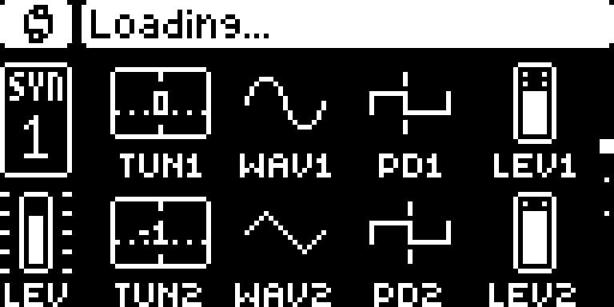
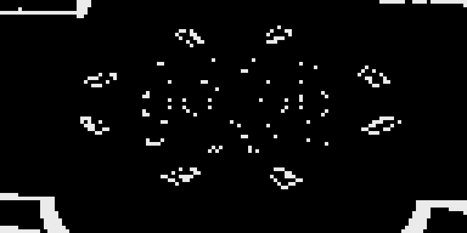

# The display path, found by watching the screen instead of naming a function

**Measured 2026-09-13 on Digitone II 1.11**, against digikit `ec32de1`, resumed
from the 400M boot rung with the UI drawing (409 frames composed).

This project named the display path twice by reading code and was wrong twice —
`Sound::updateMirror` was a vtable-only lambda nothing calls, and forcing
`parameter_value_getter`'s return changed nothing on screen. The rule that came
out of it is that **an instruction pattern confirms an address, never a role**.

So nothing here is named by eye. `scripts/paint_map.py` watches the bytes that
*are* the screen and records the `pc` of every instruction that writes one; a pc
that wrote a pixel is on the display path by definition.

## 1. The write hook fires — and that settles a second question

1,637,709 framebuffer writes from 29 distinct pcs across 209M instructions.

That matters beyond this page. `scripts/write_map.py` used the same
`install_mmio_trace` mechanism over candidate cave RAM and printed `events: 0`
twice, and both runs were too short to reach the code that writes — so *"the
hook does not fire"* and *"nothing wrote"* were never separated, and the write
map has never produced a number anyone could read. **The mechanism works.** Its
zeros were run length, not blindness.

### The buffers are behind pointers, and the first run of this got it wrong

`profile.fb_front` and `fb_back` are the addresses of the **pointers**, not of
the buffers — they sit four bytes apart, and `emu.panel.read()` dereferences
before reading 1024 bytes. Watching them directly watches the pointer variables
and the RAM after them.

The first run did exactly that and produced a confident, plausible table: 1,521
writes, 6 pcs, neat 32-bit widths. Nothing in the output looked wrong. It was a
map of a data structure that paints nothing.

> **A watch aimed at the wrong address does not report an error. It reports a
> table.** The tell was arithmetic and available before the run: two
> "framebuffer addresses" four bytes apart cannot both be 1024-byte buffers.

## 2. The drawing primitives

Every pc that wrote a screen byte, grouped by the function containing it
(`dnfw fn entry --at`):

| entry | direct callers | writes | shape |
|---|---|---|---|
| `0x40113b90` | 18 | 1,302,866 | read-modify-write — reads == writes |
| `0x40114d94` | 34 | 104,448 | **writes only, no reads** — a fill or clear |
| `0x40114842` | 90 | 75,656 | read-modify-write |
| `0x401157fc` | 108 | 45,598 | read-modify-write |
| `0x40115118` | 5 | 49,434 | read-modify-write |
| `0x40113cf4` | 21 | 28,511 | |
| `0x40113edc` | 18 | 1,124 | |
| `0x40131d8e` | 2 | 1,024 | writes only — in the `panel_diff` neighbourhood |

The two with 90 and 108 direct callers are the general-purpose primitives the
whole UI draws through. `0x40114d94` writing without ever reading is the
signature of a fill: it does not need the old pixels.

**These are leaves, not the page renderer.** They say where the ink goes.

## 3. Walking back: only 2 of 34 callers actually fire

`scripts/caller_map.py` hooks a function entry and reads the return address off
the stack, which on ColdFire is `(sp)` at the first instruction of a callee.

`param_index_in_page` (`0x400dbcc4`) — **2,798 entries, 2 distinct callers**:

| returns to | count | enclosing function |
|---|---|---|
| `0x40037166` | 2,797 | `0x40036bac` |
| `0x400371cc` | 1 | `0x40036bac` |

So the static list of 34 is right and almost all of it is cold. One function
does essentially all the parameter-table indexing this instrument does while
drawing.

### The control: two unrelated instruments agree to the byte

The runtime return addresses are `0x40037166` and `0x400371cc`. The static
caller scan reports call sites at `0x40037160` and `0x400371c6` — **exactly six
bytes earlier in both cases**, which is the length of `jsr <32-bit absolute>`.

A linear disassembly scan in this repository and a stack read inside someone
else's emulator, sharing no code, land on the same two instructions. Neither was
adjusted to fit the other.

### And the chain above it

| watched | live caller | count |
|---|---|---|
| `param_index_in_page` `0x400dbcc4` | `0x40036bac` | 2,798 |
| `0x40036bac` | `0x4003951e` — **the destination-list builder** | 2,097 |
| `parameter_value_getter` `0x4006408a` | `0x4006538e` | 2,796 |
| | `0x40063af0` | 233 |

`0x4003951e` is already named in `docs/version-anchors.md` as the
destination-list builder — found independently, months of reasoning earlier, by
following the four filter sites. It turning up here as the live caller is
corroboration from a direction that was not looking for it.

**`parameter_value_getter` runs constantly** (3,031 calls) even though forcing
its return changes nothing on screen. Both facts are now measured, and together
they say it computes a parameter value for something that is not the pixels —
which is a live lead rather than the dead end it looked like.

## 4. A candidate for the page renderer, explicitly not confirmed

`0x400167a4` (7 direct callers) calls the text primitive `0x401157fc` 466 times,
and it sits where 1.10E's `FUN_40016f38` — identified in
`docs/parameter-table-consumer.md` as the `[MOD]`/parameter page renderer — would
land after the relink. Its body repeats one block (`0x40046bfe`, `0x40030e66`,
two vtable calls, then `0x4003e426`, the engine thunk site named in
`docs/version-anchors.md`) several times over, which is the shape of a loop over
parameter cells.

**This is a candidate and nothing more.** No reference to the 1.11 record base
`0x401f7f94` was found in its first 1,600 bytes, and "it is near where the old
one was" is precisely the reasoning that produced two wrong identifications
already. It gets confirmed by a role test or not at all.

## What this does not establish

**No input is modelled** (`docs/emulator.md`), so every count here is from an
undriven boot sitting on whatever page it starts on. Nothing reached only by
pressing `[MOD]` or turning an encoder appears, and that includes the whole
mirror path — which is why `updateMirror` and its enclosing function stay silent
in every run so far. Those zeros still mean "not entered during an undriven
boot".

## Reproducing

```
python scripts/paint_map.py  --digikit ~/digikit --snapshot ~/snaps/boot400M.snap
python scripts/caller_map.py --digikit ~/digikit --snapshot ~/snaps/boot400M.snap \
    --at 0x400dbcc4 --at 0x4006408a
dnfw fn <image> entry   --at <pc>        # what function is this
dnfw fn <image> callers --at <entry>     # and the static list to check against
```

Ask `emu.run.usable_rung()` which snapshot to resume; do not copy a rung number
out of a docstring (`docs/emulator.md`).

---

# The emulated instrument, and what it is actually showing

Every count on this page was taken while the firmware was drawing **a real
parameter page**. That is not an assumption — here is the frame, captured at
`panel_diff` entry and written out by `scripts/drive.py`:



`TUN1 WAV1 PD1 LEV1` over `TUN2 WAV2 PD2 LEV2`, with knob widgets, the `SYN 1`
track badge and a level meter — the Digitone II's SYN1 page, rendered by the
firmware into its own framebuffer. The `Loading...` banner is the modal digikit's
`weakptr` diagnostic exists to clear; the page is drawn underneath it regardless.

**Screens are archived as PNGs in `docs/img/` rather than described.** A byte
count says a screen changed; a picture says what it changed to.

## Two configuration facts, both measured, both costing a run

**DMA timer channel 1 makes this build worse.** digikit's `build()` docstring
says `channels=(3, 1)` stops a fault, so it was added. Measured on 1.11:

| timer channels | richest frame | what it shows |
|---|---|---|
| `(3,)` | **2,183 lit** | the SYN1 parameter page above |
| `(3, 1)` | 411 lit | the boot animation; the page is never reached |

It did not stop the fault either. **Digitakt's fix is not Digitone's** — the
same lesson as the boot rung, learnt twice from the same docstring.

**`weakptr` is unavailable on 1.11.** Its patch site is build-specific and
digikit's guard refuses:

```
RuntimeError: weakptr: 0x40188b40 holds 4878, expected 6714
```

That is the guard working exactly as it should.

# Input is modelled, it works, and the halt was my own bug

`emu/panelin.py` implements the front panel properly — buttons and encoders over
UART8, addresses resolved per build. digikit's README saying "No input" is
stale. The firmware's own control table reads out of the running image:
**55 buttons** (`TRIG SRC FLTR AMP FX MOD PRESET SETTINGS …`) and 10 encoders,
so `MOD` is button code 6, channel 0 bit 5 — found by name, not guessed.

`scripts/drive.py` drives it, and **the input path works end to end**:

| step | new frames | bytes changed | executed | stop |
|---|---|---|---|---|
| idle (no input) | 69 | 168 | 43,013,859 | limit |
| press+release `MOD` | 64 | **616** | 20,030,401 | limit |
| `ENCODER A +10` | 117 | **120** | 40,060,798 | limit |

Both move the screen by far more than it moves on its own, which is what the
idle control exists to establish. And the screen goes somewhere real — the
`Loading...` banner is replaced by the project name and a live tempo:


## The retraction, and it is the most useful thing on this page

**This first reported `unhandled vector 257 at 0x4011eb0e` — a `halt`
instruction — as a digikit bug, and filed it upstream. It was my own defect.**

`panelin.feed()` returns the new pc, and the script threw it away:

```python
panelin.press(m, p, 0, 5)                  # returns the ISR pc -- discarded
pc, ran, stop = longrun.spin(m, pc, ...)   # resumed at the PRE-injection pc
```

`raise_vector` pushes an exception frame and sets the pc to the handler.
Resuming at the pc from *before* the injection runs the firmware on with a
stray exception frame on its stack, and it asserts. The `halt` was the firmware
correctly detecting the corruption I had introduced.

Three things went wrong in order, and only the third was expensive:

1. The docstring says `-> new PC`. I read past it.
2. The failure looked like a firmware panic, because it *was* one — just one I
   caused. A correct-looking assert is a persuasive wrong answer.
3. **I wrote it up and filed it upstream before finding my own bug.** The
   measurement was real and the interpretation was not, and the direction of
   the error — blaming someone else's code — is the one that costs other people
   time rather than only mine.

The rule this earns, which is the same one this project already applies to
addresses, now pointed at ourselves: **before reporting a fault in someone
else''s tool, eliminate your own use of it.** The issue is closed with the
retraction (`m-dwyer/digikit#5`).

## But the encoder does not edit a parameter, and that is the result

Input being *delivered* is not input being *useful*. The second half of the
control asks whether a turn changes a **value**, and it does not.

Six `ENCODER A` turns of +10 detents, with the page drawn and the header showing
the loaded project: **the parameter row is byte-identical before and after.**
`TUN1`'s widget does not move. The screen churns, execution changes — driving
the run raises `param_index_in_page` from 2,798 calls to **4,106** and
`parameter_value_getter` from 3,031 to **4,448** — but nothing is edited.

This is exactly the case `docs/emulator.md` recorded the author warning about:
*"the author flags encoder deltas as buggy, so verify the input path delivers a
value change and not merely an event before believing any trace — a broken delta
lights the wrong half of the path and looks like a result."*

It looked like a result. The control caught it.

### So the mirror probes are still unanswered

With input driven, `M`, `S`, `F`, `B`, `C` and `A` — the `updateMirror` lambda,
its enclosing function, the fill loop, both bulk copies and one pip consumer —
**all still report zero**.

That is **not** evidence that they are off the parameter-edit path. No parameter
was edited. A probe cannot be absent from an event that never happened, and
reading those zeros as a finding would be the same error as reading the trace
harness's blank columns as one.

**The engine-feed path is therefore still not reachable by driving the UI**, and
it stays on the static route: `0x4003951e` (the destination-list builder, and
the live caller found above) and `0x4003e426` (the engine thunk site).

Not reported upstream: the author already flags encoder deltas as buggy, so this
corroborates a known issue rather than finding a new one — and this page has
already spent one upstream report on a defect that turned out to be mine.

## What does not change

The `channels=(3,)` vs `(3, 1)` measurement above stands — it was a separate
observation with its own evidence, and had nothing to do with the halt.

---

# The encoder delta, traced to where it actually stops

digikit's author flags encoder deltas as buggy, and `docs/emulator.md` carries
the warning. This is how far the delta gets on Digitone II 1.11, measured
against `ec32de1`. It gets **much** further than "buggy" suggests, and the
failure is in one identifiable place.

## It is delivered, and the firmware decodes it correctly

Hooking `queue_send` (`0x40001896` — 37 direct callers on 1.11, the same
address digikit uses on Digitakt) reads the firmware's **own decoded record**
for the event, which is ground truth: it is immune to render timing, modal UI
and frame tearing, because no pixel has to move for it to exist.

Sending `panelin.encoder(m, profile, 0, 5)` — ENCODER A, +5 detents — produces:

```
ret=0x4011f780  type=1  code=1  delta=+5
raw=01000000 00000001 05000000 00000000
```

`type=1` is an encoder record, `code=1` is channel 0 + 1 = **ENCODER A**, and
the delta byte at `+0x08` is **exactly the 5 that was sent**. The ring drains
completely: `produced: 2, consumed: 2`.

So the wire format, the DMA ring, the RX vector, the driver and the firmware's
own decoder are all correct. **Nothing on the input side is broken.**

| stage | works? | evidence |
|---|---|---|
| bytes into the DMA ring | yes | `produced` advances |
| RX vector, driver drains it | yes | `consumed` catches up |
| firmware decodes the event | **yes** | its own record, right code and delta |
| queued to the application | yes | `queue_send` at `0x4011f780`, in `0x4011f5d0` |
| consumed by the app | yes | `queue_receive` `0x40001928`, 622 of 625 returns to `0x4002f184`, in **`0x4002e91c`** — the main task's message loop |
| UI reacts | **yes** | the label under encoder A switches from `TUN1` to a live value readout |
| **the value changes** | **no** | `0.00` after 45 detents |

## Timing matters, which is the owner's insight showing up in the data

The Digitone scales an encoder's sensitivity by how fast it is turned. That is
visible here, and it is why the first attempts looked like nothing happening at
all:

| input | result |
|---|---|
| 6 × `+10` in a burst | **nothing** — parameter row byte-identical |
| 15 × `+1`, ~10M instructions apart | **the label switches to the value readout** |
| 5 × `+1`, ~50M apart | nothing — too slow, the overlay never engages |
| 30 in one message | nothing |

So the firmware is applying its acceleration logic, and it takes a *plausibly
timed turn* to engage at all. A burst is not a fast turn; it is one message.

## Where it stops

The UI engages — the encoder is recognised, the parameter is focused, the value
overlay replaces the label — and then the value stays at `0.00` through 45
detents in either direction. The `panelin` docstring says the firmware
"accumulates deltas per encoder and clamps what it flushes to ±30", so the
shape of the remaining bug is an **accumulate-and-flush that engages but never
flushes**, which would look exactly like this.

That is a hypothesis and is recorded as one. What is measured is the table
above.

## Why this is worth having anyway

**The consumer is the parameter-edit path.** `0x4002e91c` takes the encoder
record and is supposed to turn it into a parameter change — which is the
**engine-feed path** this project has been hunting by other means all along.
Finding it by following an encoder event is a better provenance than any
pattern match: it is the code the firmware itself routes the input to.

So even unfixed, this hands LFO4 the function it needs to read, with a role
established by observation rather than by name.

## Root cause candidate: the encoder timestamps itself from a timer nothing drives

Found by pointing `scripts/diff_trace.py` at the problem rather than reading the
2 KB message loop by eye.

**The instrument, and the correction it needed.** Record every basic block the
CPU enters during an idle window, a driven window and a second idle window, and
report what ran only while turning. The first version used *sets* and reported
the UART driver and the RTOS queue and **no application code at all**, at 6
detents and again at 20. That was the instrument, not the firmware: the code
handling an encoder record also runs when idle, so subtracting "blocks that also
ran when idle" deletes exactly what is being looked for. Counting blocks instead
of listing them fixes it — 29 blocks run **exactly once per detent**, all in the
driver at `0x4011fc2c..0x4011fde0` and the queue at `0x40001f1a..0x40001f74`.

That bounded the search to ~440 bytes, and those bytes say this:

```
0x4011fc54  movel 0xfc07000c,%d6        ; <-- DTIM0's counter (DTCN0)
...
0x4011fc90  movel %d3,%a3@(0,%d2:l:4)   ; accumulate the scaled delta
0x4011fcc4  movel %d6,%a2@(4)           ; store that timestamp per encoder
```

`d6` is read from `0xfc07000c` and **only ever stored**, never compared or used
arithmetically here. `BASES[0] = 0xFC070000` in digikit's `emu/dtim.py`, and
offset `0x0C` is `DTCN` — so the driver stamps every encoder event with **DMA
timer 0's free-running counter**, for something downstream to measure speed
with. That is the device behaviour the owner described: the Digitone scales an
encoder's sensitivity by how fast it is turned.

**And that counter never moves.** Measured in the emulator:

| address | what | value |
|---|---|---|
| `0xfc07000c` | DTIM0 `DTCN` | **0, 0, 0** — never advances |
| `0xfc070000` | DTIM0 `DTMR` | `0x0000` — not enabled |
| `0x466758b0` | the millisecond tick global | 1095 → 1426 over 30M instructions ✓ |

digikit models DMA timer channels by request and defaults to `(3,)`; **channel
0 is never among them**. So every encoder event is stamped `0`, every interval
between detents computes as zero, and a delta scaled by a zero interval
plausibly scales to nothing — which is precisely the observed behaviour: the
parameter focuses, the value overlay appears, and the number never moves.

**Stated as a candidate, not a conclusion.** What is measured is that the driver
reads DTCN0, stores it per encoder, and that DTCN0 is stuck at zero. That the
downstream consumer divides by or compares against it is inference, and the
arithmetic has not been read. It is written here as the next thing to check, not
as the answer.

Two things this did *not* turn out to be, both of which were checked:

- **The branch at `0x4011fc70` is not a rejection.** It looked like "too fast →
  clear the accumulator", and instrumenting it shows the **process** path taken
  on every detent at every spacing tried (6 of 6, at 10M, 40M and 80M apart) and
  the clear path never. Reading a branch direction off a disassembly and
  believing it is how this project has been wrong before; the hook settled it in
  one run.
- **`0x4017cea4` is not the acceleration helper.** It was hooked on that
  assumption and fires 60,000–480,000 times in a window with six detents — it
  scales with run length, not with input. A count is what exposed that; the
  name would not have.

## The bug, located: the accumulator has no reader

Watching the per-encoder accumulator at `0x445a0dc4` with a write hook while
turning ENCODER A twelve detents:

```
writers:  0x4011fc90  ×12        <- inside the driver
readers:  0x4011fc7e  ×12        <- inside the driver
values:   1, 2, 3, 4, 5, 6, 7, 8, ...
```

**Two program counters touch it and both are the driver's own**
(`0x4011fc7e` reads the running total, `0x4011fc90` writes it back). The values
climb monotonically and are **never cleared**. Nothing in the application ever
reads the accumulated delta.

So the shape is exact: the driver accumulates, and **the consumer that should
drain the accumulator and apply it to the parameter never runs.** That is why
the UI focuses the parameter and shows the value overlay — it learns *which*
encoder was touched from the `queue_send` record, which does arrive — while the
number never moves, because the amount lives in an accumulator with no reader.

### The DTIM0 candidate is weakened by its own test

The previous section proposed that the timestamp read from DTIM0's dead counter
was the cause. **Tested and it is not sufficient:** driving `0xfc07000c` with a
synthetic advancing counter through a full turn leaves the value at `0.00`,
exactly as before. The timestamp is still stored from a counter that never
moves, and that is still worth fixing, but it does not explain this.

The accumulator having no reader does.

### And it is not about missing preset data

Worth ruling out explicitly, because "storage is not served" is digikit's known
big gap and it is the obvious thing to blame. `ENCODER LEVEL` (channel 8) drives
a **global**, not preset data — and it behaves identically: the label `LEV`
switches to its value readout `100`, and then forty detents downward move
nothing. A preset parameter and a global parameter fail the same way, so the
loaded-preset state is not the variable.

That also matches the device: a loaded preset lives in RAM as its own state, and
a DN/DT keeps its current project across a power cycle, so nothing here needs
the `+Drive` to have been read.

## The dispatch is on the wire tag, and an encoder-only test can never flush

The accumulator's address is a **literal in the image** (`lea 0x445a0dc4,%a3`),
so its other users can be found without running anything. Scanning MAIN OS for
the constant gives **three** references — `0x4011fbac`, `0x4011fc0a`,
`0x4011fc7a` — and only the last is the accumulating driver already traced. The
other two are both inside **`0x4011f9ac`**, which does this:

```
0x4011fbb0  clrl %a1@(0,%a0:l:4)          ; clear that encoder's accumulator
0x4011fbb6  andl %d0,0x445a0dec           ; and its bit in the pending mask
```

So `0x4011f9ac` is the **drainer**. It has one call site, `0x4011fd84`, and the
code that gates it is a three-way dispatch:

```
0x4011fd5c  movel 0x445a0984,%d1
0x4011fd62  asrl #4,%d1            ; the wire header's tag: (tag << 4) | channel
0x4011fd68  beqs ...  if tag == 3  -> 0x4011fc2c   accumulate
0x4011fd70  beqs ...  if tag == 7  -> console block
0x4011fd78  bnes ...  if tag != 2  -> skip
0x4011fd84  jsr 0x4011f9ac         ; tag == 2  -> DRAIN
```

**3, 7 and 2 are exactly `panelin`'s three wire tags** — encoder, console block,
buttons. So the accumulated encoder delta is drained on a **button-state
message**, not on an encoder message.

That is a real property of the hardware rather than a quirk: the panel MCU
streams the button bitmask continuously, so on a device a flush is always
arriving. `panelin` sends only what a caller asks for, so **a test that sends
only encoder messages can never flush**, and will always look like "the delta is
accumulated and nothing happens".

Confirmed both ways:

| what was sent | drainer entries |
|---|---|
| 8 encoder deltas alone | **0** |
| 8 encoder deltas, each followed by `buttons(0, 0x00)` | **8** |

### What still does not work, and where it is left

With button frames interleaved the drainer runs — and the accumulator is **still
not cleared** (`acc = 8` after 8 detents) and the value on screen is still
`0.00`. So there is a further condition inside `0x4011f9ac` before its clear is
reached; the `clrl` sits on a branch, and which branch has not been read.

One plausible reason, recorded as the next thing to check rather than as a
finding: the drainer indexes by `%a0`, and a button message carries a **button
channel**, not an encoder index — so a tag-2 message may be draining the wrong
slot, or the real flush may come from a different tag-2 message than the one
synthesised here.

**This is digikit's bug, not LFO4's**, and it is handed over at that point
(`m-dwyer/digikit#6`) rather than pursued further here. What it bought this
project is the dispatch above, which is panel-input ground truth for any future
run, and the knowledge that **every driven experiment must interleave button
frames** or it is measuring a machine that cannot flush.

---

# The engine-feed path: what the emulator can and cannot say

## The coprocessor port is never touched

The ColdFire reaches the SHARC through a FlexBus coprocessor port at
`0x8C000000` (digikit's `emu/dsp.py`). Its registers are referenced in our 1.11
image at known sites — `0x8c00000a` at `0x400cf1b6` and `0x400cf242`,
`0x8c000002` at eighteen sites from `0x400cf1be` — so the transport is there and
its 1.11 addresses are re-anchored (digikit's `0x400cf4a8` / `0x400cfd40` /
`0x40146148` are Digitakt's and resolve to nothing here).

**It never runs.** A write watch over the whole `0x8C000000` page, from three
different boot rungs, reports:

| rung | coprocessor port events |
|---|---|
| 60M | **0** |
| 200M | **0** |
| 400M (UI drawing) | **0** |

and the enclosing transport function `0x400cf0f2` is never entered either.

So **the engine-feed path cannot be observed at runtime in this emulator.** The
instrument that solved the display path — watch the destination, record the pcs
— does not transfer, because the destination is never written. That also matches
digikit's own note that the priority-3 job worker wedges on its first transfer
and none of its five queued jobs (including `KitActive::updateSingleMirror`)
ever runs.

This is worth stating as a closed door rather than left ambiguous: the engine
feed has to be found **statically**, or by first making the DSP jobs run.

## One anchor confirmed live, and it is the useful part

`docs/version-anchors.md` names two "engine fn" addresses on 1.11, re-found by
byte pattern and never observed executing. Hooking them:

| address | entries | returns to |
|---|---|---|
| `0x4004dfb0` (thunk target) | 0 | — |
| **`0x4004dc62`** (called with the object) | **1** | `0x4003e332` |

`version-anchors.md` records the 1.11 `adda` setup site as **`0x4003e324`**, and
a `jsr` there returns to `0x4003e332`. **The runtime return address confirms the
statically-derived call site exactly** — an anchor found by byte pattern months
of reasoning earlier, now watched running for the first time.

## A correction to this page: `dnfw fn entry` is "nearest call target", not "function start"

Earlier this page said `0x40036bac` "is called only from `0x4003951e` — the
destination-list builder". **The second half of that is not safe.** The measured
fact is the return address `0x400399ce`, which is solid. Attributing it to
`0x4003951e` came from `dnfw fn entry --at`, which reports the **nearest call
target at or below** an address — and that is not the same thing as the
enclosing function's entry when the real entry is reached by a branch, or when a
large function contains internal call targets.

Hooking `0x4003951e`'s entry directly gives **0 entries** in the same window
where code at `0x400399ce` ran 2,097 times. Both cannot be inside one function
that was entered zero times, so the attribution was wrong, not the counts.

The rule, which belongs next to the others here: **a call-target resolver names
a landmark, not a scope.** Where the enclosing function matters, hook its
candidate entry and check it actually runs.

---

# Reading the engine feed: the one pair confirmed both ways

`0x4004dc62` is the only engine-side function this project has confirmed
**statically and at runtime** — re-found by byte pattern in
`docs/version-anchors.md`, and observed executing with a return address that
matches the derived call site to the byte. So it is the one worth reading.

## The call site assembles the engine modulation state

```
0x4003e31c  addil #18825819,%d2      ; 0x011F425B
0x4003e322  movel %d2,%sp@-          ; arg 2
0x4003e324  addal #324440,%a2        ; 0x4F358 -- the engine modulation-state
0x4003e32a  movel %a2,%sp@-          ;           offset from version-anchors
0x4003e32c  jsr 0x4004dc62
0x4003e332  addql #8,%sp             ; two arguments
```

`0x4F358` is exactly the "engine modulation-state offset" recorded for 1.11, so
the argument is **the object's modulation state**, and the caller reaches it by
the offset this project derived by histogramming immediates. Immediately above,
a loop runs `d3` from 0 to 59,104 in steps of 3,694 while advancing `%a3` by 84
— **16 iterations**, which is the DN2's track and voice count.

## What the function does: 128 blocks of 960 bytes

Arguments arrive swapped relative to the push order, which is worth writing down
because reading it the natural way gets the two backwards:

```
0x4004dc6a  moveal %sp@(24),%a2      ; a2 = the caller's d2
0x4004dc6e  movel  %sp@(20),%d3      ; d3 = the modulation-state pointer
```

Then, after one call to `0x4019a96e` and a null check on `a2`:

```
0x4004dc82  addil #48,%d3            ; skip a 48-byte header
0x4004dc8a  lea 0x4004afec,%a3       ; the per-entry worker, by pointer
loop:
0x4004dc94  pea %a2@(0,%d2:l)        ;   arg: a2 + d2
0x4004dc98  movel %d3,%sp@-          ;   arg: the state pointer
0x4004dc9a  jsr %a3@                 ;   0x4004afec(state, entry, 0, 0)
0x4004dc9c  addil #960,%d3           ;   state += 960
0x4004dca2  addil #1163,%d2          ;   entry += 1163
0x4004dcac  cmpil #148864,%d2
0x4004dcb2  bnes loop
```

The arithmetic is exact and says what the structure is:

| quantity | value | meaning |
|---|---|---|
| `148864 / 1163` | **128** | iterations — the sound-object pool size |
| `128 × 960` | 122,880 = `0x1E000` | the modulation state's span |
| header skipped | 48 bytes | before the first entry |
| stride, state side | **960** | bytes of engine modulation state per slot |
| stride, object side | **1163** | bytes per source entry |

**128 is the sound-object pool count** already measured from the accessor that
clamps an index to 0..127 with a 2,388-byte stride (`docs/lfo4-slot-plan.md`).
Two independent structures agreeing on 128 is the kind of corroboration worth
having.

## What this is for, and what is still open

This is the shape of the control→engine feed: a per-slot walk that hands
`0x4004afec` a 960-byte engine modulation block and a 1163-byte source entry,
128 times. **A fourth LFO has to appear inside that 960-byte block**, and the
open question is now specific enough to answer: *what is the layout of those 960
bytes, and how many LFO-shaped sub-blocks does it hold?*

That is a much smaller question than "where is the engine-feed path", which is
where this page started.

**Not yet established, and not to be assumed:** that these 960-byte blocks
contain the LFOs at all. `docs/engine-index-map.md` §§11 and 14 previously
claimed a fourth LFO lane existed and **both are withdrawn** — the probes that
"confirmed" it changed the forward and inverse maps together and never
discriminated. Nothing here revives that. What is established is the feed's
shape and its two strides, read from instructions, with the call site confirmed
by a runtime return address.

## Inside the 960-byte block: five uniform 152-byte sub-objects

Watching slot 0's block (`0x44719f78` at runtime, captured by hooking
`0x4004dc62` and reading its argument off the stack) over 209M instructions:
**359 writes and 166 reads across 247 distinct offsets**, spanning `0x0` to
`0x3bc` — so effectively the whole 960 bytes is live.

Nearly every offset is 4-byte aligned. **Seven are not**, and they are the key:

```
0xd  0x39  0xbd  0x155  0x1ed  0x285  0x31d
      +44  +132  +152   +152   +152   +152
```

`0x400f58ec` writes one of them as `moveb %d0,%a2@(13)` — so `%a2` points at a
**sub-object** and the odd byte is its field at `+0xd`. That turns the seven
flags into seven sub-object bases:

| base | `0x0` | `0x2c` | `0xb0` | `0x148` | `0x1e0` | `0x278` | `0x310` |
|---|---|---|---|---|---|---|---|
| stride to next | 44 | 132 | **152** | **152** | **152** | **152** | — |

The last five are a **uniform array of 152-byte (`0x98`) objects**, and they are
written by exactly the same two program counters — `0x400f58ec` (inside
`0x400f5186`) and `0x401b5082` — with the same `0/1` value pattern, while the
two at `0x0` and `0x2c` are written by entirely different code. Five instances
of one type, two of others.

`0x310 + 152 = 0x3a8`, comfortably inside 960.

### What this is and is not

**Established:** the engine modulation state is 128 slots × 960 bytes at
`object + 0x4F358`, skipping a 48-byte header, and each slot holds five uniform
152-byte sub-objects sharing a flag byte at `+0xd`, plus two differently-shaped
ones before them.

**Not established, and specifically not assumed: that the five are LFOs.** The
DN2 has three. Five could be three LFOs plus two envelopes, or five of something
else entirely, and this project has already withdrawn two claims of a "fourth
LFO lane" made on thinner evidence than this
(`docs/engine-index-map.md` §§11, 14). Naming them needs a correlation between
one of these sub-objects and a parameter whose id is known — which needs a
working parameter edit, which is what the encoder bug currently blocks.

**Why it still matters.** The question is no longer "where does the engine get
fed" or "what is the layout of the 960 bytes". It is now: *what are the five
152-byte sub-objects, and is their count a bound the code reads?* If a fourth
LFO means a sixth sub-object, the block has to grow by 152 bytes and whatever
bounds the five has to change — and that is a question with an address to look
at rather than a space to search.

## The count is not a bound. The five are members constructed by name.

This is the question `docs/ROADMAP.md` says everything else follows from, asked
of the engine side and answered:

> Find the code that indexes the grid and look at the `3`: **a loop bound or
> table length → a small change; objects constructed by name, with unrolled
> parameter tables → large.**

**It is the large branch.**

`0x401b5054` is the 152-byte sub-object's constructor — it installs vtable
pointers (`%a2@(-12)` is the classic multiple-inheritance offset-to-top) and
clears the fields at `+0x0c` and `+0x0d`, the flag byte the write watch found.
It runs **720 times**, all from one call site, inside `0x400f582a`.

`0x400f582a` in turn runs **720 times from exactly five distinct return
addresses, 144 each**:

```
0x4004c90e   144
0x4004c916   144
0x4004c92a   144
0x4004c932   144
0x4004c93a   144
```

Five call sites, not one site taken five times. And the code around them is
unrolled by hand:

```
0x4004c89c  movel %a2,%d7 ;  addil #328,%d7     ; 0x148
0x4004c8ba  movel %a2,%d6 ;  addil #480,%d6     ; 0x1e0
0x4004c8de  movel %a2,%d5 ;  addil #632,%d5     ; 0x278
0x4004c91c  movel %a2,%d4 ;  addil #784,%d4     ; 0x310
            ...           ;  %a4                ; 0xb0
0x4004c90c  jsr %a5@      ; one call per register
0x4004c914  jsr %a5@
0x4004c928  jsr %a5@
0x4004c930  jsr %a5@
0x4004c938  jsr %a5@
```

**Every one of those immediates is an offset the runtime write-watch found
independently** — `0xb0`, `0x148`, `0x1e0`, `0x278`, `0x310`. One instrument
watched memory being written and derived the offsets; the other read the
constructor and found them as literals. Neither was adjusted to fit the other.

### What that costs a sixth sub-object

There is no `5` anywhere to increment. A sixth means:

- a **sixth register** loaded with `base + 936`, and a **sixth `jsr`**, spliced
  into a constructor that has no room to grow in place;
- the containing object grows by **152 bytes**, and it exists **144 times**;
- the engine modulation block grows past 960 bytes per slot, ×128 slots, which
  moves `0x4004dc62`'s `#960` stride and its `#148864` loop bound;
- every hard-coded offset after the insertion point shifts, and they are
  immediates scattered across the constructor rather than one table.

That is a cave-and-relocate job on a live object graph, not an immediate edit.

### The honest caveat, unchanged

**None of this says the five are LFOs.** It says there are five of one type,
built by name. If they turn out to be three LFOs and two envelopes, the above is
what a fourth LFO costs on the engine side; if they are something else, the cost
belongs to whatever they are. That identification still needs a parameter whose
id is known to be correlated with one sub-object — which needs a working
parameter edit, which the encoder bug blocks.

What has changed is that the question is now **"which five, and is the DSP side
willing"**, with the control-side cost already measured, rather than an open
search.

## What the five actually are — and the lead this closes

The constructor passes a literal the type names itself with:

```
0x400f5872  pea 0x401fffb4        ; a pointer table
0x400f5788  pea 0x4021e7fa        ; -> "SoundModConfParam"
```

and the string pool carries the family around it: `12SoundModConf`,
`9ModConfig`, `ModSetupView`, `ModDestListView`, `GroupedModDestListView`,
`ParameterPageView::showAndUpdateModDestList`.

So the five 152-byte objects are **`SoundModConfParam` — the MODULATION SETUP
configuration**, not LFO state.

### This is a lead this project has already closed, reached from the other end

`docs/lfo4-feasibility.md` closed `MOD4` / `modTarget_t[4]` months of reasoning
ago with a device fact from the owner: *"For each modulation input (velocity,
mod wheel, etc) there are 4 modulation destinations."* That made `MOD1..MOD4`
the four **destination slots of one modulation source**, and not a dormant
fourth LFO.

Five `SoundModConfParam` per sound sits exactly where the modulation **inputs**
would — the sources that each own those four destinations. Two independent
routes, one static from an RTTI array and one dynamic from the engine feed,
arriving at the same subsystem. The earlier one already ruled it out for LFO4.

### So the correction to this page

Two paragraphs above said *"a fourth LFO has to appear inside that 960-byte
block"* and framed the open question as *"what are the five, and is their count
a bound"*. **The first is wrong and the second is answered.** The block is
modulation *configuration*, and a fourth LFO does not have to live in it — an
LFO is a modulation **source generator**, and nothing here generates anything.

What survives, and it is not nothing:

- The **engine-feed path is mapped**: `0x4003e324` → `0x4004dc62`, 128 slots ×
  960 bytes at `object + 0x4F358`, a 48-byte header, entry stride 1163.
  Confirmed statically and at runtime.
- **The five are members constructed by name at hard-coded immediates**, not a
  bounded array — so *if* LFO4 ever needs a slot in a structure shaped like this
  one, the cost measured above is what it costs.
- **`SoundModConfParam` is identified by the firmware's own name**, not by
  inference, which is the standard this project failed twice before reaching.

And the standing question is unchanged and still unanswered: **where the LFO
generators live.** Nothing found today generates a waveform, which is consistent
with the generators being SHARC-side — `docs/sharc-code-map.md` — and with the
DSP hunt in `docs/ideas-backlog.md` §7 still being the binding constraint.

---

# Where the LFO generators are not

With the engine feed mapped and its contents identified as configuration, the
standing question is the one `docs/ROADMAP.md` has carried all along: **where is
the thing that actually generates an LFO?** Two scans answer half of it.

## The ColdFire has no generator of any kind

Every LFO-bearing name in MAIN OS 1.11:

```
0x4021f718  11LfoPageView
0x4020545f  LfoPageView::getFirstSoundSlotLock...
0x40210589  LFO1      0x402105d9  LFO2      0x4021a54a  LFO3
0x40210488  LFO Trig  0x40210491  LFO.T     0x40219f0d  POLY M.LFO
```

A **page view**, and parameter label strings. That is all.

Widening the search to `Oscillator|Waveform|Generator|Modulator|EnvGen|Envelope|
PhaseAcc|RampGen` adds nothing that generates either: `Osc1 Waveform`,
`Main Waveform`, `Swarm Waveform` are parameter labels;
`MultiSourcePageView::drawEnvelopePage` draws a page; `SampleWaveformsFactory`
builds a UI display.

**There is no LFO class, no oscillator, no modulator and no envelope generator
in MAIN OS.** Every audio- and modulation-generating name in the image is a
view, a page, or a label. That is consistent with
`docs/dn1-dsp-comparison.md` — the DN1 runs audio DSP on the ColdFire and the
DN2 does not — and it settles the control side: **a fourth LFO cannot be
generated by patching MAIN OS**, whatever is done to the parameter table, the
page view or the storage slots.

## The SHARC image is stripped of application names

Scanning the played-out image (9 regions, 6,423,108 bytes) for the same words
returns **14 matches, all of them RTOS and vendor middleware**:

```
..\..\..\..\lib\freertos-sharc\{event_groups,queue,stream_buffer,tasks,timers}.c
..\..\..\..\lib\freertos-sharc\portable\CCES\SHARC_215xx\port.c
...\lib\src\services\Source\{gpio\adi_gpio.c,pcg\adi_pcg_v1.c,spu\adi_spu_v2.c}
```

Those are `__FILE__` strings from FreeRTOS and ADI driver asserts. **No
application source paths and no application RTTI**, so the DN2's audio code is
stripped where digikit's author found Digitakt II's unstripped — worth knowing
before anyone repeats that search here expecting names.

## What the SHARC does carry: a band-limited wavetable bank

A shape scan of the float32 rodata — the method the Octatrack community used
(`docs/references.md`) — finds **31 smooth tables spanning [-1, +1]**, 30 of them
in `0x282403f0..0x2826f000`, on a regular `0x400` (256-float) stride from
`0x2825e8b0`, with mean second difference rising monotonically table to table:

```
0.00077  0.00111  0.00152  0.00191  0.00231  0.00273  0.00316  0.00373  0.00415
```

Increasing harmonic content at a fixed stride is the signature of a
**band-limited / mipmapped oscillator wavetable bank**, which is audio-rate
oscillator data — `Osc1 Waveform`, `Main Waveform` and `Swarm Waveform` are its
parameters. **It is not claimed to be LFO data**; Elektron LFO shapes are a
small fixed set and would not need mipmapping.

## So the constraint, stated exactly

LFO generation is **SHARC-side and unnamed**. It cannot be found by strings on
either processor, so it has to be found by reading SHARC instructions — which is
`docs/ideas-backlog.md` §7, the parked DSP hunt, and which now has what it was
missing: `docs/sharc-code-map.md` identifies ~240 KB of code in two regions with
a confirmed `load = exec × 2 + 0x28000000` mapping for the `0x1c` space, and
digikit ships `tools/sharc_disasm.py`.

**This is the binding constraint on LFO4 and has been since the engine side's
two "fourth lane" claims were withdrawn** (`docs/engine-index-map.md` §§11, 14).
Everything control-side is now mapped or costed; nothing control-side can
produce a fourth modulator on its own.

---

## The panel driver latches button state — it does not need refreshing

**Measured 2026-09-14, `scripts/hold_test.py`.** Raised by digikit's author in
`m-dwyer/digikit#9`: Digitakt II's MACHINE SEL menu *"usually closes within a
second, **with or without the patch**"*, and she was unsure whether it was a
patching bug or emulator timing.

"With or without" rules out the patch, so the question was whether the emulator
lets a held modifier lapse. There was a reason to think so. `digikit#6` found
the per-encoder accumulator is drained only when a **button** message arrives —
the drainer is gated on the wire tag — and the inference drawn there was that
real hardware **streams** button state continuously. If the firmware rode on
that stream, a modifier held by one message and never refreshed would lapse, and
"within a second" is the shape of a panel-link watchdog.

**digikit's own wire note predicted the opposite**, which is what made it worth
running rather than assuming:

> tag 0x2 — an 8-bit STATE BITMASK for that channel's eight buttons, not a
> press/release event. The firmware XORs it against the previous byte for the
> channel and derives the edges itself.

### The result

`[FUNC]` — code 17, channel 2, bit 0, found **by name** from the firmware's own
control table — pressed once, never re-sent, then held for **600M
instructions** (~2.5 s of emulated CPU):

```
0x445a0983  idle=0x00 -> after 1 slice 0x01, after 59 0x01, after 60 0x01
0x445a0df7  idle=0x00 -> after 1 slice 0x01, after 59 0x01, after 60 0x01
```

Two bytes take the FUNC mask and still hold it with nothing refreshing them.
Idle churn across the same 8 KB window is **1 byte**, so the measurement is not
swamped by noise.

**The driver latches. The streaming hypothesis is wrong, and the menu bug is not
the same root cause as `digikit#6`.** Whatever closes MACHINE SEL sits above the
panel driver.

### Two instruments discarded on the way, both worth recording

**The screen measured nothing.** The first design watched lit-pixel counts
across `idle → hold-once → idle → hold-streamed → idle`. Holding `[FUNC]`
changes nothing drawable on this build: deviation **+0** against an idle spread
of 2, identical in both modes. That is the outcome that means *the instrument
does not respond*, and reporting either mode as "held" or "lapsed" from it would
have been invention. The three idle windows are what made that visible.

**A write trace named the wrong byte.** Tracing writes during a press pointed at
`0x445a0df4`, which takes the mask — and reads back zero at the next sample. It
is a transient edge byte, consumed within one slice. *A write trace shows what
was written, not what survived*, so the persistent store had to be found by
diffing memory snapshots instead.

### What does not transfer

This is **Digitone II 1.11**, not Digitakt II 1.15C. digikit's own note says the
panel parser is byte-identical across builds with only the data addresses
moving, so the driver-level conclusion should carry — but the UI layer is
product-specific, and MACHINE SEL is a Digitakt screen. The negative is strong
about the driver and says nothing about the menu's own timers.

---

## The Octatrack's drawing primitives, and what transfers — 2026-09-16

**Shared by the owner from the Octatrack researchers** (OS 1.40C MKII, their
`PANEL_DRAW.md`). Cited in our own words; their addresses are theirs and none of
them apply here. What is worth having is the **model**, plus one confirmed
difference and one cautionary tale.

### The confirmed difference: they have grey, we do not

| | Octatrack 1.40C | **Digitone II 1.11** |
|---|---|---|
| surface | 128 × 64, **2 bits per pixel**, four levels | 128 × 64, **1 bpp** |
| buffers | descriptor at `0x400bf10a`, pointers at `+12`/`+16` | pointers `fb_front` `0x402a0b88`, `fb_back` `0x402a0b8c` |
| measured | — | `0x44622bc8`..`0x44622fc8` = **exactly 1024 bytes** = 128·64/8 |

Their panel carries a descriptor record — width, height, bpp, two buffer
pointers. **Ours does not, or not in that shape**: scanning for a record opening
`128, 64` returns 68 hits and not one has a plausible bpp with a pointer behind
it. digikit resolves our buffers as two bare pointers instead.

**So do not carry their surface layout across.** What does carry is that both
machines double-buffer and that every drawer writes one buffer.

### The model worth looking for here

- **A rectangle op whose `mode` argument branches on sign** — theirs is
  `fill(ctx, x1, y1, x2, y2, mode)`: `< 0` EOR (invert), `> 0` OR (set),
  `= 0` clear.
- **Shading by checkerboard mask**, `0xaaaaaaaa` and its opposite phase
  `0x55555555` — a 50% dither over a rectangle. **This is the only way to get
  grey on a 1-bpp panel, so it is more relevant to the DN2 than to the machine
  it was found on**, which has real levels available.
- **Text cannot be dimmed.** Their blitter ORs one bit per pixel into one
  buffer and takes no intensity. If the DN2's is the same shape, a grey label is
  a dithered rectangle over drawn text, not a text attribute.
- **Fonts as 20-byte metric records** — default advance, `(yOffset << 16) |
  height`, and three table pointers (per-glyph widths, per-glyph offsets with
  negative meaning absent, glyph bitmaps). No colour anywhere.
- **Cursor geometry tables are `(centre, half-width)`, not `(left, width)`** —
  the call computes `x1 = x - w - 1` and `x2 = x + w + 1`, symmetric about `x`.

### Why this matters to two of our open items

**`docs/ideas-backlog.md` §13.1, the intro-screen mod logo.** This is the
drawing vocabulary that entry needs: a rect op with invert/set/clear, and dither
for shading. It also sharpens the redraw constraint already recorded there — at
1 bpp with no grey, the concept art's line work has to become solid pixels or
dithered fills, nothing in between.

**`docs/lfo4-build-plan.md` §5i, widget selection.** Their cursor idiom is
*"look the cell's geometry up in a per-type table indexed by column"*. That is
the same shape as the thing §5i cannot find: what picks a specialised widget per
parameter. A per-type table indexed by id or column is worth looking for
directly, rather than tracing the draw call.

### [METHOD] Their negative finding is the better lesson

Their note flags an argument that every call passes as `-1` and that looks
exactly like a shade — and it is a **maximum character count**, compared against
a character counter inside the blitter. They confirmed it negatively **on
hardware, at the cost of a flash**.

*"It is the most shade-looking argument in the firmware and it is not one."*

That is the same failure this session paid for repeatedly: a stride of 8 that
was glyph rows, a 32-bit value that was a task control block, a byte that
incremented per click and was a counter. **A plausible reading is not a
measurement**, and the cheapest defence is an experiment whose wrong answer
looks different from its right one.

## The panel clear, and why a cold boot shows nothing — 2026-09-17

`tools/bootwatch.py` was run from reset over DN2 1.11 with a write watch on both
panel buffers, `0x44622bc8` and `0x44622fc8`, 1,024 bytes each, to 420M
instructions.

**768 writes, every one of them a zero, every one from the same PC.**

```
[315750760] fb_front 0x44622fc4 size 4 value 0x0 pc 0x40114e7c
```

**[SHARPENED the same day]** `0x40114e7c` is not a dedicated panel clear. It is
`0xe8` bytes into **`0x40114d94`, a rectangle-fill primitive with 34 direct
callers**, and the PC that appeared is one arm of its inner loop — the arm that
writes zeros. The routine walks longwords with a row stride taken from
`%a2@(12)`, so `%a2` is a `Bitmap` and **`Bitmap+12` is its stride**. Calling it
"the panel clear" was reading one PC as if it were a function.

Both buffers read all-zero at the end of the run. Nothing drew.

**That is not a bug, and `emu/frame.py` already says why:** every task but the
idle task blocks in `sem_pend` on a device event that never happens under
emulation, so the draw task never runs. `frame.py` generalises `dspboot`'s
single forced semaphore to "any pend whose count is <= 0", and only then does
`Bitmap::setPixel` execute. That path takes a **snapshot**, which DN2 1.11 did
not have.

**Consequences worth carrying:**

- A cold-boot write watch cannot answer the boot-draw question. It needs the
  unblock path, which needs a snapshot ladder — being built now.
- The same missing snapshot is why a patched DN2 build could not be booted under
  `guirun.py` earlier today: it resumes, it does not cold-boot. And a snapshot
  carries its own copy of MAIN OS, which is what `--weakptr` exists to patch
  around — so a snapshot built from stock cannot test a modified image without
  care.
- `0x40114e7c` is now a named routine. It is also the cheapest possible probe
  for "did the panel get cleared", which is a different question from "did
  anything draw".


## Finding the Digitone's `setPixel` — still open, with the route

~~`emu/frame.py`'s `SET_PIXEL = 0x40104eb4` is a **Digitakt II 1.15C** address. Run
against DN2 1.11 it hooks nothing, which is why a capture from the 60M snapshot
reported `setPixel calls: 0` alongside `pends satisfied: 0` — two independent
failures that look like one.~~

**[WRONG — corrected 2026-09-17, same day]** That constant is dead code.
`longrun.build(bitmap=True)` hooks `profile.set_pixel`, and the profile comes from
`symbols.resolve()` over the image actually loaded — a 64-byte signature that
picks the right one of a near-identical pair `0x66` bytes apart:

| image | `setPixel` | its twin |
|---|---|---|
| Digitone II 1.11 | **`0x40113b90`** | `0x40113bf6` |
| Digitakt II 1.15C | `0x40104eb4` | `0x40104f1a` |

So the hook *was* on the Digitone's routine, and `setPixel calls: 0` is a true
reading: **the draw task never ran**, because `pends satisfied: 0` — the unblock
policy did not release it from the 60M rung. One failure, not two. The error was
reading a module constant and not the call that uses it — the same mistake as
reading `usable_rung()`'s docstring instead of calling it.

DN2 1.11 has no `setPixel` string: it is a non-virtual method, so nothing in the
RTTI names it — which is why digikit finds it by signature instead, above. What the image does carry is mangled **fragments** of functions
taking a `Bitmap` — `6BitmapiibE` at `0x401f1b6f` is `(Bitmap&, int, int, bool)`,
which is the signature — so the symbol survives inside longer template manglings
even though the method itself is anonymous.

**The route, and it is the owner's shortcut:** trace it on **Digitakt II 1.15C**,
which is the image digikit supports best and the one `frame.py`'s address already
matches, then carry the structure across. What transfers is the *shape* — which
Bitmap object the intro draws into, in what order, and where the version string
sits — not the addresses. `0x40114d94` and its 34 callers are the Digitone-side
foothold to re-anchor onto.

## The intro is a displacement map over a static logo — 2026-09-17

Traced on **Digitakt II 1.15C** first, on the owner's advice, then found
byte-for-byte on the Digitone. Unblock from an early rung does not work: a
resume from 60M satisfied 4.1 million pends and drew nothing. What works is
`gui.py`'s recipe — a plain boot to a 400M snapshot where the intro is already
running, then resume with the draw task unblocked and `dsp=True`.

`scripts/trace_intro_draw.py` attributes every `setPixel` to its caller (via
digikit's `emu.hle.LAST_PIXEL_CALLER`, branch `emu/setpixel-caller`). Over 40M
instructions from 400M:

```
caller        pixels      lit   bbox            bitmap
  0x400d3d98  1,076,631   42,784   (0,0)-(127,63)   0x4313b298
```

**One caller, the whole panel, about 131 full frames.** The 20M count matches the
616,823 recorded in `emu/gui.py`'s own notes to within 15, so the tracer measures
the same drawing. Nothing draws the logo through `setPixel` — that is a copy.

The copy loop (Digitakt `0x400d3d48`) is the effect:

```
d0 = table[(i+1) & 0x3fff] + scroll ;  y = d0 & 63
d1 = table[ i    & 0x3ffe] + scroll ;  x = d1 & 127
v  = getPixel(source, x, y)
setPixel(panel, col, row, v ? -1 : 0)
i += 2
```

Each panel pixel samples a **static source bitmap** at a coordinate taken from an
**offset table** (two entries per pixel, a 16,384-entry ring) plus a **scroll**
value. Animating the scroll animates the whole effect.

| | Digitakt II 1.15C | Digitone II 1.11 |
|---|---|---|
| copy loop (address-free match) | `0x400d3d6c` | `0x400d3b3c` |
| source bitmap | `0x43135268` | `0x42c4567c` |
| offset table pointer | `*0x43135284` | `*0x42c45698` |
| scroll | `*0x43135264` | `*0x42c45678` |
| panel bitmap | `0x4313b298` | — |

The three fields sit together — scroll at `+0`, the source `Bitmap` embedded at
`+4`, the table pointer at `+0x20` — so they are one intro object.

**The source, read straight out of the 400M snapshot** with
`scripts/dump_bitmap.py`: 128 × 64, stride 2, 367 lit — the Digitakt's slanted-box
glyph, undisplaced. And one warped frame from the panel, fragments radiating from
the centre:




### What this means for the two backlog entries

- **§13, a mod stamp:** add pixels to the **source** bitmap and they are warped
  and animated with the logo for free — or set them on the panel after the copy
  for a stamp that holds still. Either is a small cave; neither needs the logo's
  decoder.
- **§9, a custom animation:** the motion is data — the offset table and the scroll
  ramp. A different table is a different animation, and a different source image
  is a different logo, without touching the loop.

**Still unread:** who fills the source bitmap and builds the table, and whether
the Digitone's source is the Digitone glyph. The Digitone 400M rung is being
built to answer the second.
