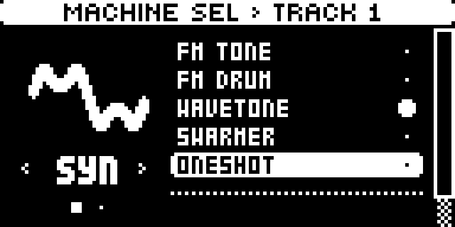
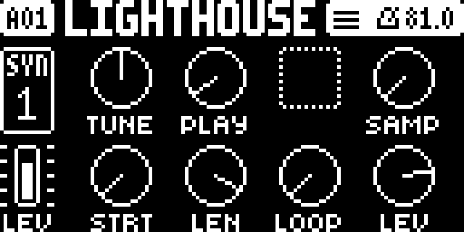
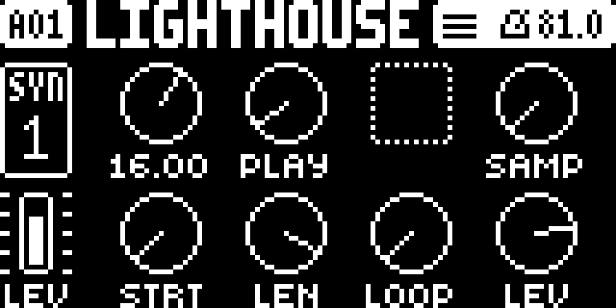
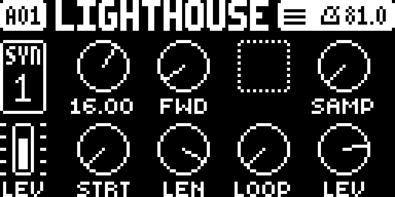
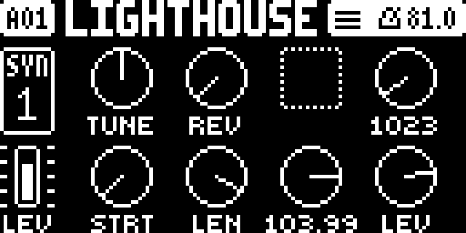

# Porting a DT2 machine to the DN2: measured, not estimated

**2026-09-25.** The question: ONESHOT is the simplest DT2 SRC machine and its
code is already in a firmware we hold, so what would porting it cost?

**Short answer: more than Waverider, not less.** The premise is true for 85% of
the image and false for exactly the part that is the machine.

## The two images are verified against digikit's own hashes

| image | section 7 blob SHA-256 | matches digikit |
|---|---|---|
| DN2 1.11 | `336e340a…3115e2` | yes |
| DT2 1.16 | `0f514a12…7fffa2` | yes |

So both databases below are built from bytes digikit have already indexed, and
their addresses can be cited directly.

## What ONESHOT is

Digitakt II manual OS 1.16, **A.2.1**, in our words: the default machine, playing
a sample linearly — forward, reversed or looped. Seven parameters on one page:

| | |
|---|---|
| `TUNE` | pitch, bipolar, ±5 octaves |
| `PLAY` | REVERSE, REVERSE LOOP, FORWARD LOOP, FORWARD |
| `SAMP` | sample select — **up to 1016 samples per project**, p-lockable (sample locks) |
| `STRT` | start position |
| `LEN` | length; start + length is the end point |
| `LOOP` | loop return point |
| `LEV` | level |

**It is a sample player.** That matters more than the parameter count.

## How much DT2 SHARC code already exists in the DN2 image

Both databases built with digikit's `sharcdb`, compared on `func_hash`
(`reloc_hash` is relocation-tolerant; `exact_hash` is byte-for-byte):

| | count |
|---|---|
| DT2 functions | 1,228 |
| DN2 functions | 1,157 |
| **DT2 functions with a relocation-tolerant twin in DN2** | **1,038 (85%)** |
| DT2 functions **byte-identical** in DN2 | 409 (33%) |
| DT2 instructions covered by a twin | 37,840 / 50,752 (75%) |

**85% shared looks like the port is nearly free. It is not**, because of *which*
15% is missing.

## The missing part is precisely the audio engine

The largest DT2 functions with **no** DN2 twin:

| DT2 `sw` | instrs | what digikit identify it as |
|---|---|---|
| `0x1c642a` | **1,464** | the per-slot dispatch — voices and effect stages |
| `0x1c2b24` | 766 | the per-track loop |
| `0x1c18a6` | 654 | — |
| `0x1c24e9` | 396 | the per-track unpack |
| `0x1c4f81` | 381 | inside the voice render |
| `0x1c207b` | 303 | the master |

And narrowing to what a machine actually needs:

- **the per-slot dispatch's reach set**: 40 functions, 28 with twins, but only
  **1,655 of 3,903 instructions (42%)** — and the missing 58% is dominated by
  the 1,464-instruction dispatch itself;
- **the voice render `0x1c4ecf`**: 84 instructions, **no DN2 twin**, and a leaf
  in the call graph.

So the 85% that transfers is the **infrastructure** — maths helpers, the
reciprocal/divide routine, the effect stages digikit already found byte-identical
across the two products. The **product-specific sample engine does not transfer
at all**, which is exactly what one would expect of a sampler and an FM synth.

**This is not a surprise so much as a correction**: "we already have the code"
is true of the platform and false of the machine.

## And the subsystem underneath it does not exist on the DN2

ONESHOT needs sample storage (1016 per project), a sample browser, sample locks
per step, and streaming from the `+Drive` into the voice at trigger time. The
DN2 has none of it as a user-facing sample path.

> **Superseded in part, 2026-09-26 (`docs/drive-storage-research.md` §4).**
> "Streaming from the `+Drive` into the voice at trigger time" is not how the
> DT2 works. It **preloads** a project's samples into a 400 MiB RAM pool
> (`0x19000000` at DT2 `0x40153814`) that sits on the SHARC side, and the voice
> reads RAM. The DN2 also has more than "none of it". The ColdFire end of the
> DT2's sample-page link (the `0x8c000000` port) is present and identical, and
> the +Drive has about 20.9 GiB the stock firmware never touches. The
> conclusion below is unchanged, because the SHARC engine is still the cost.

The owner's storage decision — **wavetables and samples both become `+Drive`
project data** — settles *where* this would live, and DNX is the format
authority for it. It does not reduce the amount of subsystem to build.

**And the owner's point, which this study under-weighted**: any DT2 machine
needs *extensive sample management tooling*, and **rerouting the whole UI to
handle it**. That is the part this page nearly costed at zero. The DN2's
interface has no sample browser, no `+Drive` file navigation, no sample
assignment screen and no sample-lock display — those are whole screens and
whole navigation paths, not a parameter page. Adding a parameter page is what
LFO4 proved we can do; adding a file browser to someone else's UI framework is a
different order of work, and it is on the critical path for **every** DT2
machine, not just ONESHOT.

Storage size is the lesser half of it. The greater half is that a sample bank is
**unbounded and user-managed** — 1016 arbitrary-length files that must be
listed, previewed, assigned, locked per step and persisted — where a wavetable
is **fixed geometry**, and a useful Waverider can ship with a handful of tables
at 8 KB each and grow later.

## Against Waverider, which is the comparison that was asked for

| | ONESHOT port | Waverider |
|---|---|---|
| DSP render code exists in a firmware we hold | **no twin in DN2** | no |
| the render itself | variable-length sample reader: start/length/loop, four play modes, per-voice streaming | fixed **2048-sample frames**, two readers, linear interpolation |
| storage | 1016 arbitrary-length samples | wavetables, fixed geometry |
| browser and locks | full sample browser, sample locks | slot list, slot locks |
| **runnable today** | no — needs a SHARC core | no — needs a SHARC core |

**A wavetable oscillator is strictly simpler than a sample player**: fixed frame
geometry, no variable length, no four play modes, no loop-point arithmetic. Both
are blocked on the same thing — nothing can execute SHARC code yet — but if that
blocker is cleared, Waverider is the smaller of the two engines *and* the one
whose data format we already parse.

## Conclusion

**Do Waverider first.** ONESHOT's apparent advantage — existing code — does not
survive measurement: the sample engine has no DN2 counterpart, and the sampler
subsystem beneath it would have to be built from nothing.

What this exercise did produce, and it is worth keeping:

- **85% of DT2's SHARC image has a twin in DN2, 33% byte-identical.** That is a
  large shared platform, and it means helper routines found in one image can be
  looked for in the other by hash rather than by reading.
- A working two-image comparison, reproducible in about 80 seconds.

## Status

**[D]** — static structural comparison only, single review. `func_hash` matching
is prioritisation evidence: collisions are possible, and two functions with the
same shape need not have the same semantics. No emulator run, no hardware.

## Revisited 2026-09-26: a ONESHOT-lite on Waverider's machinery

**Raised by the owner:** port ONESHOT as a way to test sample handling, apart
from Waverider.

**Corrected the same day, at the owner's challenge.** ~~The conclusion above
stands for a port: the DT2's sample engine has no DN2 twin, so this would be
our own player, not Elektron's moved across.~~ "No twin" means the DN2 does
not *already contain* the code, not that it cannot be moved. Both are SHARC+,
there is room, and the part a machine needs is small:
- the voice render `0x1c4ecf` is 84 instructions and a leaf;
- `0x1c4f81` beside it (381 instructions) already renders correctly in
  digikit's runner on DT2 1.16.

The large missing piece, the 1,464-instruction per-slot dispatch, is not needed:
Waverider's type-5 loop plays that role on the DN2. **So port first, and write
our own player only as the fallback.**

The conditions a port has to meet:
1. **No redistribution. Decided by the owner, 2026-09-26: the user supplies
   both firmwares.** The user uploads their DN2 1.11 OS and their DT2 OS, which
   Elektron publish for free. Our code extracts the routine from the DT2 file
   and transplants it into the DN2 image at apply time, in the CLI and in the
   browser, so no Elektron code is redistributed. This is the same pattern as
   `lfo4` rebuilding the parameter table from the user's own DN2 image.
   - What the repository holds for a transplant: only our own work (offsets,
     the donor's version and hash guards, relocation tables, adapter code).
     **Never a DT2 byte**, in code, SPEC JSON, tests or fixtures; tests that
     need the donor skip without it.
   - A transplant mod takes a second input image and refuses a donor whose
     version or hash it was not measured against.
2. **An adapter.** The routine expects the DT2's voice record (32 × `0x1d8` at
   `0x2412cc`) and absolute addresses for its tables and sample pool. That
   means a DT2-shaped record per type-5 track, filled from the DN2 frame, and
   relocated addresses.
3. **Samples in DSP memory.** This is Waverider's table-delivery problem, which
   M4 solved: bake a small bank into section 7 behind a directory.

**The offline experiment that settles it:**
- lift `0x1c4ecf`'s reach set into the DN2 image in the runner;
- drive it from the type-5 loop with a DT2-shaped record and a baked sample;
- compare it with digikit's runner executing the same routine on the DT2
  image, which is the control.

**In progress, 2026-09-26:** the offline port experiment runs on
`feature/oneshot-port`, under the two-firmware rule above. Its results will be
added here when it reports. **[D]** until then.

**What has changed since** is that most of a player's infrastructure now exists
or is being built for Waverider (`docs/waverider-feasibility.md`):
- the SHARC runner gate, and a reader of our own bit-exact to a reference (M1);
- a sixth machine type and its render loop (M3);
- the frame parameters and the per-track chain (M4);
- tables baked into section 7 behind a directory (M4);
- the first flash of modified SHARC code (M5, in progress).

**If the port fails, the fallback is a ONESHOT-lite of our own:**
- a small **baked sample bank** in section 7, as Waverider bakes tables and
  `transients` replaces the drum bank, with no browser;
- `SAMP` as a slot index, like Waverider's SLOT;
- a one-shot reader with `STRT`, `LEN`, `LOOP` and the four `PLAY` modes.

It tests the sample path end to end, but not the library: the unbounded,
user-managed bank on the `+Drive` and the browser the DN2 UI lacks stay the
expensive half (`docs/drive-storage-research.md`).

**Order:** after Waverider M5 has run modified SHARC code on the instrument.
Until then both carry the same first-flash risk. **[D]**, not started.

## The experiment, run (2026-09-26): the port works, offline

**Done, offline.** The DT2 1.16 ONESHOT render was extracted from the user's own
DT2 file, relocated into the DN2 1.11 image, and run in digikit's SHARC runner.
It is **bit-identical to the DT2 control** for all four play modes, and an
adapter of our own drives it inside the DN2's own per-block routine, audible at
the amp. Gate: `scripts/sharc_oneshot_port.py` (`6f812e9`, CPython 3.13), every
check PASS. Nothing is flashed; no .syx and no DT2 byte is written to the repo.

### What the routine is [E]

`sw 0x1c4ecf` (84 instructions) is the entry: it saves registers, and when the
voice record's sample pointer (word 0) or ACTIVE byte (`+0x1b8`) is zero it
zero-fills the output and returns. Otherwise it falls into `sw 0x1c4f81` (381
instructions), **a variable-length sample player**: 64 points at 96 kHz, a
6-tap 256-phase polyphase interpolation of int16 PCM, forward or reverse, with a
loop and a one-shot end, and declick ramps; it then calls a 2:1 decimator to 32
outputs. Confirmed by running: with a start/length/loop/step record and a known
sample it reads PCM in order, wraps at the loop, plays backwards on a negative
step, and clears ACTIVE at the end of a one-shot. So it is exactly the machine
the manual (A.2.1) describes: TUNE, PLAY (the four modes), STRT, LEN, LOOP.

### The reach set, and its size [E]

Closed under calls (digikit's `sharcdb` edges), **4 functions, 611
instructions**, none with a DN2 twin (as the 2026-09-25 study found):

| donor `sw` | instrs | window | what |
|---|---|---|---|
| `0x1c4ecf`+`0x1c4f81` | 84 + 381 | L1 | entry + the reader (one routine, moved as one span) |
| `0x1c06ba` | 47 | L1 | a float reciprocal/divide helper (the declick ramps) |
| `0xb80000` | 99 | L2 | the 2:1 decimating filter |

Plus the two data tables it reads at absolute addresses: the polyphase
coefficients (`0x25d940`, 256×6 Q31 words, 6,144 bytes) and the decimator's four
coefficients (`0x26ef88`, 16 bytes). Everything else is relative to the record
pointer (R4), the output pointer (R8) or the stack. **Ten relocation sites** in
all: two `data32` loads of the coefficient base, two `rel24` calls to the
divide helper, one `addr24` call to the decimator, its pushed return address,
and four `addr32` loads of the decimator coefficients. `src/dnfw/transplant/`
holds these as addresses, sizes, SHA-256 digests and the relocations — never a
donor byte.

### The control and the transplant [E]

digikit's runner executes the routine on the DT2 image (from its own engine
init, a hand-armed voice, an original test sample in the pool) — the control —
and, relocated, inside the DN2 image, called the same way. Per mode, the DN2
transplant is **bit-identical** to the DT2 control over the rendered blocks:

| mode | bit-identical | peak | instr/block |
|---|---|---|---|
| FORWARD | **yes** (0 differing bytes) | 0.358 | 3,611 |
| REVERSE | **yes** | 0.039 | 3,805 |
| FORWARD LOOP | **yes** | 0.358 | 3,611 |
| REVERSE LOOP | **yes** | 0.039 | 3,805 |

Controls: reverse starts quiet where forward is loud (the chirp's decayed tail
played backwards), and a triggered all-zero sample renders **exact** zero. The
relocations are the only difference between the two, and the output is identical
to the last bit — which is the strongest evidence the transplant is faithful.

### The adapter, end to end [E]

`csrc/oneshot/sharc/oneshot5.asm` (our own, selas-assembled, loaded at `sw
0x181000`) is a sixth per-type render loop, machine type 5, in the shape of
Waverider's. On a note trigger it builds a **DT2-shaped voice record** for the
track from six frame parameters (TUNE, PLAY, SAMP, STRT, LEN, LOOP), resolves
SAMP through a sample bank baked into section 7 behind an `OSB1` directory
(M4's mechanism), and calls the transplanted render with R4/R8/R12 as the
donor's own dispatch does. Driving the DN2's own per-block routine `sw
0x1c2712` with a type-5 frame and a trigger:

- the record the adapter builds matches `dnfw.oneshot.params` word for word;
- the type-5 track renders **bit-identical to the DT2 control** into its buffer;
- it passes the per-track chain and is **audible at the amp output** (peak
  0.049, ~-26 dBFS, the chain's own ~-20 dB headroom);
- a triggered all-zero sample is exact silence at the render.

`src/dnfw/oneshot/build.py` splices the transplant, the adapter, the bank and
the step table into DN2 section 7 with the type-5 patches (the clamp
`min(R2,4)→5` and lookup `[5]=5`, as M3/M4), rebuilds through `dnfw`, and the
image passes **all 21 verify checks in memory**. No .syx is written.

### The WAVs

All 2.5 s, 48 kHz, 16-bit mono, in `out/oneshot/` (looped renders say so; the
runner renders a few blocks, so each looped file is those blocks repeated and
cannot show change over time — the numbers above measure that, and a PREVIEW
plays the sample itself over the whole file):

| file | what it is |
|---|---|
| `oneshot_{forward,reverse,forward_loop,reverse_loop}_transplant.wav` | **the key deliverable**: the transplanted render inside the DN2 image, per mode; bit-identical to the control (LOOPED) |
| `oneshot_{...}_control.wav` | the DT2 control: the same routine on the DT2 image (LOOPED) |
| `oneshot_{...}_preview.wav` | PREVIEW (not the runner): the test sample itself, forward/reversed, over the whole file |
| `oneshot_adapter_machine.wav` | a type-5 track's buffer after the adapter drove the render; bit-exact to the control (LOOPED) |
| `oneshot_adapter_amp.wav` | the same voice at the amp output, end of the per-track chain; audible (LOOPED) |
| `oneshot_adapter_silent.wav` | a triggered all-zero sample: the render is exact silence (the amp's note-on click remains) |
| `oneshot_no_sample.wav` | a null-pointer record: silent (the runner cannot execute the zero-fill loop's count, so it is recorded, not a render) |

### The one blocker left, and what is unverified

- **A note trigger on a type-5 track that was idle the previous block** hits the
  firmware's per-type voice **setup** dispatch (`0x8052db90[type]` at
  `0x1c91ad`), which has five entries: `0x8052db90[5]` reads past it and the
  jump lands at 0. When the voice is triggered on the block it is dispatched,
  the note-on branch (`0x1c9104`) skips that setup and everything runs. So the
  end-to-end above **triggers on the first block**. A real type-5 machine needs
  a **sixth setup-table entry** — the same class of image patch as the clamp and
  lookup, and M4's already-recorded `[O]` ("type 5's per-type setup entry"). It
  is on the critical path for Waverider too, not only ONESHOT.

  > **Corrected 2026-09-27 ("The ColdFire half", below).** Not the setup table:
  > Waverider M5 measured that the dispatch bounds the type with `compu(type, 5)`
  > before it indexes `0x8052db90`, so type 5 takes MIDI's no-setup arm. Re-run
  > with the clamp left stock, the idle-then-trigger case still halted at PC 0 --
  > inside the render's own zero-fill arm for an idle record (word 0 = 0), which
  > the adapter handed it on every idle block. The adapter now writes an idle
  > voice's 32 zeros itself and calls the render only for an armed record, and
  > the case passes.
- **Silicon.** Nothing has run on a DSP; the runner uses G1–G11 (three inferred,
  not cited from the PRM). The DT2 render itself runs with **no** new runner
  workaround — it decodes and executes on digikit's runner as is.
- **The ColdFire side.** The frame here is built from parameter defaults with
  hand-set machine params; a real ColdFire never sets a machine type of 5 or a
  SAMP parameter, and there is no UI to do so.
- **The sample bank is tiny and baked**; the unbounded, user-managed `+Drive`
  library and the browser the DN2 UI lacks remain the expensive, untouched half
  (`docs/drive-storage-research.md`).

### Which bytes are whose

Committed: `src/dnfw/transplant/` (the spec — offsets, sizes, SHA-256 digests,
relocation-site values, all of our own choosing) and `src/dnfw/oneshot/` +
`csrc/oneshot/` (our adapter, record math, bank format, and original test
samples). The DT2 render, divide helper, decimator and coefficient tables are
**extracted from the user's DT2 1.16 file at apply time and relocated in
memory**; none of their bytes is in the repository. The plan refuses a wrong
device, a wrong OS version or a wrong section-7 hash on either image (three
negative controls, all PASS).

**[E]**, offline only. Gate: `scripts/sharc_oneshot_port.py`, all steps PASS.

## The ColdFire half (2026-09-27): the DT2's page, drawn by the DN2

**The question:** what does the Digitakt II's ColdFire do for a ONESHOT track,
how much of it can be moved into the Digitone II as it is, and what is the least
plumbing that makes a DN2 track *be* ONESHOT? **The answer:** the page moves --
its records, its formatters and its knob list are all data or code the DN2
already has -- and the page *class* does not, because it is wired to the DT2's
sample subsystem. The DN2's own page class draws the DT2's page instead.

Grades: **[V]** verified on the instrument, **[E]** measured in an emulator,
**[D]** read statically once, **[O]** open.

### The DT2 1.16 ColdFire side of ONESHOT

| piece | DT2 1.16 | notes |
|---|---|---|
| machine list | display names `0x4020eb68`, 12-byte rows `{long, short, hint}`, row 0 is ONESHOT; accessor `0x400da548` (`moveq #6`) | the digikit 1.15C finding (`0x400caf48`, 7 types) re-anchored: 1.16 has the same seven machines [D] |
| its page | a 44-byte descriptor `{title, subtitle, 8 entries, tag 10}`, array in BSS at `0x4293b960` (7 rows, `0x400c8840(type)`), row 0 written by the unrolled initializer at `0x401c47ca`: entries **202, 203, 0, 205, 206, 207, 208, 209** | the **same struct** the DN2 uses for its SYN pages (`0x42432ad4[type]`, measured live: WaveTone's first is `{"DN VA 1", "WaveTone", 238..245, 10}`) [E] |
| its records | the parameter table at `0x4020f1c8`, 274 records, 60 bytes, the DN2's layout field for field; ONESHOT is page 0, entries 200..209: SLOT, BANK, TUNE, PLAY, CFADE, SAMP, STRT, LEN, LOOP, LEV | the page shows seven: A TUNE, B PLAY, C empty, D SAMP, E STRT, F LEN, G LOOP, H LEV. CFADE (new in 1.16) has a record and no knob; SLOT and BANK serve the sample browser [D] |
| its page class | `SourcePageView` (RTTI), derived from `MachineParameterPageView`, 60-slot vtable at `0x401ed880`, 17 of them its own | the DN2's `MultiSourcePageView` is its sibling: same base, same vtable size [D] |
| the frame | the DT2's builder (`0x4002eae4`) copies each track's slots 25..34 as one 20-byte block to frame `+218 + 96 t` (2,050-byte frame at `0x80005348`), machine type at `+148 + 2 t` | the DN2 does the same with slots 25..65 into 146-byte track slots: the ONESHOT values ride the same slot numbers on both [D] |
| SAMP | a raw index 0..1023 (range `0x3ff`, formatter `%d` of the value itself, not `>> 8`) | chosen through `SourcePageView`'s key handler (vtable slots 2 and 17), which builds a `SampleListView` [D] |

The record's formatter is at `+0x34`: `dnfw params` counts records from 8 bytes
before the page-id word, so its `w0` column is the *previous* record's
formatter. Read that way, every ONESHOT formatter has a meaning that fits its
parameter: TUNE the bipolar decimal (`+16.00`), PLAY an enum (`REV`, `REV.L`,
`FWD.L`, `FWD`), SAMP `%d` of the raw value, STRT/LEN a decimal, LOOP `OFF` or a
decimal of `value - 1`.

### What can move, and what cannot

**The two UI frameworks are one framework** [D]: of the DT2's 989 C++ classes,
884 exist in the DN2 with the same names, the same base chains, and -- for all
but three (`AbstractValue`'s template family, `DataChangeInfo`,
`SoundSlicesChangedInfo`) -- the same vtable sizes (digikit's `rttiscan` over
both images). The DT2-only classes are the sampler's (`SamplePicker`,
`SampleManager`, `SampleListView`, `SampleFSSelectView`,
`SampleBrowserPopupMenuView`, `SourcePageView`, the slice editors,
`FsRequestHandler::FileWriter`, `Recorder`, ...); the DN2-only ones are its voice,
chord and arp views. A shape-hash map of every function (mnemonics with operands
dropped) finds a DN2 twin for 90% of the DT2's 14,432 function entries, and a
DT2 -> DN2 absolute-address map voted from 9,110 twin pairs (the DT2's display
object `0x44d2e70c` -> `0x44507ef8`, 143 of 143 votes).

| piece | verdict | evidence |
|---|---|---|
| the eight records | **transplantable with relocation** [E] | same 60-byte layout. Relocated at apply time: page id `0` -> `1`, CC and NRPN cleared, the ordinal kept from the dead record they replace, the three name pointers to copies of the donor's strings, the formatter to its DN2 twin, the unit suffix to the DN2's own empty string |
| the six value formatters | **transplantable as they are: the DN2 already has them** [E] | each checked at apply time byte for byte outside its string and call operands: `0x400e1424 -> 0x400e2ecc`, `0x400e144e -> 0x400e2ef6`, `0x400e1618 -> 0x400e30c0`, `0x400e16ca -> 0x400e3172`, `0x400e1728 -> 0x400e31d0`, `0x400e21a6 -> 0x400e3c4e`. The PLAY formatter's DN2 twin is dead code there -- no DN2 record points at it, and its `REV`/`FWD.L` strings are in the image |
| the page descriptor | **transplantable as data** [E] | the same struct; its entries renumbered to the recipient's |
| the machine name | **as data** [E] | the donor's `Oneshot` / `ONE`, copied |
| `SourcePageView` | **not now: coupled to the DT2's sample subsystem** [D] | 17 own methods reach 59 functions / 3,703 instructions with no DN2 twin, besides 99 calls to functions that have one. The coupling is concrete: slots 2 and 17 construct a `SampleListView` (the browser, `0x401ee52c`) and draw `NO SAMPLE ASSIGNED`; slots 11 and 17 read the sample pool's tables `0x405ba368` / `0x405ba768` through `0x401537b8` / `0x401537d0`; slot 11 animates a play position from the DSP's reply block (`0x80001000 + 2 (0x54e + t)`, through `0x400cd726` / `0x400cd764`); four page statics live at `0x40965b8c..0x40965bf0` |
| the browser and the pool | **not transplantable**: DT2-only classes all the way down (`SampleManager`, the FS request handler, the pool directory) | the RTTI diff above |

**The cheapest alternative, and the one taken:** move the records, the
formatters and the descriptor, and let the DN2's own `MultiSourcePageView` draw
them. Nothing of the page is our code; the plumbing is.

**Appending the records failed first, and why is worth keeping** [E]. As LFO4
does, the table was copied into RAM with the eight records after the stock 320
(entries 321..328). A machine change then loaded `0xffff` into every ONESHOT slot
and drawing the page faulted (an illegal-instruction exception through a knob
object `0x40041a40` returned). The runtime companion table (`0x4243325c`, 68 bytes
an entry, 321 entries, unrolled initializer) cannot grow, so entries past 320
clamp to entry 0 there. LFO4 gets away with it because its values have storage
of their own. The records now take the places of eight dead `Error` records
(entries 1-5 and 11-13: no page, no slot, range 0, name `ERR`); a read watch over
them through a stock UI session (pages, turns, MACHINE SEL, trigs) saw no reader
[E, one session]. Entries 17 and 18 are dead too but carry a range; left alone.

### The plumbing (type 5, exclusive with Waverider for now)

`dnfw.oneshot.coldfire`, at Waverider M5's sites (`docs/machine-list.md` on
`feature/waverider-m5`), answered for ONESHOT:

| # | site | edit |
|---|---|---|
| 1 | MACHINE SEL list `0x401ddd58`, group `0x40059274` | `{0, 2, 1, 3, 5, 4}`; 5 joins the synths |
| 2 | name accessors `0x400dc332/358/37e` | a six-row table, row 5 the DT2's own names |
| 3 | attribute rows `0x401f7930`, permission test `0x400dc19a` | a sixth row, WaveTone's (all tracks) |
| 4 | stored-sound LOAD `0x400dd286` | keeps -1..5 |
| 5 | `param_set_slot_to_id` `0x400dc02a` | type 5, slots 25..64 -> ONESHOT's map (slot -> entry) |
| 6 | SYN overview / count / page `0x400c248e`, `0x400c24d2`, `0x400c24ee` | type 5: one page, the DT2 descriptor |
| 7 | parameter ownership `0x40036c24` | type 5 owns page-1 records (the records say page 1, which the DN2 reads as "a machine parameter", page <= 4) |
| 8 | eight dead records | the DT2's |

The shims, the tables, the strings and two static COW string reps (refcount -1)
are one 2.5 KB CODE chunk at `0x46900000`, which the startup loader copies out
before the BSS clear (`dnfw.patch.loader`, proven by LFO4). `getMachineType` is
**not** canonicalised, unlike Waverider's: the DN2's page view and knob objects
work for type 5 as they stand once the records are in-table [E].

### The frame, field by field [E]

| DT2 record | slot | frame byte in the track slot | the ColdFire sends | the adapter reads |
|---|---|---|---|---|
| TUNE | 25 | +0 | half the value | `frame >> 7`, 64 = the sample's pitch |
| PLAY | 26 | +2 | half | `frame >> 7`: 0 REV, 1 REV.L, 2 FWD.L, 3 FWD |
| SAMP | 28 | +6 | half, **the lowest bit lost** | the frame word: bank slot = SAMP / 2, rounded |
| STRT | 31 | +12 | half | `2 f * len / 30720` (0x7800 = 120.00 = the end) |
| LEN | 32 | +14 | half | the same |
| LOOP | 33 | +16 | half | 0 = OFF (loop from STRT); else `(2 f - 1) * len / 30720` |
| (type) | header `+148 + 2 t` | | **5** for the ONESHOT track, 1 for the others | the lookup `0x25d748[5] = 5` |

The halving is Waverider M5's finding (the builder copies the modulated mirror,
which holds half of each value, rounded up: `0x6117 -> 0x308c`), and this port's
own frames show it too: `0xffff -> 0x8000`, `0x2d00 -> 0x1680`, `0x5a00 -> 0x2d00`.
#133's first adapter read slots 25..30 coarse with `bit 0 reverse, bit 1 loop`,
right for its hand-made frames and wrong for the DT2's records on three counts
(slot numbers, PLAY's order, the halving); `oneshot5.asm` and
`dnfw.oneshot.params` now follow the table above.

**SAMP's lowest bit does not reach the DSP** [E]. A one-sample bank does not care;
a bank of many needs SAMP sent whole -- a ColdFire shim on the mirror copy for
slot 28, or reading it from the sound instead of the mirror [O].

### SAMP without a browser [E]

The DT2's SAMP record and formatter move as they are: on the DN2 it is a plain
knob, 0..1023, drawn `%d` of the raw value (`1023` in the screenshot below). The
browser is not bypassed so much as never reached: the DN2's page view has no key
handler that opens one. For a small baked bank that is enough: SAMP picks a slot
(SAMP / 2, rounded; a slot past the bank's count plays slot 0).

### The prototype, in the ColdFire emulator [E]

`scripts/emu_oneshot_page.py` (digikit-up `9007c2a`): the build installed over
`boot400M` as the startup loader would leave memory (its changed runs and the
CODE chunk at its load address) by digikit's `guirun --patch-ranges`, run to the
UI and saved; the drive run restores that.

| | |
|---|---|
|  | MACHINE SEL offers ONESHOT after SWARMER |
|  | after YES and NO: the DT2's page, drawn by the DN2 -- TUNE, PLAY, (C empty), SAMP / STRT, LEN, LOOP, LEV |
|  | push-and-turn A: the DT2's bipolar formatter, `16.00`; the sound's slot 25 went `0x4000 -> 0x5000` |
|  | push B: the DT2's enum formatter, `FWD` (the default, 3) |
|  | after turns: PLAY `REV` (0), SAMP `1023` (raw `0x3ff`), LOOP `103.99` (`0x6800 - 1` in 8.8) |

- the machine setter wrote type 5 at `sound+0xDE`; a machine change loaded the
  DT2's own defaults: TUNE `0x4000`, PLAY `0x300`, SAMP 0, STRT 0, LEN `0x7800`,
  LOOP 0, LEV `0x6400`;
- every knob edits its slot (turned: slots 25, 26, 28, 31, 32, 33, 34); PLAY,
  SAMP and LOOP need many detents, as the DN2 scales a turn by the range;
- the frame the builder built carries type 5 at `+148` for track 0 and 1 for the
  others; its slot words were not re-read after the turns (below).
- **controls**: the WaveTone SYN page of the build, before ONESHOT is chosen, is
  byte-identical to stock `ui1200M`'s render (same PNG digest); in stock, the
  same menu steps close MACHINE SEL and draw normally; the other fifteen tracks
  keep their types.

**Not re-measured here:** the mirror refresh the builder copies from. Entering
`0x4002549c` (track sync) or `0x40025af4` (kit sync) as a guest call faulted in
this harness -- in the stock control as well, so it is the harness, not the
build -- and the builder therefore copied a mirror the turns had not refreshed.
That slot values reach the frame at half is M5's measurement on the same builder.

### The first build

`dnfw mods apply <DN2 1.11> --mod oneshot --donor <DT2 1.16 .syx> --sample <WAV>`,
or `scripts/build_oneshot.py --sample <WAV>` (which also writes the sections and a
report for the gates). Both OS files are the user's; the render, its tables, the
records, their strings and the page's knob list are read from the donor at apply
time, each behind a SHA-256.

DSP side, corrected for the silicon (Waverider M5's corrections):

- everything in **L1 block 2** above M5's spans: the render at sw `0x185000`, the
  divider `0x185480`, the decimator `0x185500`, the adapter `0x185800`; data at
  DM `0x30c000..0x31c000` (#133's DM `0x29xxxx` was the gap between blocks 0 and 1);
- the entry is the image's own `JUMP 0x185800` at sw `0x1c9448`; the clamp at
  `0x1c294c` stays stock; the lookup `[5] = 5`;
- the bank: one sample, 48 kHz mono after conversion, **at most 0.49 s** (47 KB
  of block 2).

**The gates** (2026-09-27):

| gate | result |
|---|---|
| SHARC runner, `scripts/sharc_oneshot_port.py --sample <the bass drum>` (digikit `6f812e9`) | **PASS on every step.** The render relocated into block 2 is bit-identical to the DT2 control in all four play modes; the image's own JUMP enters the adapter on 8/8 blocks; a trigger after two idle blocks renders, silent before it and bit-identical to the DT2 control from the trigger on (#133's blocker, gone); the adapter's record equals `dnfw.oneshot.params`; machine tap bit-exact to the DT2 control (peak 0.358), audible at the amp (peak 0.049); a triggered all-zero sample is exact zero at the machine tap |
| ... the user's sample (`28-bda02.wav`, 44.1 kHz -> 48 kHz, 0.314 s), 16 blocks | machine tap **bit-identical to the DT2 render of the same sample** (peak 0.344), amp out peak 0.045; idle-then-trigger bit-exact too |
| ... stock control | WaveTone on track 0 through the stock image and through the ONESHOT image: its buffer (peak 1.0) and the amp output **bit-identical** |
| ... section 7 | 880,136 B, rebuilds and passes all 21 `dnfw` verify checks |
| ColdFire, `scripts/emu_boot_check.py` from **reset** (the loader copying the CODE chunk) | **booted and drew its UI**: 1 frame in 450 M instructions (control: stock, 1 frame in 620.5 M) |
| ColdFire, `scripts/emu_oneshot_page.py` | above; the gated MAIN OS is byte-identical to the one in the image |
| image | `00_Resources/02_Builds/oneshot_DN2_1.11.syx`, 2,431,136 B, sha256 `698a3279...9473f29a`; `dnfw inspect`: 21 of 21, HMAC reproduced |
| tests | 351 passed, 9 skipped (`test_transplant_coldfire.py`, `test_oneshot.py` among them) |

WAVs (`out/oneshot/`, 2.5 s, 48 kHz; the runner renders a few blocks, so a looped
file repeats them and a PREVIEW plays the sample itself): `oneshot_user_machine.wav`
(the bass drum through the adapter and the DT2 render), `oneshot_user_amp.wav`,
`oneshot_user_preview.wav`, and the chirp set from #133
(`oneshot_{forward,reverse,...}_{control,transplant}.wav`, `oneshot_adapter_*.wav`).

The gate bakes the user's sample beside a silent slot (its silence control needs
one); the image bakes the sample alone. The two banks differ in count and length,
nowhere else.

### What a flashable ONESHOT needs, in order

1. **This build** (type 5, one sample, exclusive with Waverider): ColdFire and
   SHARC gates as above. **Hardware test below.** [E]
2. **After Waverider M5 lands** (its ceiling and rows; do not merge them twice):
   move ONESHOT to **type 6**: a seventh name row, attribute row and list entry
   (`{0, 2, 1, 3, 5, 6, 4}`), LOAD bound `#8`, the slot map, SYN page and
   ownership shims keyed on 6, the DSP lookup `[6] = 6`, and the entry chained
   after M5's loop (M5 jumps back to `0x1c944c`; ONESHOT's adapter would take
   over that jump and return there itself). Block 2 is already split between
   them. [D]
3. **SAMP whole** to the DSP (above), then a bank of several samples. [O]
4. **The two-file input on the web**: a `site/oneshot.html` that takes the DN2 and
   DT2 files and a WAV and runs the same plan in JS (`dnfw.transplant` ported,
   the committed JSON of the shims and the adapter). No DT2 byte goes to the
   site: the user's browser reads both files. [O]
5. **The pool and the browser**: the +Drive, a sample manager, and a page class
   of our own or `SourcePageView` with its pool and DSP-feedback reads adapted. [O]

### The first flash: the hardware test

Prepare: the stock `Digitone_II_OS1.11.syx` to hand and the recovery route in
`docs/flashing.md` proven on this unit (Early Start-up Menu -> recovery, a
class-compliant USB-MIDI link). Save any project worth keeping.

| # | do | pass | fail -> |
|---|---|---|---|
| 1 | flash `00_Resources/02_Builds/oneshot_DN2_1.11.syx` | the device reboots to the usual screen | EXCEPTION or a hang: **recovery** with stock 1.11 |
| 2 | play a stock project (FM Tone / WaveTone tracks) | sounds as before | a stock machine silent or changed: stop, report, recovery |
| 3 | track 1: FUNC + SYN, move to ONESHOT (after SWARMER), YES, then NO | the SYN page shows TUNE PLAY (gap) SAMP / STRT LEN LOOP LEV | an empty or ERR page: report the screen |
| 4 | trig track 1 | the baked sample plays once (a bass drum in this build) | silence: note the page values; a crash or noise: power off, recovery |
| 5 | TUNE +12 (push and turn A) | an octave up | |
| 6 | PLAY to REV (B, many detents) | the sample backwards | |
| 7 | PLAY to FWD.L, LEN shorter, LOOP 60.00 | it loops the second half | |
| 8 | other tracks trig while track 1 plays | no glitches, no silence | |
| 9 | SAVE PROJECT, power-cycle, reload | track 1 is still ONESHOT with its values | it loads as FM Tone: the LOAD bound; report |

A fault at step 1 or 4 points first at the unproven parts: L1 block 2 at run time,
the DSP code's instruction forms, the CODE chunk's RAM.

### What is unverified

- **Silicon**, both processors. Nothing here has run on either.
- **L1 block 2 at run time** (free by every static test, M5's reading) and the
  SHARC instruction forms the adapter adds (the idle zero-fill's 32 stores are
  Type 15b, the firmware's own).
- **The dead entries 1-5 and 11-13** are unread in one UI session; a session is not
  every path (MIDI, SysEx parameter dumps, copy/paste of a track were not tried).
- **The frame's slot words after a turn** (the harness's mirror refresh above).
- **Save and load of a type-5 sound**: the LOAD bound is M5's measured edit; this
  build's round trip was not run.
- **LOOP = OFF** is our reading (loop from STRT); the DT2's DSP-side mapping of its
  frame was not transplanted.
- **Pitch**: TUNE's coarse semitones only; the fine byte is dropped at `>> 7`.

**Which bytes are whose, again:** committed are our adapter, shims, bank format,
the plan (addresses, sizes, SHA-256 digests -- the donor's strings are checked by
digest, never held -- and relocation values) and original test samples. The user's
sample is read at build time and exists only in the image built from it.
