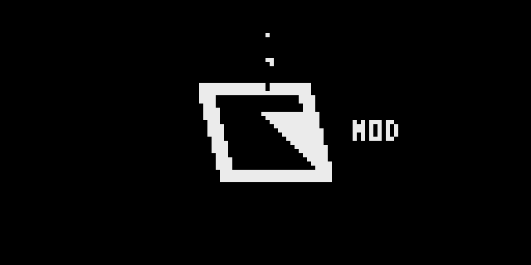
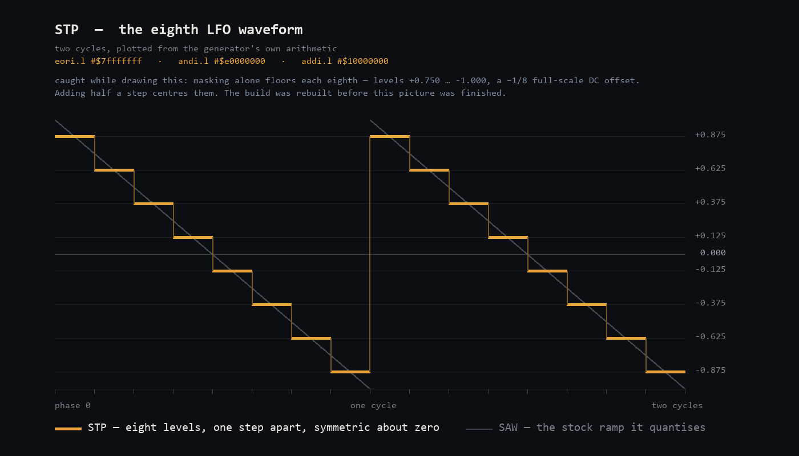
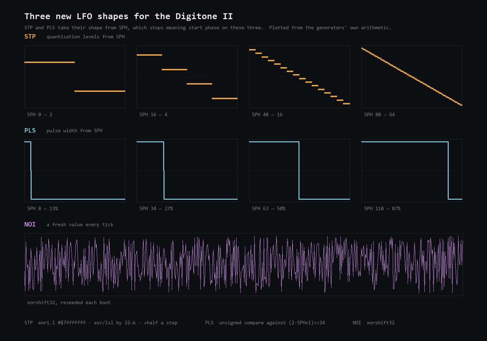
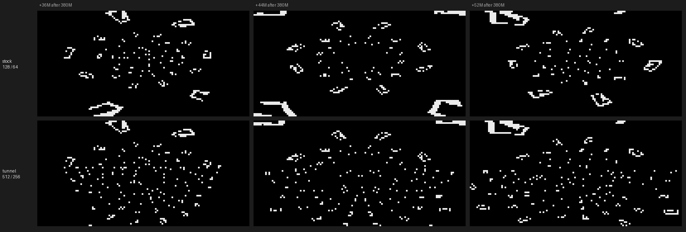
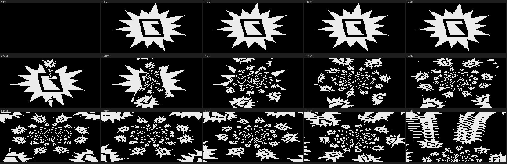
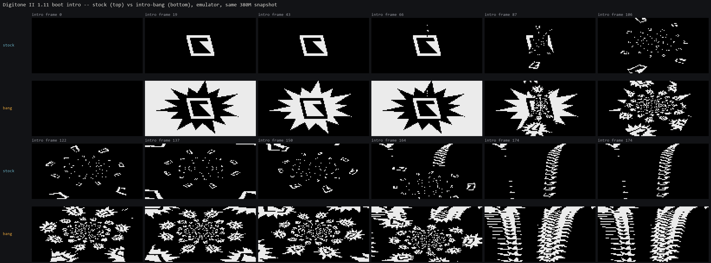

# Ideas parked for later

Deliberately kept rather than discarded — a path that is closed *today* is still
a signal, and several of these become the obvious move once the fourth LFO is
done or once we start on the DN1. Each entry says what it is, what it would buy,
and what would have to be true for it to work.

Nothing here is scheduled. The active work is `docs/lfo4-feasibility.md`.

---

## 1. Reclaiming space by removing a feature

**The idea.** 1.11 added a whole container section (id 8, ~160 KB) for the
Outbox. If Elektron can add a section, could we delete one we do not use — the
Outbox — and spend the space on a fourth LFO? And more generally: is "sacrifice a
feature for room" a strategy?

**Why deleting section 8 does not buy what we need.** The ELE3 container's
sections are not all mapped into the CPU's address space. MAIN OS (id 3) loads
at `0x40000400` and executes there; section 8's `dest` is `0x00000000`, like
`blob` and `meta` — flash-resident **data** the OS reads, not code at a virtual
address. A fourth LFO's parameter records, page-view and hook stubs must live
**inside section 3's virtual address range**. Removing section 8 frees flash and
file size and adds **nothing** to that range. It also risks a boot fault: 1.11's
MAIN OS contains the Outbox code, and if anything loads that section at startup
(not only when hardware is attached), deleting it breaks the boot for no gain.

**The variant that does pay off: repurpose dead code inside section 3.** Pick a
feature whose *code* we are willing to sacrifice, prove nothing reaches it, and
its bytes become one large contiguous cave at a usable address — exactly "remove
a feature for room", aimed where room actually exists. What must be true:

- the region is genuinely dead (established by cross-reference analysis, not
  assumption), or its call sites are neutered / its entry made to return;
- we accept that every future diff against stock is harder to read.

**When to spend it.** Not yet. ~29 KB of padding in ~1 KB runs (1.11) is
probably enough for hook stubs plus a page-view. **Size the requirement first**
and only sacrifice a feature if the measurement says we must. This becomes much
more likely on the **DN1**, whose image is smaller and whose padding is
scarcer — which is where this strategy earns its keep.

> ### ⚠️ "~29 KB of padding in ~1 KB runs" is wrong. Corrected 2026-09-13.
>
> Those runs are **not padding**. Sixteen of them sit at a regular 0x40C stride
> from `0x40287ef6`, each 1,035 zero bytes followed by one `0xff` — a
> **16-element array of 1,036-byte records**, shipped zeroed and **written at
> runtime**. Sixteen is this machine's track and voice count.
>
> `dnfw cave scan` offered them because the bytes are zero, exactly as
> `docs/memory-map.md` warns it will: *a zero run is a candidate, not a
> blessing.* Caves were placed there anyway, the firmware overwrote them while
> the keyboard was played, and the device took an **address error with
> PC `0x40000042`** — a jump into what had been code and was now data
> (`docs/flashing.md`).
>
> So the free-space budget for hooks is **unmeasured**, not 29 KB, and a regular
> stride is positive evidence *against* a run being padding. The boot proof's
> cave at `0x4028ea02` is outside this array and has run without incident.

**Related, and also unresolved:** growing section 3 itself. Freed flash could in
principle let MAIN OS extend past its end (`0x4030b980` on 1.11), but that needs
the device's flash layout confirmed and the boundary above the loaded image
pinned, so new bytes cannot collide with anything. See `docs/memory-map.md`.

### 1a. The better half of the idea: **add** a section, do not delete one

*Raised by the owner 2026-09-13, from the Outbox observation above.*

This entry asked *"if Elektron can add a section, could we delete one?"* and
answered no. It never asked the other question, and that one is much better:

> **If Elektron can add a section, can we?**

Section 8 is the existence proof, and it is a strong one. In a single release
Elektron added a **new section id**, carrying a payload the ColdFire never
executes, at a `dest` of its own choosing, and the device accepts it. Nothing
about that mechanism is Outbox-specific.

**Why this is the right shape for LFO4.** Every cave problem this project has
had comes from *squatting*: finding bytes that look unused inside a section
built for something else, and being wrong about them — the `0x40287ef6` array
above being the expensive case. A section of our own has none of that. We choose
the `dest`, we know the length, and nothing else in the image claims it. No zero-
run hunting, no stride heuristics, no guessing whether a gap is real.

It also composes with the 25 MB above the BSS end (`docs/lfo4-slot-plan.md`):
that region is unclaimed but full of power-on garbage, so anything living there
must be initialised by our own code. A section with a `dest` **is** the
initialiser — the loader writes it before the OS runs, which is precisely the
service the extension array needs.

**What must be true, in order of how likely it is to kill the idea:**

1. **The updater accepts an unknown section id** rather than rejecting the
   image or faulting. This is the gate. Section 8 shows *Elektron's* new ids are
   accepted by the 1.11 updater — it does not show an id nobody has shipped is.
2. **The loader honours an arbitrary `dest`**, and writes it where we ask.
3. **Integrity survives.** The content checksum and the HMAC-SHA256 trailer are
   both ours to recompute (`docs/ele3-format.md`), so this is expected to be
   routine — but it is expected, not shown. **The "Multiplier" key material is
   not to be touched**, and adding a section does not require touching it.
4. **The `dest` does not collide** with anything the loader or BSS clear uses.

**Why it is testable now, which it was not last week.** Point 1 used to be
flash-and-find-out on the owner's hardware. **Section 4 is the updater**, and
`m-dwyer/digikit` runs section 4's code under emulation already — that is how it
depacks (`docs/emulator.md`). So the updater's section dispatch can be read
statically out of 32 KB of ColdFire, and exercised, without touching the device.

**Do this before building anything.** It is cheap, it is offline, and it decides
between "a section of our own" and "keep hunting for safe caves" — which is the
difference between a solved placement problem and the one that has bitten us
twice.

### 1b. Answered the same day: the updater looks sections up **by id**

Read out of the 1.11 updater (section 4, 32 KB, `0x80000400`), statically —
no device, no emulator run needed in the end.

`'ELE3'` occurs exactly once in the image, as an immediate:

```
80003cf8:  read 32 bytes of the container header
80003d1a:  movel #'ELE3',%d0
80003d20:  cmpl  0x8000b3d4,%d0        ; magic
80003d28:  moveq #52,%d0
80003d2a:  cmpl  0x8000b3d8,%d0        ; and a second field == 52
```

and the lookup at `0x80003d6e` is:

```
d3 = 0x80020                    ; the section table, container offset 0x20
loop: read 16 bytes at d3       ; one entry, matching docs/ele3-format.md
      d3 += 16
      if (wanted_id == entry[0]) goto found      ; 0x80003dbe
      if (++d2 < *0x8000b3f0) goto loop          ; bounded by the section count
      return 0                                    ; NOT FOUND
found: copy the entry out, return 1               ; 0x80003dce
```

**A `find_section_by_id`, not a dispatcher.** Two consequences, and they pull
against each other:

* **Good: an unknown section id is harmless.** The loop only ever *searches*.
  An id nothing asks for is never found, never examined, and produces no error
  and no fault. Gate 1 above is passed — adding a section will not break the
  update.
* **Bad: it is therefore inert.** Nothing installs a section the updater does
  not look up by name. Our bytes would ride along in the file, be covered by the
  content checksum and the HMAC, and then be **ignored**.

**The corroboration is in our own notes.** `docs/os-versions.md` records that in
1.11 the **updater changed for the first time in three releases**, 14,231 bytes
differing — and 1.11 is exactly the release that added section 8. That is what
this code predicts: *the updater must be taught each new id*. A fact recorded
weeks ago as a curiosity turns out to be the mechanism.

**So 1a is elegant and blocked**, by the same property that makes it safe. Using
it would mean patching the updater — the one section this project and
`m-dwyer/digikit` both refuse to touch, because a broken updater takes the
recovery path with it.

### 1c. What survives: grow section 3

The need was never "a new id". It was **bytes at an address we choose, installed
by something that already works.** Section 3 is already looked up, already
installed, already loaded at `0x40000400`, and its length comes from the section
table.

So the viable form of this idea is the one already parked under *"Related, and
also unresolved"* above: **extend MAIN OS past its end** (`0x4030b980` on 1.11)
rather than add a section beside it. Same benefit — a region that is ours, at a
known address, with no zero-run guessing and no stride heuristics — and it needs
no updater change at all.

What must still be established, and is now the actual blocker:

1. **What the updater does with a found section** — whether it honours the
   table's length and dest generically, or carries per-id expectations. Read the
   code at `0x80003dce`'s callers next.
2. **What lies above `0x4030b980`** in the loaded image, and where the `.data`
   copy and BSS clear land — `docs/memory-map.md` puts BSS at `0x402fc000` and
   the initializer at `0x402e2000..0x40300000`, which need reconciling with an
   image that ends at `0x4030b980`.
3. **Flash room**, which is where deleting section 8 finally becomes relevant —
   not for address space, but to pay for a longer section 3.

Note the shape of that last point: the owner's original instinct was right, just
one step removed. Section 8's space does not house our code — it **funds** it.

---

### [READ 2026-09-17] The BSS clear's bounds, and what they cost this idea

Both ends of the boot clear, read at `0x400004b2`:

```
0x400004ba  movea.l #0x402fc000,%a0      | BSS start
0x400004c0  move.l  #0x466b74d0,%d1      | BSS end
```

and immediately before it, the `.data` initialiser loop:

```
0x40000492  move.l %a2@+,%a1@
0x40000498  cmpa.l #0x4030b980,%a2        | until the image's tail
0x400004a4  clr.l  %a0@+
0x400004a6  cmpa.l #0x80010000,%a0        | then clears SDRAM 0x80000000..
```

~~MAIN OS loads at `0x40000400` and is 3,192,192 bytes, so it ends at
`0x4030b800`, and the initialiser runs to `0x4030b980`. The BSS clear starts at
`0x402fc000` — 63,488 bytes below the image's own end.~~

**[CORRECTED 2026-09-17, same day]** `0x40000400 + 3,192,192` is **`0x4030b980`**,
not `0x4030b800` — an arithmetic slip. So MAIN OS ends **exactly** where the
second initialiser stops reading, and the BSS clear starts **63,872 bytes** below
the image's end. The conclusion is unchanged; the numbers were wrong. That is what
`docs/memory-map.md` means by "recycles the initializer tail": the last ~62 KB of
the loaded image is the `.data` initialiser, consumed once and then handed to BSS
and wiped.

**So appending bytes to section 3 does not buy shippable space.** Anything past
`0x402fc000` is cleared before the OS runs, and everything below it is the
program. Growing the section is not the cheap move this entry assumed.

**What would work, and it is a different build:** append the payload past the
initialiser tail, then **copy it out before the clear runs** — a cave on the boot
path ahead of `0x400004b2`, moving it into the unclaimed 25.3 MB above
`0x466b74d0`, which the clear never touches. That is the shape of the experiment
worth running, and it would settle §1, §6 and the wavetable half of §14 together,
because all three want the same thing: bytes that ship in the image and survive
to run time.

**What will not work, recorded so it is not proposed:** raising the clear's start
immediate at `0x400004ba`. The region it would spare is *reused* as BSS after the
initialiser is consumed, so sparing it leaves real globals uninitialised. The
immediate is one 6-byte edit and it is the wrong one.

### BUILT AND SEEN RUNNING END TO END 2026-09-17: shipped bytes reach run time

`scripts/build_payload_section.py` -> `00_Resources/02_Builds/payload-section_DN2_1.11.syx`.
21 integrity checks pass, HMAC reproduced; MAIN OS grows from 3,192,192 to
3,192,340 bytes.

**The mechanism.** A 148-byte payload — magic `DNFW`, a length, and the intro
stamp's pixel table — is appended at `0x4030b980`, the first byte past everything
the `.data` initialiser reads. The two startup calls at `0x4000053e` (initialiser,
then BSS clear) become one `jsr boot`: `boot` runs the initialiser as stock does,
copies the payload to `0x46710000` above BSS end, then runs the clear. The intro
stamp reads its table from there behind a magic check, so **`MOD` at boot is the
visible proof** and a missing payload simply boots stock-looking.

**Verified under the emulator, from reset, with no patching over a stock snapshot**
— the boot hook runs before any snapshot could exist, so this had to be a cold boot:

- a write watch on `0x46710000` saw the copy at **instruction 98,426**, from
  `0x402dfa34`, writing `DNFW`, length `0x8c` and the first table entry — and
  nothing else wrote there through 3M instructions;
- the grown image then booted cleanly to a 400M snapshot of its own, and its
  intro's source bitmap came back with the logo's 367 pixels plus the stamp's 34,
  and the panel shows `MOD` beside the logo:



**What it proves and what it does not.** It proves that this loader path carries
a larger section 3 into memory and that the tail survives when copied out before
the clear. It does not prove the **instrument's bootloader** accepts a larger
section — digikit's loader is not Elektron's — nor any size beyond 148 bytes.
That is what the flash answers. If it passes, every data-shaped entry is unblocked
at once: eight wavetable bands for §14, a bigger or different intro texture for
§9, and the shipped half of §3.

## 2. An emulator as a test harness

**The idea.** <https://github.com/joelanders/gearmulator-md-mm> — a fork of
TUS's Gearmulator adding **Machinedrum and Monomachine** emulations. It boots
the real firmware and its panel menu even offers *Send SysEx File*, following
the machine's normal receive procedure. An emulator that accepts an OS update is
exactly the test harness this project lacks: flash a patched OS in software,
observe, iterate — with no brick risk and no MIDI transfer.

**Why it is not a drop-in.** The Machinedrum and Monomachine are 2000s-era boxes
built around a **DSP56300**, which is what Gearmulator emulates (it began as an
Access Virus emulator). The Digitone II is a 2024 **ColdFire V4e + SHARC**
design — different host CPU, different DSP, different peripherals. Running DN2
firmware would mean writing a new machine from scratch, not configuring an
existing one. The fork also ships **no LICENSE file**, so as with ems-octakit,
nothing gets ported from it until that is resolved.

**The more realistic route.** We do not need audio to test most of what we are
changing. The parameter table, the page-view wiring, the MOD navigation and our
cave hooks are all **control-path** code on the ColdFire. **QEMU has m68k /
ColdFire support**, so the promising experiment is: load MAIN OS at
`0x40000400` under a ColdFire QEMU, stub the peripherals the startup touches
(`0xfc080000` and friends), and see how far it gets — ideally far enough to
exercise a patched parameter table without a SHARC at all. Even reaching `main`
would be a large win for iteration speed.

**What it would buy.** Today every hardware test costs a full SysEx flash and a
recovery path. A software loop would make the fourth LFO — and everything after
it — dramatically cheaper to try.

---

## 3. Expanding the PCM catalogue for the FM drum machine

**The idea.** The DN2's FM drum machine uses PCM content alongside its synthesis.
Expanding that catalogue would be a **data-side** mod rather than a code one,
and so is a genuinely different (and possibly easier) class of change than the
fourth LFO: no cave, no engine tick, no bound immediates.

**Where to look.** `blob` (id 7, 602,076 → **836,956 B**). **Section 8 is
ruled out** — `docs/data-sections.md` identifies it as a complete ARM Cortex-M
firmware image, not DN2 data.

**Updated 2026-09-12.** `blob` is now known to be **mixed data, a large part of
it float32** (`docs/data-sections.md`). If the FM drum machine's PCM lives here
it is float32, not the 16-bit PCM this idea assumed, and it shares the section
with other content — so the first job is to map `blob`'s internal layout and
find its index, not to look for a WAV-like header.

**What would have to be true.** We would need to (a) locate the PCM data,
(b) decode its format — sample rate, bit depth, any header or index table, and
(c) find the index the engine uses to address it, since adding samples almost
certainly means growing a table the code bounds-checks, which puts us back in
code-patching territory for the index even if the audio itself is pure data.

**Verification.** DNX is the instrument here too — if patched firmware exposes
new samples, a project saved from the device should show them in the sound
objects it already decodes.

---

## 4. Open the FX and Master parameters to LFO modulation and p-locks

**The idea (2026-09-12).** The DN2's FX **settings** — the parameters that
control reverb, delay and chorus themselves — accept MIDI CC from outside, but
you cannot route an LFO to them or p-lock them in a pattern. Make them
modulatable like any other parameter.

**Not the sends.** Clarified by the owner: the per-track Chorus/Delay/Reverb
*sends* are already modulatable, and that is not what this is about. The
firmware agrees — ids 67/68/69 (`FX` page, `CHR`/`DEL`/`REV` Send) all carry the
full `0x1e00` mask.

**What the mask actually says.** `docs/modulation-mask.md` found the field that
decides destination-list membership, at `record+0x24`. Read across the FX and
Master pages it does **not** split the way the idea assumed:

| Page | ids | Mask |
|---|---|---|
| **Delay** settings | 113-122 | **`0x1e00` on 9 of 10** — Delay Time, Pingpong, Stereo Width, Feedback Gain/HPF/LPF, Reverb Send, Mix Volume, FX Routing. Only `Delay Mix Vol.` is `0x0` |
| **Reverb** settings | 123-131 | **`0x1e00` on 7 of 9** — Pre-delay, Decay Time, FB Shelving Freq/Gain, Input HPF/LPF, Mix Volume, FX Routing. Only `Reverb Mix Vol.` is `0x0` |
| **Chorus** settings | 105-112 | **`0x0` on all 8** |
| **Master** (compressor) | 149-159 | **`0x0` on all 11** |

So **Delay and Reverb settings are already marked modulatable** — yet the owner
reports they cannot be reached. That is the interesting part: **the mask is
necessary but not sufficient.**

**Where the real gate probably is.** The destination-list builder
`FUN_4003951e` does not walk the parameter table. It walks **101 slots of a
`ParameterSet`**, through a virtual call:

```c
slot = (**(code **)(*param_1 + 0x50))(param_1, i);   /* i = 0 .. 0x64 */
```

and only then tests the mask. The RTTI names four such classes —
**`SoundParameterSet`, `FxParameterSet`, `TrigParameterSet`, `MidiParameterSet`**
(typeinfo strings at `0x402147ef`ff). A synth track's LFO almost certainly walks
a `SoundParameterSet`, which would never enumerate an FX setting no matter what
its mask says.

If that is right, the work splits cleanly:

- **Delay and Reverb**: the mask is already correct; the job is **enumeration** —
  get those ids into the set the LFO's destination list walks. No record edits.
- **Chorus and Master**: need **both** — the mask set to `0x1e00` *and* the
  enumeration. Chorus is eight one-word record edits, Master eleven.

**Retracted: the FX-track hypothesis.** The guess above was that the DN2 has an
FX track with its own LFOs and those masks exist for it. The owner settled it:
*"nope, that's Octatrak exclusive"*. There is no FX track on the DN2. The Delay
and Reverb masks are latent capability that nothing on this device asks for.

> **What this retraction does NOT say, flagged 2026-09-14 because it was
> misread — by me, in a summary to the owner.** It retracts an *explanation of
> the masks*, not a feature. "The DN2 has no FX track" is a fact about the stock
> device, and the stock device has no fourth LFO either; that is the premise of
> this whole repository, not an objection to it. **Adding FX tracks remains a
> live idea and is §8.** The only thing established here is that the existing
> `0x1e00` masks are not evidence of hidden FX-track machinery, so they cannot
> be cited as a head start.

**Settled (2026-09-12): it is an enumeration problem, and the enumeration is a
data edit.** `docs/parameter-set-tables.md` reads the boot-time builder
`param_set_tables_build` (1.11 `0x400dc4d0`). It walks the parameter table and
files each id into a set chosen by the record's **page id** at `record+0x00`, at
the slot given by **`record+0x04`**:

| Page id | Set |
|---|---|
| `11..15` and `26..28` | **sound** — the table the LFO destination list walks |
| `16..21` | **FX/global** — Chorus 16, Reverb 17, Delay 18, Master 19–20, Ext-in 21 |
| `22..25` and `26..28` | **MIDI** |
| `29, 30, 0xffffffff` | not enumerated at all |

So Delay and Reverb are unreachable because they are filed into the FX/global
table while the LFO walks the sound table — and **both deciding fields are
editable records**, not code. Moving Delay Time into the sound set is a two-field
write to one record.

**The cheap half is finished: every parameter a mask edit can open, is open.**
Measured 2026-09-12. Of the 173 parameters an LFO destination list can reach —
the union of the sound, machine and filter tables, which is what
`param_set_slot_to_id` can return — exactly **13** still carried mask `0x0`, and
those 13 are precisely Group A of `scripts/build_moddest_expand.py`, flashed and
confirmed working:

| | |
|---|---|
| Portamento | `PTIM` `PORT` |
| Amp | `DEL` `MODE` `RSET` |
| SYN | `ATRG` `ARST` `BTRG` `BRST` `PHRT` `KSA` `KSB1` `KSB2` |

**There is nothing left that a mask edit alone can open.** Any further
destination requires moving a parameter between sets, which is a different and
much larger job.

**And that job is bigger than "two record fields", for three reasons — the third
is the real one.**

1. **The page id *is* the UI page.** A moved parameter leaves the Delay page.
2. **There is no free sound slot.** `docs/engine-index-map.md` §6b: slots 0, 65
   and 100 all resolve to engine index 0. Slot 65 is repairable with a 4-byte
   forward-map write; slot 100 is a trap. So the ceiling is **one** moved
   parameter, not two.
3. **The FX objects are on the other side of a different mirror.** The LFO's
   output reaches the engine through `Sound::updateMirror` into the sound
   mirror, indexed by the sound engine space (0..106, fully accounted for by
   sound parameters). Delay, Reverb, Chorus and Master are mirrored separately
   by `FxSetup::updateMirror` into `fxSetupStorage_v0_t`, a different structure
   with a different index space. Enumerating an FX parameter into the sound set
   would give it a sound-mirror slot that the FX object never reads. It would be
   offered, and it would not move.

So **Delay and Reverb already carrying `0x1e00` is a red herring** — the mask
costs nothing and buys nothing while the enumeration and the mirror are both
wrong. And Chorus and Master are not "eight and eleven record edits"; they are
the same cross-mirror problem plus a mask.

**What would actually have to be true**, and none of it is established: either
the engine's destination space covers FX parameters (unknowable from this image
— the engine's code is not in it), or the modulation is applied control-side
before the mirror split, in which case the place to hook is `FxSetup::updateMirror`
rather than the parameter table.

**The more promising half of this idea is the p-locks**, which were always the
second part of it and are a different mechanism: pattern storage, decoded by DNX
(`DNX/docs/dn2-pattern-format.md`), not the LFO destination path at all. That
has not been costed and is where to look next if this idea is picked up.

**Then the engine unknown, now narrowed.** On 2026-09-12 a mask flip made
Portamento Time both appear as a destination **and actually modulate**, proving
the apply path is generic over the parameter index
(`docs/modulation-mask.md`). But Portamento Time is a **per-voice sound
parameter** the engine already computes for every voice. Chorus, Master, Delay
and Reverb settings are **global** — a different object, not per-voice — so that
result is encouraging and is **not** evidence these will work. Failure stays
visible and harmless: the parameter appears in the `DEST` list and does not
move.

**P-locks are a separate question.** Whether a parameter can be p-locked is not
obviously this field. DNX's decoded pattern format
(`DNX/docs/dn2-pattern-format.md`) is where to check what the p-lock table can
address.

---

## 5. Bake an LFO's output into parameter locks

**The idea (2026-09-12, from the owner).** Internal LFO modulation is invisible
on screen, and deliberately so — if the display followed the LFO, arming live
record during playback would capture that movement as p-locks and record the
modulation on top of itself (`docs/lfo4-feasibility.md`, the retraction).

But doing it *on purpose* is a feature: run an LFO, then **bake** its output
into parameter locks across the sequence and free the LFO for something else.
The owner's own caveat is the cost: "it would take precious sequencer space for
other modulations/parameter locks."

**Why it is interesting here.** It needs no new engine capability — it is a
sequencer-data transform, writing values the p-lock table can already hold. That
makes it a very different risk class from a fourth LFO, and it is the kind of
thing DNX can verify offline by reading the resulting pattern.

**What would have to be true.** We would need the LFO's output at each step
(which needs the tick, or a good enough reimplementation of the LFO's maths),
somewhere to put the values (DNX has the p-lock layout and the free `4*slot + 0`
band), and a UI affordance to trigger it. The first is the same blocker as
everything else on this list.

---

## 6. A new ELE3 section as real address space, instead of caves

**The idea (2026-09-12, raised by the owner).** Asked why new code cannot simply
be appended at the end of MAIN OS and referred to by its address, the honest
answer turned out to be narrower than `docs/code-caves.md` had been saying.
Appending shifts nothing — the "every address moves" objection is about
*inserting*, not appending, and absolute addressing does not care where the
bytes sit. What kills it is that the space past the section end **is already
reserved**: BSS runs `0x402fc000`–`0x466b74d0` on 1.11, the section ends at
`0x4030b980`, and the clear loop at `0x400004b2` zeroes ~104.5 MB of it before
`main` runs. An appended table is erased at boot.

**But that argument does not apply to a different address.** The ELE3 container
is a table of `{id, offset, comp_len, dest}`, and 1.11 already ships six
sections at four distinct `dest` values (`0x02010000`, `0x40000400`,
`0x80000400`, and two at `0`). Nothing about the format restricts us to the
six that Elektron chose. A ~~**seventh section with `dest` above the BSS end**
would be written straight to an address the startup code never touches~~ — real,
unclaimed, arbitrarily large address space, with no cave chaining, no BSS
surgery, and no shifting.

> **[WRONG — corrected 2026-09-15]** The struck clause assumed that something
> reads `dest` and places the section there. **Nothing does** — see *The `dest`
> field is never read by anything* below. The idea survives, by a different and
> cheaper route, but not this one. The rest of the sentence — unclaimed space,
> no chaining, no shifting — still holds.

That would change the ceiling on this whole project. Caves cap a payload at
~1 KB per run, ~26 KB total, which is why the LFO4 work keeps running into
"needs a cave" on things as small as a 430-byte table.

**Both gating questions are answered, and both answers are yes** (2026-09-12,
`docs/memory-map.md`).

1. **Does SDRAM extend above `0x466b74d0`? Yes — to `0x48000000`.** The C
   runtime's first instruction is `moveal #0x48000000,%sp` at `0x400004f2`, and
   stacks descend, so the top of usable RAM is `0x48000000` and SDRAM is
   **128 MB**. The window above BSS is **26,512,176 bytes (25.3 MB)**. (The
   memory-controller setup at `0x4000043e` was the suggested route; the stack
   init turned out to be a shorter and less ambiguous one.)
2. **Does the heap live up there? No.** Scanning every 32-bit immediate that
   names an address in `[BSS start, top of RAM)` returns **7,043 hits inside
   BSS and none above it**. The highest reach `0x466b748c` — within **68 bytes**
   of the BSS end — and then stop dead, which is what a linker-computed `_end`
   looks like. So the heap is a static arena *inside* BSS, which is also why BSS
   is 100 MB: globals plus the pool.

**The only occupant of the window is the stack**, descending from `0x48000000`,
and its depth is unmeasured. So **place a new section at the bottom of the
window, not the top** — just above `0x466b74d0`, where the stack would have to
descend 25 MB to reach it.

**Then the loader question.** Whether the bootloader validates `dest` at all, or
writes wherever the section table says. `docs/bootstrap.md` records that
reception validates very little — "nothing reception validates can tell our
`gate-d` image apart from stock" — which is encouraging but is about the
*container*, not about `dest` handling specifically. Read
`verify_and_flash_container` before trusting it.

**Progress 2026-09-15 — and an unexpected negative.** The cost of teaching the
updater a new id turns on *how* it asks for sections: N call sites each passing
an immediate (N code edits) or one table of ids it iterates (one data edit).
Neither, so far.

`find_section_by_id` at `0x80003d6e` is confirmed by disassembly — it loads
`#524320` (`0x80020`, the section table at flash `0x80000` plus the container's
`0x20` table offset), walks 16-byte entries, and memcpys each through
`0x800048aa`. That is the function the branch note described.

**But scanning the whole 32,768-byte updater finds zero calls to it.** The
scanner is not the problem: it decodes `jsr abs.l`, `bsr.{s,w,l}` and
`jsr (d16,pc)`, and it was checked against a known call — the routine's own
`jsr %pc@(0x80003cf8)` at `0x80003d82`, bytes `4e ba ff 74`, resolves exactly.
There is also no reference to `0x80003d6e` as a 32-bit immediate anywhere in
the section.

So the lookup is **not invoked from inside the updater**. It is MAIN OS that
asks.

**MAIN OS carries its own copy of the whole container parser.** `movel
#'ELE3',d0` appears once in its code, at `0x40134546`, followed by the same
magic compare and the same `moveq #52` product gate at `0x40134554` — a **third**
copy of that check, alongside the bootstrap's at `0x02015028` and the updater's
at `0x80003d28`. Its `find_section_by_id` is at `0x4013459a`, with a prologue
byte-identical to the updater's.

**And it asks for exactly two sections, each as a literal immediate:**

```
0x400cf59a  jsr 0x4013459a    pea #7     <- the SHARC boot stream
0x400f2934  jsr 0x4013459a    pea #8     <- the ARM Cortex-M image
```

**There is no table.** N call sites, N immediates, so teaching MAIN OS a new id
is a **code edit at a new call site** — which needs somewhere to put the code,
which is the problem the section was meant to solve.

**And worse for the original plan: neither of those sections is *placed*.** Both
carry `dest 0`; MAIN OS reads them and hands them to other processors. So there
is no generic "load a section to its `dest`" path in MAIN OS at all — the
sections that do get placed at an address (2 at `0x02010000`, 3 at `0x40000400`,
4 at `0x80000400`) are loaded **before MAIN OS runs**, by the bootstrap or a
boot ROM reading flash.

**So the next question moves down a layer:** does the early loader walk the
section table generically, honouring each entry's `dest`, or does it too ask for
a fixed set of ids? If it is generic, a new section with a `dest` above the BSS
end needs *no code edit anywhere* — it would simply be placed.

### The `dest` field is never read by anything (2026-09-15)

Answered, and the answer is no. **No code in the shipped package reads
`entry.dest`.** Not the bootstrap, not the updater, not MAIN OS.

**First, a base error of mine, because it invalidates addresses quoted
earlier in this session.** The bootstrap was being disassembled at base
`0x800003fc`. Its `dest` is `0x02010000`, and that is the correct base —
confirmed because at `0x02015028` it lands exactly on the `moveq #52` product
gate this document already records, which only decodes there at the right base.
The *bytes* examined were right and the immediates quoted from them are
base-independent, but every bootstrap **address** quoted before this note is
off by `0x7dff03fc` and should be ignored.

**The table walk is one shared source module, compiled into all three.**

| Section | `find_section_by_id` | Header block in BSS | Called from inside? |
|---|---|---|---|
| 2 bootstrap | `0x02015066` | `0x80007e2c` | **no — 0 references** |
| 4 updater | `0x80003d6e` | `0x8000b3d0` | **no — 0 references** |
| 3 MAIN OS | `0x4013459a` | — | **yes, twice** (ids 7, 8) |

The bootstrap's and the updater's are instruction-for-instruction the same
routine at two addresses. Both are **dead code** — linked in from the shared
parser module and never invoked.

Reproduce the whole table with the tool the repository already had:

```
dnfw fn <image> --section 4 callers --at 0x80003d6e   ->  0
dnfw fn <image> --section 2 callers --at 0x02015066   ->  0
dnfw fn <image> --section 3 callers --at 0x4013459a   ->  2   <- positive control
```

**The third line is the positive control, and it is there on purpose**
(Principle 19). It is the same instrument, run the same way, against the same
routine compiled into a different section — and it finds both call sites. So
the two zeros are a property of the bootstrap and the updater, not of the
scan. The scope is stated too: direct calls only, in all five ColdFire
encodings; a target reached through a vtable or a function pointer would be
invisible, which is why the byte-level scan above matters — it shows the
address is never taken as a 32-bit immediate either.

**A process note, because it cost most of a session.** That command existed the
whole time. It was not used because `dnfw fn` and `dnfw disasm` both refused a
raw section — "stored raw, not code" — which is false of the updater, so the
work was redone with throwaway scripts that covered **fewer** call forms
(missing `bsr.b`) and took the bootstrap's base from a guess rather than from
`section.dest`, which is how `0x800003fc` got in. Both guards are now removed
and the loader is shared (`cli/files.load_section`). Principle 17 says a
capability with no subcommand is not finished; the corollary this earned is
that **a subcommand that refuses a legitimate input is worse than none**, since
it sends you off to rebuild it badly.

That zero is load-bearing, so it was established twice, by methods that fail
differently. A full linear disassembly of the bootstrap (10,180 instructions)
finds no instruction anywhere whose rendered text names `0x02015066`. And
decode-independently, a raw byte scan finds the section **count** (`0x80007e4c`)
read exactly once and the table base (`0x80020`) present exactly once — both
inside the walk itself. Nothing else in the image reads how many sections there
are, which no generic placement loop could avoid doing.

**The three `dest` values that *do* appear in the bootstrap are all other
uses**, which is what sent the earlier scan down a blind alley:

```
pea 0x40000400 / pea 0x40400000 / jsr ...   a start/end pair, bracketed by
                                            movec %d0,%cacr and movec %d0,%acr0
                                            -- a cache flush over the MAIN OS
                                            region, not a load
moveal 0x40000400,%a0 / jsr %a0@            reads the longword AT 0x40000400 and
                                            calls it -- the entry *vector*
movel #0x80000400,%d0 / movec %d0,%rambar1  the internal-SRAM base register,
                                            which is why the updater is linked
                                            at 0x80000400: it runs from SRAM
                                            while flash is being erased
```

So `dest` is documentation — the address each section is *linked* for. Whatever
puts sections there is outside the update package: the mask ROM, or a resident
bootloader that is not itself shipped in the `.syx`.

### Which makes the idea cheaper, not deader

MAIN OS's two callers ignore `dest` — and what they do instead is exactly the
thing a new section needs. Both look their section up by id, take `offset` and
`length` from the returned entry, resolve the source through a helper, allocate
their own buffer, and copy. None of that is specific to ids 7 and 8.

That is a complete, generic, already-reachable runtime API for reading **any**
section:

| Address | What it is | Direct callers |
|---|---|---|
| `0x4013459a` | `find_section_by_id(u32 id, Entry out[16]) -> bool` | 2 — `0x400cf59a`, `0x400f2934` |
| `0x4013458a` | `section_data_address(Entry *) -> entry.offset + 0x80000` | 1 — the id-8 path; the id-7 path inlines the `addil #524288` |
| `0x401350ce` | `block_copy(src, len, dst)` | 3 — the two section readers and `0x4013453c` inside the parser itself |
| `0x4011ffe8` | `malloc(size)` | 18 |

The caller counts are part of the finding, not decoration. `0x401350ce` was
briefly written up here as "memcpy"; three callers says it is not the general
allocator-adjacent `memcpy` at all but **the container module's own block
copy**, used by the two section readers and by the parser to lift the 32-byte
header into BSS. The module is self-contained — lookup, address resolution and
copy are all its own. `0x4011ffe8`'s 18 callers is what a real `malloc` looks
like by comparison.

Read off the section-8 caller, where the shape is clearest:

```
0x400f2930  pea 0x8                  id
0x400f2934  jsr 0x4013459a           find_section_by_id(8, entry)
0x400f2946  movel %sp@(71),%d2       entry+8 = stored length
0x400f294e  jsr 0x4011ffe8           malloc(length)
0x400f295e  jsr 0x4013458a           section_data_address(entry)
0x400f2972  jsr 0x401350ce           memcpy(src, length, buffer)
```

confirming the entry layout independently: `+0 id`, `+4 offset`, `+8 stored
length`, `+12 dest`.

**So a new section needs no container parser and no `dest` handling.** It needs
a cave that pushes an id and makes four calls that are already in the image —
tens of bytes, well inside what one cave holds. The *payload* is then
arbitrarily large, because the 25.3 MB above BSS is a destination we choose at
memcpy time rather than one the loader has to be taught.

This is the concrete form of the owner's point that it is sometimes better to
make our own section than to hunt for crumbs. The cave does not disappear — but
it shrinks to a launcher, and stops being the thing that caps payload size.

> **[ANSWERED 2026-09-16 — and the mechanism is not what is assumed below.]**
> `m-dwyer/digikit`'s emulator settles it, from the other side. `0x80000` is
> **not a memory address at all**: it is an **offset into SPI NOR flash**, and
> the container is read through a flash read routine, `read(offset, len, dest)`
> — on DT2 at `0x401296fe`, identified by `0x84020003 -> DSPI0_PUSHR` whose low
> byte `0x03` is the NOR READ command. Her boot trace shows exactly the reads
> this section needed to know about:
>
> ```
> off=0x080000 len=32       -> the ELE3 header
> off=0x080020 len=16  x5   -> the section-table entries
> off=0x19be60 len=184844   -> section 7, the SHARC blob
> ```
>
> **So the gate is passed, by a better route than the one guessed at.** The
> container is readable at runtime, section 7 *is* read at boot, and it does
> not depend on anything staying resident in RAM — it is in flash, and the
> lookup reads it on demand. A new section is readable the same way.
>
> Two consequences for the plan above. The four-call API is really a five-call
> one: `find_section_by_id` → `section_data_address` → **flash read** →
> `malloc` → copy. And the `+0x80000` is a flash base, so it is stable across
> power cycles rather than a staging buffer that might be reclaimed.
>
> Note she sees **five** section-table entries on DT2 where DN2 1.11 has six.

**What was assumed before that, kept for the record.** That `+0x80000` is
hard-coded in code that runs at every power-up, which requires the package to be
resident and readable at `0x80000` at normal runtime.

The argument for it is from hardware necessity, and it is a good one: the SHARC
and the Cortex-M are separate chips with volatile program memory, so they must
be loaded **on every power-up**; sections 7 and 8 are their boot images
(`docs/sharc-image.md`); and these two call sites are the only code in the
image that reads them. The instrument cannot make a sound otherwise. The
section-7 path corroborates it in passing — a 1 MB buffer, a `moveb #3` block
header, then a polling loop on `0xec094018` — which is a coprocessor boot
upload, not an update routine.

**A static confirmation was attempted and the method cannot answer it.**
Direct-call reachability from the C runtime's startup node (`0x400004b2`)
reaches **15 of 6,974** function entries. The program is not a call tree from
`main`; it is dispatched through vtables and RTOS task registration, neither of
which names a target in an instruction (`image/functions.py` says so, and this
is what that warning looks like at scale). So *not reachable* here means
nothing at all, and no amount of refining the roots will change that. Recorded
so the next pass does not spend an hour rediscovering it.

What would actually settle it is the trace harness on the device
(`patch/trace.py`) — a cave at `0x400cf34c` that fires once at power-up with no
update in progress. **That is worth doing before anything is built on the
`0x80000` residency**, and it is cheap: it answers the question that gates the
whole idea, and it is the kind of probe whose absence of a result is still
informative.

**Risk, stated plainly.** This writes to an address no stock firmware writes to,
which is a different class of experiment from everything done so far: every
patch to date has been same-length edits inside a region the device already
uses. ~~A bad `dest` could fail at flash time rather than at boot.~~ (`dest` is
read by nothing, so it cannot fail — the failure moves to a bad `memcpy`
destination at runtime, which is worse, because it lands after boot and after
the recovery menu is out of reach.) The recovery
path (`docs/flashing.md`) is proven, so the downside is a reflash, not a brick —
but this should not be the first thing tried after a long gap, and it should be
tried with a payload whose absence is harmless (a table nothing reads yet),
never with a payload the firmware depends on to boot.

---

## 8. New LFO waveforms

**Owner's request, 2026-09-16**, queued while LFO4 was in build.

**Why it looks cheap**, and cheaper than LFO4 by a long way: the waveform set is
a **pointer table that is already read indirectly**. `docs/modulation-matrix.md`
has it — `0x4020b340`, seven entries:

| index | address | wave |
|---|---|---|
| 0 | `0x4013725e` | TRI |
| 1 | `0x40137274` | SIN (parabolic approximation) |
| 2 | `0x40137240` | SQR |
| 3 | `0x40137252` | SAW |
| 4 | `0x401372ce` | EXP |
| 5 | `0x401372be` | RMP |
| 6 | `null` | RND, handled inline by the tick |

The generators are tiny — `0x40137240` to `0x401372ce` is **142 bytes for six
waveforms**, about 24 bytes each. A new one is a small function in a cave, not a
rewrite.

**Against `docs/FEATURE-PLAYBOOK.md` §1's eight layers, most are free:**

| layer | for a new waveform |
|---|---|
| 1 Parameter records | **none** — `WAVE` already exists; only its `max` at record `+0x0c` changes |
| 2 Enumeration | **none** |
| 3 Classifier | **none** — same page, same set |
| 4 Slot space | **none** — same slot |
| 5 Engine | **the work** — grow the table, write the generator |
| 6 Serialization | **none** — the value is already stored |
| 7 Page view | **none**, unless the name list needs an entry |
| 8 Navigation | **none** |

So it is layer 5 and one immediate, where LFO4 is all eight. **This is the right
second test of the playbook**, alongside the MIDI-track LFO3 in §5 of that file —
one feature that is nearly all engine, one that is nearly all plumbing.

**What has to be read before it is priced**, and none of it is done:

1. Where the `WAVE` parameter's **maximum** is enforced. Record `+0x0c` is the
   obvious place, but the tick may clamp independently, and the formatter at
   `+0x34` maps value → name.
2. Whether the **name strings** come from a parallel table that also needs an
   entry, or from the formatter.
3. The **calling convention** of a generator: `0x4013725e` and its neighbours
   take a phase and return a level; the exact registers and scaling have not
   been written down.
4. Whether the table is read anywhere other than the tick — the **UI graph**
   almost certainly reads it too, and that is unresolved (`docs/lfo4-build-plan.md`
   §5g).

**Do not start this until LFO4 ships.** It shares the tick and the LFO page with
LFO4, and two unshipped modifications to the same code is how the 2026-09-12
probes ended up indistinguishable from each other.

### FOUND 2026-09-17: the waveform table, and it is a seven-entry function pointer array

This entry opened by saying the LFO designer's custom waveform table was *"not
located"* — the same gap the Octatrack researchers record for their own device.
It is located now, and it fell out of reading the two LFO evaluators for LFO4
(`docs/lfo4-build-plan.md` §5k) rather than from any search aimed at it.

**`0x4020b340` is an array of waveform generator function pointers**, seven
entries of four bytes:

| index | entry |
|---|---|
| 0 | `0x4013725e` |
| 1 | `0x40137274` |
| 2 | `0x40137240` |
| 3 | `0x40137252` |
| 4 | `0x401372ce` |
| 5 | `0x401372be` |
| 6 | `0x00000000` |

Called indirectly: `movea.l %a0@(0,%d3:l:4),%a0` then `jsr %a0@`, with `%d3` the
`WAVE` slot's coarse byte. Six small routines in a 142-byte run, and a **NULL
seventh** — which matches `WAVE`'s record maximum of **6** (so seven values,
0..6) and says the last waveform is not a function at all. `0x401372e0`, sitting
just past the six and *not* in the table, calls `0x401343e0` and biases the
result by `-524288` — the shape of a random source, which is what a seventh
waveform with no generator would need.

Two companion tables carry a per-waveform **start value**, chosen by the sign of
the phase accumulator:

| table | contents |
|---|---|
| `0x4020b308` | seven longwords, all zero |
| `0x4020b324` | seven longwords, zero except index **4** = `0x7fffffff` |

**Each of the three tables has exactly two `lea` sites, one per evaluator:**

| table | evaluator B `0x401373dc` | evaluator A `0x40137726` |
|---|---|---|
| functions `0x4020b340` | `0x401375ee` | `0x401379fa` |
| start `0x4020b308` | `0x40137514` | `0x40137916` |
| start `0x4020b324` | `0x40137508` | `0x4013790c` |

**Six longwords is the whole relocation cost.** There is no slack after
`0x4020b340` — `0x4020b35c` begins a curve table — so an eighth waveform means
copying 28 bytes into a cave as 32, repointing two `lea`s, and the same for
either start table that the new shape needs. Then `WAVE`'s maximum goes 6 → 7 in
the LFO records, and the generator itself is a cave routine.

**What is still unread, and it is the UI half, not the engine half:**

- the **name** the `WAVE` parameter shows — a string list somewhere, and the
  eighth needs an entry;
- the **waveform graph** the `[MOD]` page draws per column, which
  `docs/lfo4-build-plan.md` §5i-d found is selected by a three-way index branch —
  an eighth shape needs a glyph or it draws nothing;
- whether the NULL seventh entry is guarded by a test before the `jsr`, or
  reached by a branch that never indexes the table. **This must be read before
  anything is written**, because if index 6 is special-cased by value then index
  7 will fall into the same arm.

**This makes §8 a small job on the engine side and an open one on the UI side**,
which is the same split LFO4 hit at §5i. Priced honestly: the sound a new
waveform makes is cheap; making the instrument *show* it is not.

### BUILT 2026-09-17: `STP`, an eighth waveform

`scripts/build_lfo_wave8.py` → `00_Resources/02_Builds/lfo-wave8_DN2_1.11.syx`.
All 21 integrity checks pass and the HMAC trailer is reproduced.



**`STP` is the ramp quantised to eight levels** — the one shape the stock seven
do not contain, and audibly unlike every one of them: a pitch destination steps
instead of gliding, a filter destination climbs a fixed ladder. Available on
every LFO of every track, and it is an ordinary value of the existing `WAVE`
slot, so a preset saved with it stores nothing new.

The whole feature is **nine pointer edits, three record maxima and an 18-byte
routine**:

```
step8:
    move.l  %sp@(4),%d0
    eori.l  #0x7fffffff,%d0     | the stock SAW generator, entire
    andi.l  #0xe0000000,%d0     | keep three bits: eight levels
    rts
```

**The fourth instruction is the one that matters.** Masking alone takes the
**floor** of each eighth, so the levels land on +0.75, +0.50, +0.25, 0, −0.25,
−0.50, −0.75, −1.00 of full scale: evenly spaced, but with a mean of **−1/8 full
scale** — an LFO carrying a DC offset, which would pull its destination down by
an eighth of the depth for as long as it ran. `addi.l #0x10000000,%d0` adds half
a step and lands them on ±0.875, ±0.625, ±0.375, ±0.125 — still eight levels,
still one step apart, now symmetric about zero like every stock waveform. The
wrap at the top is exact, so no clamp is needed.

**It was caught by plotting the generator's own arithmetic, not the intent**, and
the build was rebuilt before the picture above was finished. A staircase is the
kind of shape that looks obviously right in the head and is off by half a step on
the page. `[METHOD] Draw what the code computes, not what it was meant to.`

All five seven-entry tables are copied into a cave as eight and their nine
`lea`/`pea` sites repointed; `WAVE`'s maximum goes 6 → 7 in the three LFO
records. The name list reads back `TRI SIN SQR SAW EXP RMP RND STP`.

**The question that decided whether this was possible, answered before anything
was written:** index 6 (`RND`) has a **NULL** generator, so an eighth index had
to be shown not to fall into whatever handles it. `0x401379e8` compares the
waveform against 6 **by value** and branches away before the indexed `jsr`, so
the NULL is never called and index 7 reaches the call exactly as 0–5 do. Had
that been a bound rather than an equality, the table copy would have been
pointless.

**The one unread risk, and what to do about it.** The `[MOD]` page draws a small
waveform graph for the `WAVE` column through a virtual call at `0x4010e1a0`
(`%a1@(180)`) whose renderer was not traced. It may draw nothing for an unknown
waveform, or index a glyph table by value. **Select `STP` while watching for a
freeze**; if the page hangs, power-cycle and reflash stock by the route in
`docs/flashing.md`. The audio does not depend on the page being open.

**Still open, and cheap now that the tables are found:** naming is solved but the
graph is not, which is the same UI/engine split LFO4 hit at
`docs/lfo4-build-plan.md` §5i. Whoever traces the widget renderer closes both.

### SUPERSEDED 2026-09-17 by three shapes whose shape is a parameter

`scripts/build_lfo_waveshapes.py` -> `00_Resources/02_Builds/lfo-waveshapes_DN2_1.11.syx`.
21 integrity checks pass, HMAC reproduced, 400 of 896 cave bytes used. The name
list reads back **TRI SIN SQR SAW EXP RMP RND STP PLS NOI**.



**The owner's idea, and it is the better design:** *"That LFO would be great to
control the quantisation levels instead of the phase."* The fixed eight-level
`STP` above was fixed only because a generator receives nothing but the phase.

| waveform | `SPH` means | range |
|---|---|---|
| `STP` | quantisation levels | 2, 4, 8, 16, 32, 64, 128, 256 |
| `PLS` | pulse width | 0.4% to 99.6% duty |
| `NOI` | nothing -- noise has no shape to dial | -- |

**`SPH` is the right parameter to take.** It exists, it is per-LFO and per-sound,
it is already saved, and on these three shapes it has nothing to do -- a
staircase that starts a step early is the same staircase. So its stock meaning is
**suppressed** for waveforms 7 and up (a third hook, at `0x4013788e`), and the
knob means one thing. No new slot, no new record, nothing extra in any file.

**How a leaf generator gets a second argument.** Generators take the phase in
`%sp@(4)` and return a level in `%d0`; `%d1` is dead at both call sites -- every
stock generator writes it before reading it, and evaluator B saves its own `%d1`
to the frame one instruction earlier -- so two `jmp` hooks load `SPH`'s coarse
byte into `%d1` on the way past. `jmp` rather than `jsr`, so the stack the
generator reads is untouched.

**Where the shapes come from.** The owner suggested reading other instruments'
manuals. The ASM Hydrasynth offers Sine, Triangle, Saw up, Saw down, Square,
**Pulse 27%**, **Pulse 13%**, S&H, Noise and Random plus a 64-step user wave --
so rather than copy two fixed pulse widths, `PLS` makes the width continuous and
covers both. ASM's newer **Leviasynth** then names the same set from the other
direction: *"sine, triangle, multi-directional saw, square, noise, random, step,
and percentage-variable pulse"*. **Step** and **percentage-variable pulse** are
two of the three here, named the same way on a 2026 instrument, and **noise** is
the one the Digitone II lacks outright -- `RND` holds one value for a whole
cycle, `NOI` is a fresh value every tick.

`NOI` is a xorshift32 over a seed word in the cave, which is RAM once the image
is unpacked -- the same region the hardware-confirmed boot cave wrote to. It is
re-seeded from the image on every power-up, so it is deterministic per boot and
needs no state anywhere else.

**Still to read, and unchanged from above:** the `[MOD]` page's waveform graph
renderer. Three unknown waveforms now instead of one.

**Also worth a future entry, from the Leviasynth's list:** its LFOs have a
**semitone-lock**, which is `STP` with its level count matched to the pitch
parameter's scaling so the steps land on semitones. That is the same generator
with a different quantiser, and it needs `DEST` -- which the generator does not
receive. A fourth hook would carry it the same way `%d1` carries `SPH`.

## 7. The DSP hunt, parked with an explicit warning

> **[UNPARKED 2026-09-14]** This section was parked because nothing could read
> SHARC+ VISA. That is no longer true: digikit ships both a Ghidra processor
> module and a stdlib-only Python disassembler for our exact chip family, built
> from ADI's *public* programming reference — **no CrossCore licence is
> involved** — and run against our image it decodes **~81% of the L2 code region
> confidently** (`docs/sharc-disassembly.md`). The binding constraint named here
> and in `docs/ROADMAP.md` is lifted. What remains unbuilt is p-code semantics,
> so the tooling **disassembles but does not decompile**.


> **[LARGELY ANSWERED 2026-09-13 — `docs/sharc-image.md`, `docs/sharc-code-map.md`.]**
> The hunt succeeded, and this section's premises are the interesting part of the
> record, so they are kept rather than rewritten.
>
> | this section says | actually |
> |---|---|
> | *"no boot stream has been found in any ELE3 section"* | **Section 7 is an ADI boot stream.** 95 blocks, consuming all 836,956 bytes exactly, entry point `0x001c12e2`. |
> | *"the ColdFire probably boots it from the 16 MB Winbond NOR — a region the update file need not touch"* | It ships **in the update**, in every release. |
> | *"the DSP image could be in the firmware in a packed form, and every test would miss it"* | The warning was right that the tests were the problem and **wrong about which problem**. `blob` is aPLib-packed in the container and we already decompress it. The searches failed on the *decompressed* bytes because they looked for a **raw** instruction stream; a boot stream is headers-plus-payloads and has no global period. |
> | *"we have no SHARC disassembler … reading it needs a tool we do not have"* | **Still true of this repository**, and it is now the binding constraint rather than a hypothetical. digikit has one (`sharc_disasm.py`, SHARC+ VISA). |
>
> The contributor's Machinedrum advice — *get an established memory map from
> MAME to identify the DSP code setup* — was sound and is now moot in the
> better direction: the boot stream **states its own memory map**, which is
> stronger than borrowing one. See `docs/sharc-code-map.md` for which regions
> are code and the `exec = (load − 0x28000000) / 2` mapping.
>
> **Still open:** whether the synthesis engine is in that image at all, and the
> `0xb8` execution address space (1,025 of 1,616 call targets).

**Parked 2026-09-12** at the owner's direction: finish LFO4 first, resume this
once there is a flashable firmware.

`docs/engine-index-map.md` §§9–13 and `docs/hardware.md` carry the state. The
short version: the DSP is an **ADSP-21569 (SHARC+)** with its own DDR3; the
ColdFire (an **MCF5441x**) does no audio DSP; no boot stream has been found in
any ELE3 section; and there is no serial flash beside the SHARC, so the ColdFire
probably boots it from the 16 MB Winbond NOR — a region the update file need not
touch.

**The warning, raised by the owner and worth stating loudly because every test
so far shares this blind spot: the DSP image could be in the firmware in a
packed form, and every test run to date would miss it.**

All three searches looked for *structure* — 24-bit periodicity, 48-bit
periodicity, ADI LDR block headers. **Compression destroys all three.** And
`docs/engine-index-map.md` §10 already measured that **~350 KB of `blob`
(windows `0x20000`–`0x78000`) is structureless**, with per-byte entropy 7.3–7.6
and near-zero column spread at every stride. That is exactly what packed content
looks like, and exactly where a packed DSP image would hide.

So the accumulated "no DSP code in the file" readings are **conditional on the
data being stored raw**, and that condition has never been tested. Say it that
way, not as a conclusion.

**When this resumes, do these in order:**

1. **Try to unpack the structureless region.** The container's own aPLib variant
   is already implemented (`src/dnfw/codec/aplib.py`) — try it at a range of
   offsets inside `blob` first, since Elektron demonstrably has that codec to
   hand. Then the common alternatives. Any successful unpack gets the
   periodicity tests re-run on its *output*, which is where they should have
   been aimed all along.
2. **Follow the reader, not the bytes.** `blob` ships with `dest 0`, so it is
   flash-resident and MAIN OS must address it explicitly. Find that code: it
   reveals `blob`'s internal layout, its index, and whether anything decompresses
   it — which answers the packing question directly rather than by statistics.
3. **Map the 16 MB SPI NOR.** Where the ELE3 payload lands and what else occupies
   it. If a DSP image sits outside the updated region, that closes the question
   and also scopes what writing flash directly would involve.

**Tooling gap to record now:** we have no SHARC disassembler. `objdump` does not
target SHARC, Ghidra has no ADSP-2156x processor module, and ADI's CrossCore
toolchain is the reference. **Even if a boot image is found, reading it needs a
tool we do not have** — worth knowing before the search succeeds rather than
after.

### Advice from another Elektron RE contributor (2026-09-12), and what it changes

Passed on by the owner, from someone who reverse-engineered the **Machinedrum**:

> When I was doing Machinedrum RE it helped a lot to have an established memory
> map from Mame to identify the DSP code setup. In Machinedrum the DSP memory is
> not reachable from the Coldfire CPU, the CPU has to upload the DSP memory word
> by word using a port in the DSPs. Use the Elektron Firmware Tool to extract the
> blobs.

This is worth more than a tip, because it **shifts the leading hypothesis and
exposes a flaw in the search that produced the current one.**

**It establishes the Elektron house pattern, across two devices.** On the
Machinedrum the ColdFire uploads DSP memory **word by word through a port on the
DSP**, because the DSP's memory is not in the CPU's address space at all. That is
exactly what octabam measured independently on the **Octatrack** — `FUN_40001b18`
pushing 79,563- and 77,061-byte payloads through the HI08 host-port window
(`docs/engine-index-map.md` §7). Two Elektron devices, two DSP families, the same
arrangement.

**So the prior should be that the DN2 does it too** — and therefore that a DSP
image *is* in this firmware, rather than that it is not. Combined with the
owner's packing warning above, the honest reading becomes: the image is probably
present, probably packed, and has not been found because neither the packing nor
the upload path was searched correctly.

**The flaw it exposes.** `docs/engine-index-map.md` §7 reported "no upload loop
found". That search looked for **absolute-addressed stores** — `move.x dN,(xxx).L`
inside a short backward branch. A word-by-word upload almost certainly does **not**
look like that: the port address would be held in an **address register**, loaded
once before the loop, and the loop body would be `move.w (aSrc)+,(aPort)` with no
absolute operand anywhere. **My scan could not have found it.** That is a
measurement gap, not evidence of absence, and §7's negative result must be read
that way.

### Revised plan for when this resumes

Ahead of the three steps above, because it is cheaper and now better aimed:

0. **Re-run the uploader search with the right shape.** Look for a tight loop
   containing a **post-increment read** (`(aN)+`) and a **non-incrementing write
   through an address register**, where that register was loaded with a constant
   in a FlexBus or peripheral window. The windows already mapped are
   `0xec09xxxx` (270 absolute accesses), `0xec07xxxx`, `0xec03xxxx`,
   `0x8c00xxxx` — but the port may be none of these, since a register-held
   address would not have appeared in that census either. Search by **loop
   shape**, then read what address the register was given.

Then, on the MAME suggestion: **MAME has no Digitone driver**, so there is no map
to lift directly. The transferable part is the method — *get the peripheral map
from an independent source rather than inferring it* — and for the DN2 that
source is **Analog Devices' ADSP-21569 documentation** (host port, link port and
SPI slave boot, and their register maps) plus **NXP's MCF5441x reference manual**
for the FlexBus chip-select configuration that decides which external window
lands where. Reading the ColdFire's chip-select setup at boot would name every
external window on the board, which is the same win MAME gave on the Machinedrum.

On the Elektron Firmware Tool: **already in hand.** It is cloned at
`00_Resources/01_Reference/elektron-firmware-tool/` (MIT), and `dnfw`'s container
and aPLib code is ported from it (`docs/references.md`). We extract blobs with
our own tooling today — but the C tool remains valuable exactly as the plan
intended, as an **independent cross-check** from code sharing no lineage with
our Python. Worth building and running `-i` over `blob` before trusting any
unpacking result we produce ourselves.

---

## 8. FX machines on tracks, and per-track assignable FX

**The idea (2026-09-13, issue #49, raised by the owner).** The DN2 assigns a
synthesis machine and a filter machine per track. Syntakt and Tonverk allow a
track to be an **FX machine** instead. Two pathways are proposed:

1. **Add FX machines as a track type** — potentially via a new ELE3 section
   (the issue says "section 9 or 10") to hold them, making FX parameters
   modulable rather than only the send value.
2. **The Octatrack model** — replace each audio track's *fixed* reverb, delay
   and chorus with **assignable FX slots**, moving FX configuration from
   global-per-pattern to per-track.

The issue notes this is adjacent to §4 (FX and Master parameters as LFO
destinations), which is correct and is where the two meet.

### What this depends on, and why it is different from LFO4

**This is DSP work, and LFO4 is not.** That is the single most important thing
to say about it, and it reorders the queue.

A fourth LFO may turn out to be entirely ColdFire-side: a parameter-table block,
a page view, a modulation destination mask, and reserved bytes that already
exist in the persisted format. An **FX machine processes audio**. It runs on the
SHARC. So §8 cannot be attempted on the strength of anything in `docs/lfo4-*`;
it sits on top of §7, which until 2026-09-13 was parked and believed
intractable.

**What changed on 2026-09-13 makes this askable rather than idle.** The DSP's
program ships in section 7, ~240 KB of it is identified as code, and its
execution addresses are mapped for one of two spaces
(`docs/sharc-code-map.md`). None of that existed when this idea would previously
have been filed under "requires a DSP image nobody has found".

**What has not changed:** we cannot read a SHARC instruction. §7's tooling-gap
note is now the binding constraint on §8, not a footnote to it.

### The two pathways are not equally expensive, and the issue's second is cheaper

Worth separating before any work starts, because the issue presents them as
alternatives of similar size and they are not.

**Writing a new FX machine** means authoring SHARC audio code, in an ISA we
cannot yet disassemble, for a processor we cannot emulate (no SHARC+ target
exists in Unicorn, QEMU or MAME — MAME's core is classic ADSP-2106x). That is
the expensive pathway by a wide margin.

**Re-routing existing FX per track** reuses DSP code that is already in the
image and already works. The reverb, delay and chorus algorithms exist; the
change is which track feeds which, and where the settings live — routing, state
and UI, much of which is ColdFire-side. It also has prior art we have already
read (`docs/octatrack-lfo-prior-art.md`).

**So the honest ordering is: pathway 2 first**, and only then pathway 1 if the
DSP side ever becomes writable. That is not a preference, it is the difference
between changing parameters to existing code and writing new code for a
processor we cannot yet read.

### On "a new section 9 or 10"

Do not design this fresh: §1b and §6 already did the work.

- **§1b** established that the updater looks sections up **by id**
  (`find_section_by_id`, `0x80003d6e`), not by position — which is what makes a
  new id conceivable at all.
- **§6** is the developed form of exactly this idea: a new ELE3 section whose
  `dest` lies **above the BSS end**, giving real unclaimed address space with no
  cave chaining. The container already ships six sections at four distinct
  `dest` values, and nothing in the format restricts us to those six.

§8 should treat §6 as its mechanism rather than restating it. The open question
§6 leaves — whether the *bootloader* accepts a section id it does not know, or
refuses the image — is the gate for both, and it is one experiment.

### Where the FX parameters actually are

§4 already measured the relevant field: `record+0x24` decides
destination-list membership (`docs/modulation-mask.md`), and the per-track
Chorus/Delay/Reverb **sends** (ids 67/68/69) already carry the full `0x1e00`
mask. Whatever §8 does to make FX settings modulable runs through that field, so
§4's measurements are §8's starting point and should not be re-derived.

### It splits three ways by cost, not two (2026-09-14)

The two pathways above are still right, but collapsing everything else into
"blocked behind the SHARC" is too coarse and hid the one tier that is open
today.

| Tier | What it is | Where it runs | Status |
|---|---|---|---|
| **A** | p-lock / modulate the **existing global FX settings** per pattern | nothing new on the DSP — the algorithms already run | **open, and adjacent to work already done** |
| **B** | let a track choose **which of the existing three** FX it feeds | reuses running DSP code; the change is routing | unknown whether the SHARC exposes configurable routing |
| **C** | **N FX instances per track**, Octatrack-style | multiplies DSP instances | genuinely behind the SHARC wall |

**Tier A is the one to start on, and it pays twice.** The thing standing between
an LFO and an FX parameter is §4's mirror split: `FxSetup::updateMirror` writing
into `fxSetupStorage_v0_t`, a separate structure with its own index space. That
is *also* exactly what per-pattern FX control has to go through. So Tier A's
mechanism is §4's named blocker, and understanding one resolves both.

> **[2026-09-14 — the index space is described, and the gate is located.]**
> `docs/fx-parameter-space.md`. Seven chorus parameters with SHARC-side indices
> from an outside write-up line up against our parameter table with a constant
> `+1`, seven for seven, which exposed a single **contiguous id run 1..67**
> across LFO1/2/3, Chorus, Delay, Reverb, Ext-in and Master — the objects that
> are not per-voice.
>
> The FX enumeration is a **101-entry pointer table at `0x42c649a8`**, read by
> `FxParameterSet`'s eight-instruction `FUN_400dc0b0`. That address is in no
> section, which is where `docs/modulation-mask.md` stopped — but it is **built
> at runtime** by `FUN_400dc4d0`, which is ordinary ColdFire code in section 3.
>
> So Tier A is no longer blocked on unpatchable data. It is a code change in a
> located function, using a mechanism already proven on hardware. **Still
> unknown:** what fills that table, and whether being enumerated is sufficient
> for modulation to be *applied* rather than merely offered.

Tier A also starts from storage that already exists: FX settings are already
pattern-scoped data, so per-step locks are an increment rather than a new
concept. **The first step costs nothing and touches no hardware** — ask DNX's
decoded pattern format (`DNX/docs/dn2-pattern-format.md`) whether a p-lock can
address an FX parameter id at all. If it can, Tier A is an enumeration problem.
If it structurally cannot, that is the real wall, found offline for free.

**Tier C's cost is not just "we can't read SHARC".** The Octatrack runs 8 tracks
× 2 FX slots; the DN2 runs **3 global** FX. Per-track means multiplying
instances, which is a DSP *headroom* question and additionally requires the
algorithms to be instantiable more than once — a property of code we cannot
inspect. Two unknowns, not one.

### What the Octatrack repositories do and do not give us

Worth stating plainly, because "we have the Octatrack code" is easy to
over-read:

| We have | What it actually is |
|---|---|
| `octabam` (MIT) | ColdFire code caves — the **delivery mechanism** |
| `midisc` (MIT) | MIDI scenes via cave splicing; we port its ColdFire assembler |
| `TABLE_ATLAS.md`, delay architecture | community docs describing **DSP56300** tables |
| `ems-octakit` | **unlicensed** — inspiration-only until a licence is granted |

**None of them contains an FX-track implementation.** The Octatrack's assignable
FX are stock Elektron firmware running on a **DSP56300**; ours is a **SHARC+
ADSP-21569**. No instruction, table layout or algorithm transfers. What we have
is the tooling that makes patching possible and the method — which is real, and
is why §"scenes" is tractable — but it is not the feature.

### The DN1 changes the answer for Tiers B and C — **parked, after the PCM work**

> **Ordering set by the owner, 2026-09-14: do not develop this yet.** It is
> recorded because it reorders the *eventual* queue, not because it is next. The
> PCM work (§3) comes first. Nothing below has been started.

**`docs/dn1-dsp-comparison.md`: the Digitone 1 runs its audio DSP on the
ColdFire.** 613 multiply-accumulates against the DN2's 50, in four-accumulator
EMAC loops at `0x40096000`–`0x4009b000`, working on the `0x80000000` fast SRAM.
Elektron moved the engine off the main CPU between 2018 and 2024.

So on the DN1 the audio engine **is in the image, on a CPU we can already
disassemble** (Gate F cleared), and its firmware is **unsigned** — no HMAC to
reproduce, a shorter build loop. Everything this section calls "behind the SHARC
wall" is simply *readable* there.

That makes the DN1 the natural vehicle for Tiers B and C, and it suggests a use
that is better than either: **read the DN1's LFO generator as a template for
recognising the DN2's.** We would learn what an Elektron modulator looks like as
code — its phase accumulator, its waveform table shapes, its constants — and
then search the SHARC for that signature instead of reading 105 KB blind. That
partially routes around §7's decode problem rather than waiting on it.

**The caveat, so it is not overclaimed:** the DN1 is a different product with
fewer tracks and voices, and nothing found there transfers to the DN2 as fact.
It transfers as a *hypothesis to test*, which is still worth a great deal when
the alternative is an unnamed 105 KB.

## 9. A tool for a custom start-up animation

**Owner's idea, 2026-09-13.** Let people replace the Elektron boot animation
with their own — a small tool that takes frames in and produces a flashable
image, rather than a one-off patch.

This is parked like everything else here, but it is worth noting that it is
**the most tractable idea on this page**, for three reasons that are already
measured rather than hoped for.

**The intro is a separate drawing path, and we have seen it.** `emu/panel.py`
records that the main OS composes text and widgets straight into the
framebuffer and never calls `Bitmap::setPixel`, while **the intro draws through
that primitive**. So the boot animation is not entangled with the UI renderer:
it is its own code reaching its own entry point. `docs/display-path.md` captures
both — the intro animation and the SYN1 page — from the same run.

**The boot path is where cave code is already proven to run.** The project's
first and only confirmed code injection hooked the boot path and wrote
`CAVE RAN!!!` over a string in RAM (`docs/code-caves.md`). Whatever a custom
animation needs, it needs it *there*, which is the one region where execution is
not a hypothesis.

**It is visible without hardware.** `scripts/drive.py` archives the panel as a
PNG from the emulator, so an animation can be iterated offline and only flashed
once it looks right — instead of the flash-and-photograph loop that every
earlier experiment paid for.

### BUILT 2026-09-17: the intro is a tunnel, and re-scaling it is a new animation

**What the start-up animation is**, read in Ghidra from `FUN_400d3606` — which
decompiled cleanly, unlike the menu dispatcher. For every panel pixel, centred
and normalised to about -1..1 with a centre jittered by `rand() % 12` once per
build (`0x40150670` is plain C `rand()`):

    r = sqrt(u*u + v*v)        theta = atan2(v, u)
    source = ( cos(theta) / r * 128  & 127,   sin(theta) / r * 64  & 63 )

A **1/r polar tunnel with the logo as its wall texture**. A write-watch
(`scripts/probe_intro_motion.py`) split the animation into its two phases: the
table is built once — its writers are `0x400d376c` and `0x400d3796`, its hash
freezes when done — and then a scroll value climbs about 8 per 2M instructions
(written at `0x400d3a2a`), flying through the tunnel. A final pass resolves to the
plain logo, which is why the stamp in §13 settles cleanly.

**So a custom animation is data, not code.** The texture's scale is two float
immediates:

    0x400d374e  move.l #128.0,-(sp)
    0x400d377e  move.l #64.0,(sp)

`scripts/build_intro_tunnel.py --x-scale 512 --y-scale 256` ->
`00_Resources/02_Builds/intro-tunnel_DN2_1.11.syx`: **two bytes**, one in each
float's exponent, tiling the logo four times as densely around the wall. The
coordinate masks are untouched, so no value can read off the bitmap, and the
final resolve is untouched. 21 integrity checks pass, HMAC reproduced.

**Seen running under the emulator, and measured, not eyeballed.** Both runs were
resumed from a 380M snapshot, the tunnel build's two bytes written over one, 60M
instructions each, a frame every 4M taken from the pixels `setPixel` was handed,
and the finished table dumped from `*0x42c45698` at the end:

- **9,086 of 16,384 table entries differ**, and they differ as predicted: near the
  centre stock `(77, 51)` became `(52, 12)` — `77×4 & 127 = 52`, `51×4 & 63 = 12`
  — and `(56, 59)` became `(93, 47)`, the same relationship within truncation,
  because the build computes `floor(v×512)`, not `4×floor(v×128)`.
- **9 of 15 frames differ.** The six that match are before the fly-through.



**One artifact of the method, stated so it is not mistaken for the effect.** The
upper rows of every tunnel frame match stock, because the generator had already
written those table rows before 380M — its build starts earlier than the 400M probe
suggested. On the instrument the whole table is computed with the new constants,
so the whole screen is the dense field in the lower half. A snapshot before the
generator runs would show that too; 380M was not early enough.

**Where this goes next**, all in the same function and all cheap to try: the
random jitter (`% 12`), the `1/r` (swap it for `r` and the tunnel becomes a
zoom-out), `cos`/`sin` swapped (a quarter-turn), or a different texture — which
is the source bitmap §13 already writes into.

### What is not known yet

- **Where the frames live, and in what form.** Nothing has looked. The
  `blob` section is the SHARC program (`docs/sharc-image.md`), so the animation
  is somewhere in MAIN OS — as bitmap data, as drawing code, or as both.
- **Whether it is data or procedure.** A stored frame sequence is a
  replace-the-bytes job with a size budget. A procedurally drawn animation —
  which the captured frames' symmetry rather suggests — means writing ColdFire
  drawing code in a cave, a different and larger task.
- **The size budget.** Same-length replacement is free; anything larger needs
  §1's space or §6's section.

The first question is the cheap one and answers the rest: hook `setPixel`
during the intro, record the pixels, and see whether the sequence matches
anything stored in the image. That is an afternoon with tools that already
exist, and it is the honest first step rather than a design.

### Why it is worth doing even though it is not LFO4

It is the first idea here with **a user other than us**. Everything else on this
page makes the instrument do more; this makes it *theirs*, which is a different
kind of value and a much easier thing to explain to someone who does not care
how an ELE3 container is laid out. It is also small enough to finish, which none
of §1, §4, §6, §7 or §8 currently are.

**See also §13**, which is the small half of this: not replacing the animation
but adding a mod stamp beside the logo it already draws. §13 answers the first
question of this entry as a side effect, because a `setPixel` trace during the
intro says whether the frames are stored or procedural.

---

## 10. The arpeggiator on MIDI tracks

**Raised by the owner 2026-09-14.** The DN2's arpeggiator is available on synth
tracks and not on MIDI tracks. Make it available on both.

**This is the most tractable idea in this file, and the reason is architectural
rather than optimistic.** An arpeggiator generates note events. It is sequencer
logic on the **ColdFire**, which is the processor whose code ships in the image,
which Gate F cleared a disassembler for, and which `docs/code-caves.md` has
already executed our own code on. Nothing here touches the SHARC. Compare §8,
where FX machines sit behind an instruction decoder we can only read at ~45%.

### What the image already says

| Anchor | Where |
|---|---|
| `ArpSetupMenuView` | `0x40212998` |
| `ArpPatternCopy` | `0x4021566c` |
| `MidiParameterSet` | `0x40214836` |
| `MidiParameterPageView` | `0x40216c4b` |
| `MidiPreset` | `0x40214637` |
| `MidiPresetEnableMaskChangedInfo` | `0x402145aa` |

Two observations worth having before any work starts:

**The arp is not in the parameter table.** A dump of all 320 records matches
nothing on `arp`. So arp settings are not parameter-table records with a page
label, and none of `docs/lfo-parameters.md`, `docs/modulation-mask.md` or
`docs/parameter-set-tables.md` applies to it directly. It is configured through
a **menu view** — `ArpSetupMenuView` — which is a different mechanism and has
not been studied in this project at all.

**`MidiPresetEnableMaskChangedInfo` is the interesting name.** An *enable mask*
on MIDI presets is exactly the shape a per-track-type feature gate would take,
and `docs/modulation-mask.md` already established that this firmware gates
capability with mask fields elsewhere. Whether the arp is gated by that mask, by
a track-type test in the menu's own code, or by the sequencer refusing to run it
for a MIDI track, is unknown and is the first thing to find.

### The first question, and it is cheap

**Is the restriction a UI gate or an engine gate?**

- If the arp runs for any track and the *menu* simply is not offered on MIDI
  tracks, this is small — the same class of change as `docs/modulation-mask.md`'s
  mask flips, which were flashed and confirmed working.
- If the sequencer's note generation checks the track type before running the
  arp, it is larger but still entirely ColdFire-side and patchable.

Find where `ArpSetupMenuView` is constructed and what decides whether it is
reachable. `ghidra/FindDataRefs.java` and `dnfw fn callers` are the tools, and
Ghidra is cleared for this CPU.

### BUILT 2026-09-17: one byte, and it asks the question this entry opens with

`scripts/build_arp_on_midi.py` -> `00_Resources/02_Builds/arp-on-midi_DN2_1.11.syx`.
21 integrity checks pass, HMAC reproduced.

**The manual confirms the restriction is real and documented.** Section 9.7:
*"The arpeggiator is not available for the MIDI tracks."* Section 8.1: *"A track
that contains any other SYN machine than the MIDI machine is considered an audio
track."*

**The chain to `ArpSetupMenuView` has exactly one link at every step**, which is
what made this cheap:

```
0x401d4c70   vtable                (typeinfo 0x401d4c08 -> "ArpSetupMenuView")
0x400191a6   constructor           1 caller
0x4019f600   make_shared factory   1 caller, allocates 0x24c bytes
0x4005fa3c   the only call site    inside a 6,516-byte menu dispatcher
```

and the branch:

```
0x4005f9c8  jsr   0x401160ac      | (track->flags@0x10 >> 1) & 1
0x4005f9da  beq.s 0x4005fa3c      | 0 -> build the setup view
0x4005f9dc  ...                    | else -> an "Arpeggiator ON/OFF" item
```

The other arm chooses between `"Arpeggiator ON"` and `"Arpeggiator OFF"` at
`0x40215d3f`, which is how we know it is the plain toggle and not a second setup
view. `0x401160ac` has **132 callers**, so it is a fundamental track property and
is left alone: the edit is the branch, `beq.s` -> `bra.s`, **one byte**.

**What the instrument will say:**

| on a MIDI track | verdict |
|---|---|
| menu opens, settings stick, **notes arpeggiate** | a pure UI gate -- the feature is done, in one byte |
| menu opens, settings stick, no arpeggiation | UI gate **and** engine gate; the note generator has its own check |
| menu opens, values wrong or dead | the view is bound to per-preset storage a MIDI track lacks |
| **audio tracks change at all** | the branch is not what this claims -- revert |

The last row is the control: audio tracks already took this branch, so they must
be unaffected.

### [METHOD] Ghidra settled the structure and was wrong about the detail

The enclosing dispatcher `FUN_4005ed12` decompiles with *"Type propagation
algorithm not settling"*: every call loses its arguments and `pea` sequences come
back as writes to imaginary stack slots. Ghidra found the function bounds that
`dnfw fn entry` had guessed wrong -- 6,516 bytes, not the 350-byte neighbour --
and that was worth the 140-second analysis. But its C for this routine is not
evidence, and the raw disassembly is. **Both readings were needed and neither
alone was enough**, which is the argument for having the project set up rather
than reaching for one tool.

The project now exists at `out/ghidra/dn2_111` (gitignored) and re-queries in
seconds with `-process -noanalysis`, so the next backlog entry does not pay the
import again.

### What makes it verifiable

The same loop as everything else here: DNX reads the device's stored state, so
whether a MIDI track has acquired arp settings is checkable from a saved project
rather than from the screen. **And the failure mode is benign** — a MIDI track
that offers an arp page and does nothing is visible and harmless, in the way
`docs/ideas-backlog.md` §4 describes for an unreachable modulation destination.

**Not started.** Filed while the PCM thread was blocked on port access.

---

## 11. A real compatibility check between mods

**Filed 2026-09-14, at the owner's direction, to be picked up when two mods
share a section or a processor.**

### What exists, and exactly what it promises

`src/dnfw/mods/__init__.py` compares **byte ranges**. Every mod declares its
extents before writing, and `check_compatible` compares every pair — every pair,
not each against the last, because "A is fine with B" and "B is fine with C"
says nothing about A and C. Overlap is refused with the offending range named.

That is the whole guarantee, and it is deliberately the weakest useful one: it
is enforced because it is the part that can be checked.

### Why byte-range overlap is not compatibility

**Two mods writing disjoint bytes can still fight.** Nothing in the current
check would notice any of these:

| shape | example |
|---|---|
| both change the same *feature* through different bytes | one opens a parameter as a modulation destination, another repurposes the same parameter's storage |
| one relies on a value the other rewrites | a cave reading a table another mod reorders |
| both consume the same finite resource | two caves in the same constants region, or two claims on the same free lane |
| one changes a count the other indexes against | growing the transient bank while another mod hardcodes 34 |
| order matters | two mods writing the same section where the second reads the first's bytes — `cli/mods.py::_staged` handles the plumbing, but nothing checks whether the order is *right* |

### What makes this filable rather than urgent

**The two mods that exist cannot collide.** `moddest` writes 13 bytes of
ColdFire data in section 3; `transients` writes the FM drum bank in section 7,
which is SHARC data. Different sections, different processors, neither touching
code. Verified on 1.11: no overlapping extents, 21/21 integrity, sections 2, 4,
5 and 8 byte-identical, and both changes present and confined.

So the check currently returns the right answer, and it would return the right
answer if it did nothing at all. **The first mod pair that shares a section or a
processor is when this stops being free**, and that is the trigger to pick this
up.

### What a real check would need

Not a bigger overlap test. The candidates, roughly in order of cost:

1. **Declared resources, not just bytes.** A mod says what it *claims* — this
   parameter id, this cave region, this lane, this table — and claims are
   compared as well as extents. Cheap, and catches the "same feature, different
   bytes" case that overlap cannot.
2. **Declared reads.** A mod says what it depends on being unchanged. A later
   mod writing into another's declared reads is a conflict, and this also gives
   ordering an answer instead of a convention.
3. **Differential verification.** Apply A, apply B, apply both; check that the
   combined image's diff against stock is exactly the union of the two
   individual diffs. That is mechanical, needs no declarations, and would have
   caught nothing so far — which is the point of having it before it is needed.

(3) is the one that costs almost nothing to build and asks the image rather than
the author, so it is probably first. (1) and (2) need every mod to describe
itself honestly, which is the same weakness `extents()` already has: **a mod
that under-declares breaks the only guarantee the system offers**, and no amount
of checking upstream fixes an author who did not say what they touch.

### What not to do

Do not let this become a claim that combined mods are *safe*. Nothing here
substitutes for flashing the combination. The two current mods have each been
confirmed on hardware separately and **the combination has never been flashed**
— which is a small risk given the disjointness, and is still a first run.

---

## 12. P-locking the performance modulators

**Asked for by the owner, 2026-09-15**, off the back of
`docs/modulation-matrix.md`: *"explore how to p-lock these modulator values on
any targeted track."*

The prize is real. The DN2 gives each of **Velocity, Mod Wheel, Pitch Bend,
Breath Controller, Aftertouch and Key Tracking** four destination + depth pairs
per track, and they are **static for the whole pattern**. Making them
p-lockable would mean a trig that says *"on this step, velocity drives filter
cutoff at +40"* and the next step says something else — 48 new automatable
values per track, using modulation hardware the instrument already runs every
audio frame.

### Why it does not work today, precisely

Two mechanisms that never meet.

**The p-lock path is keyed on a parameter index in 1..99.** `0x400db092`
(`docs/modulation-matrix.md`, "The parameter-set path") takes a list of
`(u16 index, u16 value)` pairs and, per entry, marks the index in a per-track
128-bit bitmap at `0x4664b26c + 16·track`, writes the value into the track's
word array, and writes `value << 16` into `0x8000de60`. Everything it touches is
addressed by that index.

**The modulators' destinations and depths are not in that space.** They live in
the per-track descriptor records at `B + 3476 + 153·track`, four longwords per
source, each `depth:s16 << 16 | dest:s16`. Nothing indexes them from 1..99, and
the DSP frame does not carry them either — the frame carries indices 25–99, the
already-modulated *results* (`docs/engine-state.md`).

So a p-lock cannot reach a modulator depth because there is no index that names
one.

### The three routes, and which looks right

**(a) Give the descriptor fields parameter indices of their own.** 48 values per
track is far more than the space has: the index space is packed 1..99 with a
single gap at 65, and the bitmap tops out at 127. **Twenty-eight free indices
against forty-eight wanted — this does not fit.** Recorded so it is not
re-proposed.

**(b) Index only the depths, and only for one source at a time.** Four depths
per source is 4 indices, or 24 for all six. **24 ≤ 27**, so it fits the bitmap's
spare range 100–127 exactly, with three to spare. The destinations stay static
and only the amounts move — which is the musically useful half anyway, and is
how Elektron's own LFO DEP is p-lockable while LFO DEST is a parameter too.
This is the version that fits the hardware rather than fighting it.

**(c) Hook the frame ISR and rewrite the descriptor list per step.** No index
space needed at all: a cave in `0x400db22c`'s caller reads the current step's
lock data and writes the four longwords before the kernel runs. Cheapest in
structure, worst in honesty — the values would not be in the sequencer's data
model, so they would not be edited, copied, or saved by any existing UI, and
would need a parallel store of our own.

**(b) is the one to scope.** It reuses the bitmap's spare capacity, keeps the
sequencer's data model intact, and the write side is one hook: after
`0x400db092` has applied the step's locks, translate indices 100–123 into the
six descriptor lists' depth halves.

### What must be checked before any of this is built

1. **The 128-bit bitmap's spare range is genuinely spare.** Indices 100–127 are
   *representable*. Nothing yet shows nothing else uses them.
2. **What the 153-byte descriptor record's other 57 bytes are.** Find its
   constructor and read its size — the same warning that sits at the end of
   `docs/modulation-matrix.md`.
3. **Whether the stored pattern format has room for the extra lock indices.**
   DNX is the authority here and has not been asked. `docs/dn2-pattern-format.md`
   in that repository gives p-lock ids as `4*slot + lfo`; whether ids above the
   current maximum survive a save is unknown and is the same class of question
   the canary answered for sounds.
4. **Where LFO1–3 are applied.** Still unfound, and it may turn out that the LFO
   depth p-lock already does exactly this job by a route we have not read — in
   which case copy it rather than invent it.

Item 4 gates the others: it is cheap, and it could make this whole entry
unnecessary by showing the mechanism already exists.

### [2026-09-17] Item 4 is answered, and it reprices route (b) rather than cancelling it

Item 4 above — *"Where LFO1–3 are applied. Still unfound"* — was the gate on the
other three, and it is now read. Both evaluators, `0x40137726` and `0x401373dc`,
**generate and apply in the same loop** (`docs/lfo4-build-plan.md` §5k):

```
mvs.b %a4@(74),%d2          ; DEST, coarse
moveq #100,%d1
cmp.l %d7,%d1
bcs   <skip>                ; DEST > 100 -> nothing
lea   %a0@(0,%d7:l:2),%fp   ; %a0 = the per-track mirror
...
movew %d0,%fp@              ; clamped 0..32512
```

**The entry hoped this would make it unnecessary. It does not, and the reason is
worth having.** An LFO's `DEP` is p-lockable because it is an *ordinary mirror
slot* — slot `8*lfo + 8`, nothing special about it. So "copy the mechanism" means
"make the performance modulators' depths mirror slots", which is route (b)
exactly. The mechanism does already exist; it just is not reachable without the
storage.

**And the storage is the problem item 1 did not see.** Item 1 says indices
100–127 are *representable* in the 128-bit per-track bitmap. True — but that
bitmap is not where values live. **The per-track mirror is exactly 101 u16 slots,
202 bytes, and sixteen of them sit contiguously.** Index 100 is its last cell;
101–123 have no cell at all. The accessor agrees from the other side: `moveq
#100` at `0x400dc02c` rejects any slot above 100.

So route (b) needs the mirror relocated and grown from 202 to 250 bytes per
track — **which is the same piece of work LFO4's v6 needs**, and neither entry
priced it as shared. Whichever is built first pays for it; the second gets it
nearly free.

Items 2 and 3 are untouched by this and still stand. Item 3 in particular is
DNX's and still unasked: whether p-lock ids above the current maximum survive a
save is the same class of question the sound canary answered, and it is cheap for
them to run.

**Item 4 is closed.** `[SUPERSEDED]` above where it says "still unfound".

---

## 13. A mod stamp on the intro screen

**Asked for by the owner, 2026-09-16**, in two steps on the same day. First:
*"is there any way that we can start marking the fw somehow to know what the
machine is holding at each time?"* — then, when it was clear the machine can
answer that question: *"I want to make it clear also to the users backing these
mods"*, and finally the shape it should take — **mod the intro screen, adding a
custom graphic next to the Elektron logo, together with the version.**

That last sentence is the entry. The two earlier ones are why it matters: an
instrument running a modified image currently looks exactly like one running
stock, and the person who has to know the difference is not us — it is whoever
flashed it.

### Why this is a different job from §9, and easier

§9 is *replace the boot animation*, a size-budgeted asset problem that starts
with "we have never looked at where the frames live". This is *add a mark to the
screen that already draws*, and the difference matters:

- **It composes rather than replaces.** The Elektron logo stays. A stamp beside
  it needs its own pixels and its own position, not a frame sequence that fits a
  budget.
- **It has a known drawing primitive.** `docs/display-path.md` and `emu/panel.py`
  record that the intro draws through `Bitmap::setPixel`, which the main OS's
  own UI never calls. A hook there is a hook on a path with one caller family.
- **It is where our cave already runs.** `docs/code-caves.md`'s only confirmed
  injection is on the boot path. Whatever this needs, it needs it in the one
  region where execution is proven rather than assumed.
- **It is visible without a flash.** `scripts/drive.py` writes the panel out as
  a PNG, and as of 2026-09-16 the emulator runs DN2 1.11 past the intro into
  `INITIALIZING +DRIVE...` — so the stamp can be iterated offline and flashed
  once it looks right.

### The version half is not the same problem as the graphic half

Worth separating, because one is nearly free and the other is not.

**The version text.** The boot screen's bottom-right version and bottom-left
letter are **composed at runtime**, not drawn from a stored string — so this is
not a same-length string overwrite. Note the trap already paid for once:
`'Digitone II'` at `0x4021a2d2` is the **service-serial identity**, reached by
`#SERIAL`-class commands (`docs/service-commands.md`), *not* the boot screen.
Changing it changes what the service report says and nothing a booting user
sees. Find the composer, not a string.

**Where the mod identity should come from.** The ELE3 container already carries
a build stamp — section id 5 is 15 raw ASCII bytes with no header
(`docs/emulator.md`), and the header itself holds a build string at `+0x08` and
a version at `+0x13` (`docs/ele3-format.md`). **The honest design reads the mod
identity out of the image rather than hard-coding it in the cave**, so a rebuilt
image cannot disagree with what it prints. That also makes the stamp mean
something for §11: two mods in one image should produce one stamp that names
both, which is a manifest question before it is a drawing question.

**The graphic.** Unknown size, unknown format, and it competes for space with
everything in §1 and §6. A 16×16 monochrome mark is 32 bytes and fits anywhere;
anything larger needs the budget measured first.

### The first question, and it is cheap

**What draws the bottom-right version string, and does it leave room beside the
logo?** Hook `setPixel` during the intro under the emulator, record every call
with its coordinates, and the answer is a picture: which regions are drawn by
what, in what order, and where the free space is. That is the same
watch-don't-scan move that §2.1b of `docs/FEATURE-PLAYBOOK.md` records as the
thing that works, and it answers the layout question and the composer question
in one run.

### What must not happen

The stamp is for the owner and for whoever is running a modified image. It must
not imply Elektron authorship or endorsement, and it must not pretend to be a
stock version string — the point is to make the difference **visible**, which is
the opposite of blending in.

**Queued, not started.** The order the owner set on 2026-09-16 is LFO4 first,
then the boot screen, and this entry is the boot screen's user-facing half.
### BUILT AND SEEN RUNNING 2026-09-17: `MOD` beside the logo

`scripts/build_intro_stamp.py --x 85 --y 29` ->
`00_Resources/02_Builds/intro-stamp_DN2_1.11.syx`. 21 integrity checks pass, HMAC
reproduced, and it changes exactly two ranges: an 8-byte hook and a 184-byte cave.

**The first build of the campaign verified under the emulator before hardware.**
The stock Digitone 400M snapshot was restored, the build's two ranges written over
it (`scripts/build_diff.py`, `trace_intro_draw.py --patch`), and the intro run for
20M instructions. The source bitmap came back with **401 lit pixels — the logo's
367 plus the stamp's 34, all 34 inside the stamp's box** — and the panel buffer at
the end of the run shows the logo's last fragments settling with `MOD` beside it:


**How it works.** The intro is a displacement map over a static source bitmap
(`docs/display-path.md`). The stamp is ORed into that source every frame from a
hook at the copy routine's entry, `0x400d3886`, so the firmware's own effect
scatters it and reassembles it with the logo. It arrives the way the logo
arrives, visibly separate from it, in a 3×5 face the firmware does not use.

**On the Digitone the source is the shared Elektron glyph** — identical to the
Digitakt's, 367 pixels, x 48–79, y 20–43 — so the stamp sits beside a mark every
Elektron product boots with, not beside a Digitone-specific logo.

**Two errors, both caught before the instrument saw them:**

- `dnfw fn entry` named `0x400d3876` as the routine's entry. That is a separate
  four-instruction function ending in `rts`; the copy routine starts at
  `0x400d3886`. Checked by disassembly — the second time today that tool has
  reported the wrong function.
- The first build's stub was sized with a placeholder address of 0, which the
  assembler encoded in the short form, so the table was placed two bytes into the
  stub and overwrote the low word of the return jump: `jmp 0x400d388e` became
  `jmp 0x400d0000`, a crash at boot. **Disassembling the build caught it.** The
  builder now sizes with a real 32-bit placeholder and refuses to write if the
  two passes differ in length.

**What is not in it yet:** the version half. The font carries digits, `V` and
`.`, so `--text "MOD V1.0"` works today; what does not exist is the right source
for the version — §13's "read the mod identity out of the image rather than
hard-coding it" is still the honest design.

### 13.2 The bang: the logo in a comic burst that flashes, then explodes into the tunnel

**Asked for by the owner, 2026-09-17**, in three steps: wrap the Elektron logo in
a "BANG"-style burst in place of the word; make it part of the intro's
animation; and *"the bang can flash reversing black and white backgrounds until
it explodes and shows the tunnel"*.

Two builds, both seen running under the emulator:

- **`intro-burst_DN2_1.11.syx`** (`scripts/build_intro_burst.py`) — the static
  version: a solid white 14-spike burst with the logo knocked out in black,
  written into the intro's source bitmap every frame. A knockout clears bits, so
  each column word needs a mask and a value — 2,140 bytes, more than any free cave
  — and the table ships as an appended payload. Filmed from 380M it holds still
  for frames ~12–73, is scattered by the tunnel from ~87, and textures the whole
  fly-through with spiralling fragments of itself:
  
- **`intro-bang_DN2_1.11.syx`** (`scripts/build_intro_bang.py`) — the flashing
  version. The payload carries **two whole 128 × 64 images**, the burst and its
  exact inverse (which is the owner's reference: white page, black burst, white
  logo), and every frame the stamp copies one over the source bitmap. The choice
  is keyed on **the intro's own frame counter**, measured as the copy routine's
  first argument, counting up by exactly one per frame: alternate every 16 frames,
  every 8 from frame 48, then hold the normal image from frame 72 so the tunnel's
  scatter is the explosion.



Animated, same snapshot, same timing: [stock](img/intro-stock.gif) ·
[bang](img/intro-bang.gif).

**Photosensitivity.** Whole-screen flashing between 3 and 30 Hz is the range that
matters. The defaults alternate at about 1.9 Hz and then 3.75 Hz if the intro
runs near 30 fps, and `--slow`/`--fast` lower it further.

**Not yet on hardware.** `intro-stamp`, `intro-burst`, `intro-bang` and
`payload-section` all hook the same startup call and intro routine, so they are
alternatives: flash one.

### 13.1 A flip-flap logo

**Owner's proposal, 2026-09-16**, with a picture: Sara Ball's *Croc-gu-phant*,
the children's flip-flap book where each horizontal band of the page turns
independently, so a crocodile head sits on a leopard torso on elephant legs.
Suggested elements were musical instruments rather than animals.

**[CORRECTED the same day, and the correction is the important part.]** This was
first written up as *the identifier* — bands as digits, the figure as a number
you read off the screen. The owner's clarification: **no.** *"We keep the
hash/versioning — this is just a fun way of making the logo at booting something
that follows the concept of the mod."*

So the division of labour is:

| | carries | must be |
|---|---|---|
| **version + hash** (§13) | the identity | exact, readable, authoritative |
| **the figure** (this entry) | the character of the build | recognisable, not decodable |

Recorded because the over-engineered version is the one that will be
re-proposed. A figure that has to be *decoded* needs a band registry, a reserved
value for unregistered mods, and a rule for what happens when there are more
mods than bands — all of it real work, all of it in service of a job the hash
already does better. **Nobody has to read the creature. The hash is right there.**

#### What this buys instead, and why it is still worth doing

The logo is the one place on the boot screen where a person's eye already goes,
and a composite logo says *this machine is not stock* in the instant before
anyone reads a version string. That is §13's whole purpose, delivered by
recognition rather than by literacy.

And it says it **in the shape of the thing itself**: a modular instrument,
running modular firmware, announcing itself with a figure assembled from parts.
The joke is load-bearing.

#### What it changes about the build

All of it in the direction of less work than §13.1 originally implied.

- **It is the logo, not the animation.** §9 is a frame sequence. This is **one
  static drawing at one moment** — no timing, no budget for motion.
- **The figure need not be derived from a manifest.** Deriving the bands from
  the same hash §13 already computes is enough, and is one line. The §11
  manifest tie-in was a consequence of wanting the figure decodable; it goes
  with that requirement.
- **Collisions do not matter.** Two different mod sets drawing the same creature
  is a non-event, because the hash beside it differs. This removes the only hard
  constraint the original version had.

#### The budget, which is not a problem

At 128×64 mono (`emu/panel.py`) a three-band figure at 36×48 is 36×16 a band,
**72 bytes at 1 bpp**. Twelve parts is **864 bytes**. That fits the ~29 KB of
existing padding and needs neither §1's reclaimed space nor §6's section — the
rare entry on this page with no space problem.

What binds is **legibility at 36×16 monochrome**. Strong silhouettes only: a
horn's flared bell, a keyboard's black-key comb, a drum shell's lugs, a string
bridge. Interior detail will not survive, and the parts have to read as
*belonging to different instruments* at that size or the joke does not land.

#### The property worth protecting

**Stock draws the stock logo.** An unmodified image boots exactly as Elektron
shipped it, and the composite appears only when something has been changed. The
figure's *presence* is the signal; its composition is the flavour.

#### It replaces the logo — owner, 2026-09-16

Not beside it, not built from it. **The composite figure stands where the
Elektron logo stands.** Three things follow.

**The footprint is inherited, not negotiated.** The figure gets the logo's box,
whatever that turns out to be. No hunt for free space, no layout code deciding
where things sit — the `setPixel` trace §13 already calls for measures the box,
and the box is the spec.

**It may be a data swap rather than a cave.** If the logo is stored bitmap data
drawn by a generic blitter, replacing it is a same-footprint byte replacement —
the cheapest class of change in this project, and the same class as Gate E's
string patch, which is flashed and proven. If it is drawn procedurally, it is a
cave on the boot path, which `docs/code-caves.md` has also proven. **Either way
the mechanism exists**; the trace says which one, and that is the whole first
question.

**It settles §13's authorship constraint outright.** §13 says the stamp must not
imply Elektron authorship. Removing their mark is the strongest possible form of
not claiming it — the boot screen stops carrying a manufacturer's brand rather
than carrying one over modified code.

#### The owner's concept art — 2026-09-16


Registered as **the reference for this entry**. It is 1024x512, 1-bit in
appearance, and reads left to right as: a **trumpet** bell and valve cluster at
the front, a small **synth/robot head** above, a **drum or cymbal** as the rear
body, and a **guitar neck** for a tail, standing on four thin legs.

**It answers the geometry question below by demonstration rather than argument.**
The bands run **horizontally** -- trumpet, torso, drum, tail -- and the figure is
**exactly 2:1**, which is a wordmark's proportion, not a stacked creature's. The
reasoning in the next section was written before this arrived and the drawing
independently arrives at the same layout.

It also fixes the visual language: **pure 1-bit, no dither, outline-led**, which
is what the panel is (`emu/panel.py`: 128x64 mono). So the medium is already
right; nothing has to be adapted from a greyscale or colour original.

**It is concept art, not the asset, and the difference is the whole practical
problem.** At 1024x512 the outlines are one pixel wide. Mapped into the panel
they would be:

| target box | scale | what happens to a 1px outline |
|---|---|---|
| 128x64 (full screen) | 1/8 | sub-pixel -- the figure must be redrawn, not scaled |
| 96x48 | 1/10.7 | worse |
| 64x32 | 1/16 | far worse |

**Downscaling this file will produce mush at every one of those sizes.** The
figure has to be **redrawn pixel by pixel at the target box**, using the concept
for its silhouette vocabulary and part order, not its line work. That is a
drawing job measured in hours, and it is the honest cost of this entry -- the
`setPixel` trace only says how many pixels there are to draw into.

**What the redraw has to preserve**, in priority order:

1. the **part order** left to right, because that is the encoding;
2. each part being **recognisable as a different instrument** at the target size,
   which is the constraint that will force parts to be dropped or simplified;
3. the four legs and the head, which are what make it read as a creature rather
   than a pile of objects.

#### The geometry problem this creates, which is real

**The Elektron logo is a wordmark: wide and short. A flip-flap creature is tall.**
Those do not compose. A three-band figure stacked vertically into a wordmark's
box gives each band a few pixels of height and nothing reads.

**The fix is to turn the bands ninety degrees**, and it suits the subject better
than the original did. Instruments are *already* segmented along their length:

| instrument | left | middle | right |
|---|---|---|---|
| horn | mouthpiece | tubing | flared bell |
| guitar | headstock | neck | body |
| flute | headjoint | body | foot |
| drum kit | hi-hat | shell | cymbal |

Bands running **left to right** fill a wordmark's footprint naturally, and a
mouthpiece on a guitar neck ending in a flared bell is exactly the Croc-gu-phant
joke in the register the owner asked for. Vertical stacking was an artefact of
the book, not of the idea.

Budget is unchanged in total and only redistributed: three bands across a wide
short box rather than a narrow tall one.

## 14. A shape bench: see the LFO shapes, and design new ones

**Asked for by the owner, 2026-09-17:** *"the web should offer a preview of the
forms in the firmware provided and allow you to add or change shapes. New shapes
can be added by templates offered or by providing a formula for them. Phs is the
wildcard where any shape customisation parameter lands. The tool should show
visually the shapes."*

**DELIVERED as an artifact:** https://claude.ai/artifact/VWYjJZE3z1FQaEEHe7wTwC

It follows the precedent of the browser tool that shipped with the extra LFO
destinations (PR #61): a single page, no build step, nothing to install.

### What it does

- **Draws every slot on the instrument's own panel** — a real 128 x 64 one-bit
  buffer, blitted and pixel-doubled, because that is the geometry
  `docs/display-path.md` measured. No anti-aliasing, for the same reason the
  panel cannot anti-alias.
- **Ten slots**, colour-coded by provenance: ships with 1.11, added by the mod,
  or yours. Each carries a thumbnail that re-renders as `SPH` moves.
- **`SPH` as the wildcard**, with the page saying what it means for the selected
  shape — levels for `STP`, duty for `PLS`, colour for `NOI`, and "no effect on
  this shape's outline" for the seven that use it as a start phase.
- **A sweep strip**: the same shape at eight `SPH` values, which is the fastest
  way to see whether a customisation parameter is doing anything useful.
- **Templates and a formula field.** Eight templates — staircase, pulse,
  trapezoid, exponential decay, sine power, two poles, chaos, and the
  Leviasynth's **semitone lock**. The formula is `p` (phase) and `s` (`SPH`),
  returning -1..1.
- **Reads a firmware.** Load a de-packed MAIN OS and it reports the generator
  table's address, whether it is still where Elektron put it, `WAVE`'s maximum,
  and slot by slot whether each entry is the stock generator, a replacement, the
  NULL that `RND` uses, or something added.

### The export, and why it is the part that matters

A formula cannot become four ColdFire instructions in general. So the bench
exports the thing that *can* carry any shape: **eight tables of 256 signed
words, one per `SPH` band, and a twelve-instruction generator that indexes
them.**

```
    andi.l  #0x7f,%d1
    lsr.l   #4,%d1              | SPH -> band 0..7
    lsl.l   #9,%d1              | x 512 bytes
    move.l  %sp@(8),%d0
    lsr.l   #24,%d0             | phase -> 0..255
    add.l   %d0,%d0
    add.l   %d1,%d0
    lea     tab,%a0
    mvs.w   %a0@(0,%d0:l),%d0
    lsl.l   #16,%d0             | 16-bit table -> 32-bit level
```

4,096 bytes of table per waveform. The cave at `0x402cf52c` holds 896, so a
wavetable shape needs either the unclaimed 25 MB above BSS (filled at boot from
a table in the image) or one of the larger free runs — **the first thing to
settle before this is built**, and it is the same space question as §1 and §6.

### What is not built yet

- the builder side: `scripts/build_lfo_waveshapes.py` accepting the bench's JSON
  and emitting a wavetable slot;
- the `[MOD]` page's waveform **graph** for any shape the firmware did not ship
  with — still the one unread renderer, and now three shapes deep;
- reading a `.syx` directly. The page needs a de-packed section because aPLib
  depacking in the browser has not been written. `scripts/js_codec_check.mjs`
  already has the codec in JavaScript, so this is porting, not research.

---

## 15. A wavetable synth machine

**Asked for by the owner, 2026-09-17**, and it corrects a misreading recorded in
§14: *"about the LFO wavetable, I think it was misunderstood, is not a wavetable
for the LFO but a new synth machine to handle wave tables"*. `lfo-wavetable`
(a table-driven **LFO** shape) stays built and is being tested as it is; this
entry is the different and much larger thing that was actually meant: **a SYN
machine whose oscillator plays wavetables**, alongside the Digitone II's
existing machines.

### Why this is a different class of work from everything built so far

Every build in `docs/backlog-builds.md` changes the **ColdFire**: the UI, the
sequencer, the LFO evaluators, the boot screen. **Audio is synthesised on the
SHARC+ DSP.** A new oscillator is DSP code, and the DSP hunt is §7 — parked, with
a warning. So this entry inherits §7's cost, whatever else it needs.

### What already exists to build on

- **The ColdFire half has a precedent, on the Digitakt.** digikit's
  `tools/machinepatch.py` is *"Milestone A of adding an eighth machine"*: it
  relocates the UI's source machine list (`0x401e1958` on DT2 1.15C, seven u32s)
  into a cave so an eighth entry can exist, and proves the firmware reads the
  relocated copy. Its Milestone B installs an eighth machine *descriptor* behind
  a trampoline on the ColdFire machine dispatch `FUN_400caf48`. That is the menu
  and the descriptor — the part a user sees — and it is Digitakt-side; the
  Digitone equivalents are unread.
- **`docs/chimera-feasibility.md`** covers running one device's machines on the
  other, including how the SHARC program is shipped and loaded, and a third
  party's map of the six machine-selector roles.
- **Wavetables are data, and shipped data now works under the emulator.**
  `payload-section` (§1) proves bytes appended to MAIN OS reach run time. A
  wavetable set is exactly that shape of payload — though whether the *DSP* can
  read ColdFire memory, or needs the tables pushed to it, is unknown.

### The first questions, cheapest first

1. **Can a Digitone machine slot be added at all on the ColdFire?** Port
   Milestone A to DN2 1.11: find the machine list and the dispatch, relocate the
   list, and see an eighth row in the menu. No sound, and no DSP — it only proves
   the slot exists.
2. **What does selecting a machine send to the DSP?** The frame carries indices
   25–99 (`docs/engine-state.md`); the machine type is one of them. Whether the
   DSP accepts a type it does not know, and what it does with it, decides whether
   this is a DSP *patch* or a DSP *rewrite*.
3. **Where would the tables live for the DSP to read?** Answered by (2).

Only (1) is ColdFire work, and it is the natural first build.
