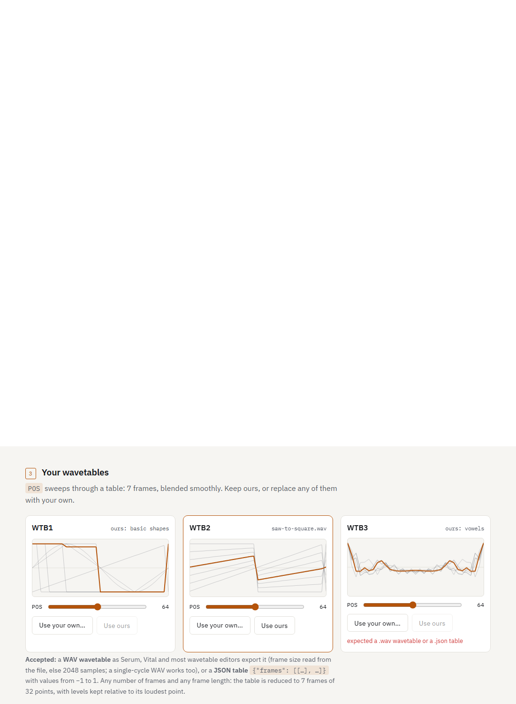

# Firmware mods: the model, and the first one

`dnfw mods` is the user-facing half of this project. Everything else in `docs/`
is how things were found out; this is what someone who owns a Digitone II can
actually do with it.

## What a mod is

A named, declared change to one or more container sections, expressed as bytes
written at known offsets. Deliberately a larger idea than `dnfw.patch`, which
models one same-length edit with `expect` guards — a mod may rewrite hundreds of
kilobytes and carries its own notion of what the user supplies.

Two rules, both enforced rather than remembered:

- **No section's *unpacked content* changes length.** Every address after a
  resized payload moves and nothing here fixes up the code that refers to them.
  A mod needing more room is a code-cave or new-section problem
  (`docs/ideas-backlog.md` §1a, §6).

  **Sharpened 2026-09-14.** This used to read "no section changes length",
  which is wrong in a way that only became visible once a section's *stored*
  length actually changed. The two lengths are different things. The **stored**
  length is the compressed bytes in the container, and the section table records
  where each section sits, so changing it moves nothing an address ever points
  at — `ele3.assemble` rewrites the offsets, and a rebuild re-signs over the
  result. The **unpacked** length is what lands at `dest`, and that is the one
  the code's addresses are relative to. The old wording forbade both.

  This matters beyond pedantry: every replacement of a compressed section
  changes its stored length a little, because compression depends on content.
  Reading the rule as forbidding that would rule out the whole mods system.

  **Sharpened again 2026-09-17, on hardware.** The unpacked length of MAIN OS
  *may* grow — **only by appending past its last byte**, into one shared area.
  Nothing addresses that space, so nothing moves; the boot hook that copies it
  above BSS is the only reader. `intro-bang_DN2_1.11.syx` did exactly that and
  booted on the instrument. The area is a directory of named chunks
  (`scripts/gen_bootscreen_code.py`), so several data-carrying mods can share one
  copy hook instead of each appending their own; merging chunks from two mods is
  the next piece of the compatibility system, and until it exists a mod that
  appends refuses an image that already has an area.
- **Integrity is not the mod's business.** A mod produces section payloads;
  `dnfw build` recomputes the section byte-sum, the content checksum and the
  HMAC-SHA256 trailer, and re-verifies before anything is written.

## Compatibility, and what it does not promise

The goal is mixing mods. That only works if each declares, *before* writing,
which bytes it will touch — so every mod implements `extents()` and
`check_compatible()` compares every pair.

**Byte-range overlap is the whole test.** Two mods writing disjoint bytes can
still fight over the same feature, and nothing here detects that. It is the
weakest useful guarantee; it is enforced because it is the part that is
checkable, and the limit is written down rather than glossed.

Every pair is compared, not each against the last: "A is fine with B" and "B is
fine with C" says nothing about A and C.

**A real check is filed as `docs/ideas-backlog.md` §11**, to be built when two
mods first share a section or a processor. Until then the two that exist cannot
collide — `moddest` writes ColdFire data in section 3, `transients` writes SHARC
data in section 7 — so the overlap test returns the right answer and would
return the right answer if it did nothing at all. That is worth knowing about a
check before trusting it.

**Superseded 2026-09-26: the check now bites, and it is run on every pair.**
Eight mods exist, six of them in section 3, and `dnfw mods matrix` tries every
pair in both orders (`docs/mods-compatibility.md`, generated). It found:
- three real overlaps: two mods in one cave, and three appending mods on one
  start-up hook;
- one pair that combines only in one order;
- one trap that byte overlap cannot see. A mod that copies part of the image
  (lfo4 copies the parameter table) silently loses a later mod's edit to that
  part, so mods now declare what they copy (`COPIES`).

## Mod 1: `transients`

Replaces the FM drum transient bank (`docs/pcm-hunt.md` §14).

| | |
|---|---|
| section | 7, the SHARC image |
| bank | DDR `0x8045b000`–`0x804ac000`, bounded by float32 tables either side |
| entries | **34**, each 4,800 samples = exactly 100.0 ms at 48 kHz, 16-bit mono LE |
| phase | 2,496 samples into the region |

The load address is mapped to a file offset by walking the boot stream for the
block that covers it — the payloads are scattered across L1, L2 and DDR, so an
offset into the section is not an address, and writing to the wrong one would
corrupt an unrelated region.

### What validates it

**Extracting the factory bank and writing it straight back produces a
byte-identical section 7.** That is a strong check rather than a pleasant one:
a wrong offset, entry size, count, endianness or sample width would each corrupt
bytes, and none does. Rebuilds pass 21 of 21 integrity checks.

### CONFIRMED ON HARDWARE — 2026-09-14

An image carrying marker samples at five known slots
(`scripts/make_marker_transients.py`) was flashed to a Digitone II, and **every
marker played back from `TRAN`.**

That closes both questions this section previously listed as open:

| was open | now |
|---|---|
| never flashed — a file transformation, not a proven firmware change | **flashed and heard** |
| not traced from `TRAN` (id 286) to these bytes | **`TRAN` plays them** — an empirical trace, which is the stronger kind |

It validates the whole chain in one step: locate a bank by statistics, map its
load address to a file offset through the boot stream, replace entries, rebuild,
re-sign, flash, hear. No part of that sequence was previously known to work end
to end.

### What the flashed image actually differs by

Measured 2026-09-14 by rebuilding the marker image and diffing it against stock
1.11, on unpacked content:

| id | name | unpacked | result |
|---|---|---|---|
| 5 | meta | 15 | identical |
| 2 | bootstrap | 30,302 | identical |
| 3 | MAIN OS | 3,192,192 | **identical** |
| 4 | updater | 32,768 | identical |
| 7 | blob (SHARC) | 836,956 | 47,529 bytes differ, offsets 497,108..823,506 |
| 8 | ? | 159,948 | identical |

The bank runs from section-7 offset 497,108 to 823,508, so the diff stops two
bytes inside its end: **the mod wrote nothing outside the bank.** 47,529 bytes
is right for five replaced entries of 34 — 5 × 9,600 = 48,000 less the bytes
that coincide, mostly zeros.

This was measured to answer a question from the `DNX` session, which read all
16 patterns of bank A as **storage version 4** over the dump protocol while
+Drive project files from the same OS decode as version 3, and could not tell
whether that was 1.11 or our build. It is not ours: every storage-format
decision lives in MAIN OS, and MAIN OS is byte-identical. One hypothesis
eliminated by measurement rather than by argument.

Worth keeping for its own sake too: it is the evidence that **a mod's declared
extents match what it actually writes.** `extents()` is the whole basis of mod
compatibility, and until this it was a promise the code made about itself.

**What stays conditional:** the bank's location, format, entry length and count
are *measured*, not documented by Elektron, so another OS release could move
them. The mod resolves the address through the boot stream at apply time and
refuses an image whose layout it does not recognise, rather than trusting a
constant.

### The count, resolved

`docs/pcm-hunt.md` §14 recorded a disagreement: the measured extent gives 34
entries, while `TRAN` spanning 0..124 with 4-step interpolation implies 32.

**34 is right.** The owner auditioned the cut bank and entries 32 and 33 are
both good transients. So the interpolation model's step count or mapping is
wrong, not the measurement — and the mapping from `TRAN`'s 125 positions onto 34
entries is still unknown.

## Mod 3: `bootscreen`

The start-up animation: a user-supplied 128×64 mark written into the intro's
source bitmap every frame, static or flashing, and the tunnel's texture scale.
All choices are data in a `BOOT` chunk of the appended area; the 200 bytes of
code are assembled once into `src/dnfw/mods/bootscreen_code.json` and shared with
the site. `src/dnfw/mods/bootscreen.py` carries the evidence.

    dnfw mods apply <image> --mod bootscreen --boot-image mark.pgm --boot-invert         --boot-slow 4 --boot-fast 3 --boot-rush 48 --boot-stop 72 --tunnel 128 64 -o out.syx

Built through this command, it behaves identically to the hand-built
`intro-bang` that passed on hardware: filmed under the emulator from the same
snapshot, every frame whose intro frame number matches is byte-identical — the
only differences are slices that land on a different frame, because the
directory lookup spends a few more instructions per frame.

## Adding a mod

Implement in `src/dnfw/mods/<id>.py`: `ID`, `NAME`, `SUMMARY`, `DEVICE`,
`SECTION`, `extents(firmware)`, and `apply(firmware, ...) -> Result`. Register it
in `src/dnfw/cli/mods.py`'s `REGISTRY`. Declare extents honestly — a mod that
under-declares breaks the only compatibility guarantee the system offers.

## The site

`site/index.html`, published to GitHub Pages by `.github/workflows/pages.yml`.

It lives in `site/` rather than `docs/` on purpose: `docs/` is the research
record, and Pages would turn ~40 files of measurements and retractions into
public pages. The site is a small front door that points back here for detail.

---

## The browser tool

**Status: built, and live at `site/transients.html`.** The page loads a real
`.syx`, derives its signing key, depacks and repacks section 7, replaces any of
the 34 transients with the user's own audio, reassembles the container,
re-signs, re-verifies, and offers the result for download — and the image it
produces is **byte-identical to the one the Python tool builds**, and 4,608
bytes **smaller** than stock 1.11.

What remains untested is the page's *layout* — the logic behind it is checked
against real firmware in `test/test_js_{codec,firmware,mod}.py`, but nobody has
looked at it in a browser yet.

**The requirement, from the owner: zero CLI, zero cloning.** A user opens a web
page, picks their own firmware file and their own samples, adjusts each one,
hears the result, and downloads a firmware image. Everything client-side —
GitHub Pages is static, and nothing should be uploaded anywhere, which is also
what `transientsplit` does and the right posture for someone's firmware.

### What the browser has to do

| step | difficulty | state |
|---|---|---|
| SysEx transport decode/encode (8-in-7) | easy | **done** — `syx/` |
| ELE3 container parse and rebuild | moderate | **done** — `container/` |
| aPLib **depack** of section 7 | moderate — port of `codec/aplib.py` | **done** |
| aPLib **pack** of section 7 | was **the blocker** | **done** — full parse port, plus a store-only fallback |
| content checksum + HMAC-SHA256 | easy, `SubtleCrypto` | **done** — `integrity/` |
| the transients mod itself | moderate — bank offset through the boot stream | **done** — `mods/transients.js`, `bootstream.js` |
| audio decode, fit, preview | easy, Web Audio | **done** — `audio.js` |
| the UI | — | **done** — `transients.html`, not yet seen in a browser |
| transient/tonal separation | **not ours** — link to `transientsplit` | n/a |

`site/js/` mirrors `src/dnfw/`'s module layout deliberately — `syx/`,
`container/`, `integrity/`, `mods/`, `aplib.js` and `aplibpack.js` split the
same way the Python is, and one `firmware.js` for the order they go in. Two
implementations that drift are a liability; two that sit side by side with the
same names make the drift visible.

### The decision on packing: store-only first, then the real packer

**[SUPERSEDED 2026-09-14 — store-only shipped, then was replaced. Kept because
the reasoning that led to it was sound and the failure was in what it left
unmeasured.]**

The original decision was a literal-only encoder. Only section 7 is modified,
so sections 2, 3 and 8 keep their original stored bytes and never need
repacking; that reduces the problem to one section, and a store-only stream is
the easiest kind of aPLib stream to be sure of — one token type and the
terminator, no offsets, no lengths, no reuse state. Porting the real packer was
called "the blocker" and routed around.

It worked, and it cost this:

```
section 7:  602,076 stored  ->  836,956 unpacked  ->  941,583 store-only
.syx:     2,389,280  ->  2,819,488   (+430,208)
```

**What was wrong with it was not the size. It was that the size was never
compared against anything.** 340 KB was written down as a cost and filed as
acceptable, next to a note that the device had never been given a larger
section 7. Those two facts belonged together and were not put together.

The owner put them together: the transient entries are fixed-size slots
replaced in place, so why does anything grow? It doesn't. The **unpacked**
section is 836,956 bytes whatever you put in it. Only the compressed size
moves, and only because compression finds redundancy and how much is there
depends on the audio. Measured on 1.11 section 7:

| content | stored | `.syx` | vs stock |
|---|---|---|---|
| stock | 602,076 | 2,389,280 | — |
| **markers — the image flashed 2026-09-14** | 564,196 | 2,341,280 | **−48,000** |
| 34 realistic decaying drum hits | 576,364 | 2,356,640 | **−32,640** |
| 34 slots of white noise (worst case) | 653,852 | 2,454,816 | +65,536 |
| store-only | 941,583 | 2,819,488 | **+430,208** |

So the real packer stays within ±64 KB and is *smaller* for anything musical —
and **the image confirmed on hardware was 48,000 bytes smaller than stock.** It
never tested a larger image because it never was one. Store-only bought a day
of work and paid for it with an untested hardware condition on the one path a
user would actually take.

**`site/js/aplibpack.js` is now a full port** of `codec/aplibpack.py`'s parse —
greedy with one-position lazy lookahead over a 2-byte hash chain, decided by
`compress.c`'s cost model, bounded by `codec.limits`. Measured on DN2 1.11:

| section | raw | JS packed | Elektron | vs stock | JS time | Python time |
|---|---|---|---|---|---|---|
| 2 bootstrap | 30,302 | 16,138 | 16,166 | −28 | 9 ms | 0.2 s |
| 3 MAIN OS | 3,192,192 | 1,129,103 | 1,130,517 | −1,414 | 629 ms | 25.9 s |
| 7 blob | 836,956 | 598,410 | 602,067 | −3,657 | 177 ms | 8.8 s |
| 8 | 159,948 | 102,552 | 103,407 | −855 | 27 ms | 1.2 s |

Every section comes out smaller than Elektron's own, and a full browser rebuild
of 1.11 is **2,384,672 bytes — 4,608 smaller than stock.** The size risk is
gone rather than documented.

**`packStore` is kept** as the fallback whose correctness can be argued in a
sentence, and as the control `pack` is measured against. It is not dead code:
`test_js_codec.py` asserts it still emits no matches, because that is what
makes it the simple thing.

The lesson is not "store-only was a bad idea". It was a reasonable first move.
The failure was writing down a number that differed from every image the device
had ever accepted, and not asking what that difference cost.

### How it was verified, which is the part that matters

A second implementation of a format that writes firmware people flash is a real
correctness risk, so it does not get trusted because it looks right. These
checks were written down **before any of the code existed**, and all now run in
`test/test_js_codec.py` against real firmware — `scripts/js_codec_check.mjs` is
the JS half.

| # | check | result |
|---|---|---|
| 1 | **Depack agreement** — JS depack of every compressed section == Python's | **pass**, byte for byte |
| 2 | **Self round-trip** — JS depack of JS `pack` and `packStore` output == input | **pass** |
| 3 | **Cross-check** — JS output depacked by `codec/aplib.py` | **pass**, 836,956 bytes identical |
| 4 | **Whole-image rebuild** — section 7 repacked, container reassembled | **pass, 21/21 integrity checks** |
| 5 | **Packer agreement** — JS `pack` output == Python `pack` output | **pass**, byte-identical on all four compressed sections |
| 6 | **Size** — every section at or under Elektron's own stored length | **pass**, all four smaller |
| 7 | **Limits** — no offset past `PACK_MAX_OFFSET`, no match over `MAX_MATCH` | **pass** |

**Check 5 is the sharpest thing in this file.** A packer has enormous freedom —
any parse that round-trips is correct — so "it round-trips" leaves most of the
implementation untested. Demanding the *same bytes* as `codec/aplibpack.py`
pins the cost model, the tie-breaking between equally long matches, the
lazy-lookahead arithmetic, the offset window, the chain depth, and the exact
point in the loop where the hash chain is updated. Any one of those differing
shows up immediately.

That is only a fair demand because the JS packer is a deliberate port of that
parse. Where the two implementations are meant to be *independent* — the
depacker, the container, the transport — the standard is agreement on content,
not on bytes, and checks 1, 3 and 4 are written that way.

Check 4 is not a codec check at all: it asks whether the container still adds
up when a section changes stored length. It does, and the trailer and content
checksum re-sign correctly over the result.

Check 7 is the one that matters for the device rather than for correctness. A
stream can checksum perfectly and still reach further back or copy longer than
anything Elektron ship, and images of ours that did exactly that **stalled in
the Early Start-up Menu's recovery flash**. It is the failure this project has
actually hit, so it is asserted rather than reasoned about.

### The stack above the codec, and its two harder checks

`test/test_js_firmware.py`, over the whole pipeline:

| check | result |
|---|---|
| **Round-trip** — load a real image, build it straight back, nothing replaced | **byte-identical** |
| Signing key recovered from the image's own material | **pass**, derived from `"Multiplier"` |
| Every integrity field on the original | **9/9** |
| Repacked rebuild reloads, re-verifies, section content unchanged | **9/9** |
| **JS-built image vs Python-built image, same input** | **byte-identical** |
| Full browser rebuild of 1.11 | **2,384,672 bytes — 4,608 smaller than stock** |

The round-trip is `docs/ROADMAP.md`'s **Gate A in JavaScript**: one comparison
exercises SysEx framing, 8-in-7, per-packet checksums, marker counters, the
container layout, the content checksum and the HMAC trailer at once, and any one
of them being wrong shows up as a differing byte.

The last row is the one that would catch a shared *assumption* rather than a
coding slip — the failure mode where both implementations are wrong in the same
direction, which no amount of self-checking can find.

**The key never leaves the browser, and is never stored.** It is derived from
the user's own firmware file in their own tab, the way `integrity/keyderive.py`
does it, and a candidate is only accepted when it reproduces that image's own
trailer — so a wrong guess cannot pass as the right one.

**What none of this proves: that the device accepts an image this toolchain
built.** Every check above is offline.

The size question that was open here is **closed**: the browser now emits an
image 4,608 bytes smaller than stock, and every section packs smaller than
Elektron's own, so nothing about these images is larger than what the device
already accepts. The store-only route would have put a 340 KB-larger image in
front of a recovery bootloader, and that risk is gone rather than documented.

What is still untested is narrower and honest: **no image built by the
JavaScript path has been flashed.** The Python path has been, repeatedly, and
the two produce byte-identical output on every input tried — which is strong,
but it is an inference, not a flash. The first hardware run of a
browser-produced image should be treated as a first run.

## Mod 4: `lfowaves` — seven LFO waveforms, swappable wavetables

`src/dnfw/mods/lfowaves.py`, `site/js/mods/lfowaves.js`, page `site/lfo.html`.
STEP PULS NOIS TRAP WTB1 WTB2 WTB3 after RAND, each with its own glyph and a
renamed SPH (STPS WDTH TYPE SLOP POS). Passed on hardware 2026-09-17 as
`lfo-waves` / `lfo-waves2`.

- **Pre-assembled.** `scripts/gen_lfo_waves_code.py` runs
  `build_lfo_waves.compose` and writes `lfowaves_code.json` / `lfowaves-code.js`:
  33 guarded edits (stock bytes checked before writing), a 2,684-byte blob with
  every stock-derived range blanked (six `fills` read from the user's own image),
  and the three table offsets. No reassembly is needed to change a table: the
  generators and the glyph renderer read the tables at run time.
- **Wavetable input** (`src/dnfw/wavetable.py`, `site/js/wavetable.js`, same
  algorithm): a WAV wavetable — Serum/Vital style, frame size from a `clm `
  chunk, else 2048, else one cycle; PCM 8/16/24/32 or float 32/64; first channel —
  or a JSON `{"frames": [[...]]}`. Reduced to 7 frames (linear along the table),
  32 points each (box average), scaled so the loudest point is 127.
- **CLI:** `dnfw mods apply firmware.syx --mod lfowaves --wavetable 2=table.wav -o out.syx`.
- **Parity:** `node scripts/js_lfowaves_check.mjs` — WAV → identical 224 bytes,
  MAIN OS identical to the Python mod, rebuilt image 21/21; a float-32 stereo
  single-cycle WAV also reduces identically. The Python mod equals
  `build_lfo_waves.compose` with the same tables.
- **Page, driven headless in Chrome** (the harness drops the stock `.syx` and a
  WAV, clicks Build): seven waves listed, the WAV lands in WTB2, a junk file
  explains itself, build verifies 21/21 and offers the download.



**Conflicts:** claims the startup hook and grows MAIN OS through the appended
area, as the boot-screen mod does — `check_compatible` reports it; they are
alternatives until a shared area registry exists.


---

## Mod 6: `fxmod` — an LFO on the Chorus, Delay and Reverb

**Status: shipped, confirmed on hardware 2026-09-23, live at `site/fx.html`.**

Stock firmware offers an LFO a hundred destinations and every one is inside the
voice. The machine's global effects are not among them, and *three separate
things* keep them out: the `DEST` list never enumerates them, the evaluator's
bound stops at 100, and the code that turns a list entry into a stored `DEST`
value has no way to spell one. Opening any one of the three on its own changes
nothing visible, which is why this mod is bigger than `moddest` and why
`moddest`'s page says the effects "stay closed" — that page was right about the
mask and wrong to imply the gate could not be opened another way. Both pages now
say so.

`docs/fx-master-modulation.md` is the evidence: §12 the engine half, §15 and
§18 the browser half and the counting error that cost a second flash, §23 the
group-name fix.

- **What changes:** 23 places in section 3, 179 bytes, nothing appended and no
  length changed — two bounds, two hooks into a 128-byte code cave, seven `jsr`
  targets, ten records' `+44`, and one name pointer.
- **Generator** (`scripts/gen_fxmod_code.py`): runs
  `build_fxbrowser.compose` — with `build_fxbrowser2`'s four extra conversion
  sites and `build_fxbrowser3`'s longword — and writes `fxmod_code.json` /
  `fxmod-code.js`: every changed run with the stock bytes it expects, plus **26
  guards**, sites the mod reads and reasons from but never writes. The cave is
  one edit whose stock guard is the whole free run, so an image with something
  already there is refused.
- **The strong check:** `dnfw mods apply … --mod fxmod` produces a `.syx` whose
  sha256 is **identical** to `fxbrowser3_DN2_1.11.syx`, the gated build whose
  predecessor was flashed. `test_fxmod_mod.py` asserts that byte equality, so
  this mod is not a re-derivation of the build for users — it *is* the build.
- **CLI:** `dnfw mods apply firmware.syx --mod fxmod -o modded.syx`.
- **Parity:** `node scripts/js_fxmod_check.mjs` — MAIN OS identical to the
  Python mod, rebuilt image 21/21, and the group-name longword reads `CHR`
  afterwards where it read `ERR` before with Reverb's and Delay's untouched.
  Run by `test_js_fxmod.py`, which fails if the harness produces no checks at
  all rather than reading an empty run as a pass.
- **Page, driven in Chrome** (the stock `.syx` uploaded, Build clicked): the 24
  destinations render in three labelled groups — Chorus 7, Delay 9, Reverb 8 —
  the load verifies 21/21, the rebuild verifies 21/21 and offers
  `Digitone_II_OS1.11_fxmod.syx` at 2,387,616 bytes, with no console errors.

**Conflicts:** ~~none known~~. **Corrected 2026-09-26:** it shares a code cave
with `arpplocks` (`0x4028ea04`, 126 bytes). `dnfw mods matrix` refuses the pair,
and so does `apply`. It writes inside section 3 only, appends nothing and claims
no startup hook, so `check_compatible` clears it against `moddest`, `lfowaves`,
`midiarp` and `transients`. Against `lfo4` it is order-only, and refuses an lfo4 image (2026-09-26): its Chorus record
edits must be in the table before lfo4 copies it. As always that is a byte-overlap
statement and not a musical one, and no combined image has been flashed.

**What it deliberately leaves out.** Master. Its slots need destination codes
136..145 and the firmware widens a `DEST` byte with `mvs.b`, which makes
anything above 127 negative. That is a different edit and it is not in here.

**What a user should know before flashing.** These are the machine's *one*
Chorus, Delay and Reverb. Sixteen tracks' LFOs can all aim at the same cell and
they add up, because every evaluator reads the cell and adds to it before the
clamp. That is what "global" means, not a fault — but it is surprising the first
time, so both the page and the index card say it.

## Mod 8: `lfo4` -- a fourth LFO

The fourth `[MOD]` page. It modulates on every voice, and is kept by SAVE
PROJECT and across a power-cycle without one (`docs/lfo4-build-plan.md`, tests
10 and 11). Unlike every mod before it, it is **C**: `csrc/lfo4/`, compiled and
linked by `scripts/build_lfo4_browser.py`.

**How C becomes a mod.** The C stays the source. `scripts/gen_lfo4_code.py`
runs the release build's own composition (`build_lfo4_browser.RELEASE`) and
records what it changed as data (`src/dnfw/mods/lfo4_code.json`):
- 204 in-image edits, each with the stock bytes it expects;
- the 23,692-byte appended area.

It then applies the result to stock and refuses to write unless the output is
byte-identical to the build. `dnfw mods apply --mod lfo4` on stock 1.11 writes
**the same `.syx`, byte for byte**, as `lfo4-everyvoice4`, the release twin of the
code that passed on the instrument.

**No stock data ships.** The appended area carries a copy of the parameter
table, 320 stock records plus ten for LFO4 derived from LFO3's. Those 19,800
bytes are blank in the JSON and rebuilt at apply time from the user's own image
(`paramtable.records`, `lfo4records.build`).

**Order matters, and the CLI enforces it.** Because lfo4 copies the table,
`APPLY_LAST` puts it after every other mod. So `moddest`'s thirteen masks and
`fxmod`'s Chorus records are in the copy (tested). It needs the start-up hook
and the appended area, so it cannot be combined with `lfowaves` or `bootscreen`
until one platform loader owns both (`docs/mods-compatibility.md`).

**Browser:** `site/lfo4.html`, 2026-09-26. `gen_lfo4_code.py` also writes
`site/js/mods/lfo4-code.js` from the same data (the JSON stays byte-identical, and
the script still reproduces the release build byte for byte), and
`site/js/mods/lfo4.js` ports `compose`: the stock length and every edit's stock
bytes are checked, with the Python's wording, then the relocated table is rebuilt
from the user's image (`paramtable.records`, `lfo4records.build` with
`free_unique_ids` and the five field rewrites), so no table bytes ship to the
browser either.
- **Order in the browser.** One page, one mod: the user builds fxmod or moddest
  first and loads that download into the LFO4 page, which says so. The pages
  that must come first refuse an lfo4 image: moddest already did, and fxmod now
  checks the table's 56 accessor bases (`paramtable.base_sites`, ported as
  `fxmod.tableInPlace`) and says to apply fxmod first, in the CLI and the browser.
  Without that, fxmod after lfo4 applied cleanly and opened ten records in a
  table nothing reads.
- **Parity:** `node scripts/js_lfo4_check.mjs`, run by `test_js_lfo4.py`: stock
  -> lfo4 equals `lfo4.compose`; fxmod -> rebuilt `.syx` -> reloaded -> lfo4
  equals MAIN OS of the CLI's `--mod fxmod --mod lfo4`; moddest -> lfo4 equals
  the Python's; lfo4 accepts a midiarp image; every rebuilt image verifies 21/21;
  and five refusals (lfo4 on an lfowaves image, on a longer image, on an edited
  site; fxmod and moddest on an lfo4 image) are worded the same on both sides.
- **Page, driven in Chrome** (the stock `.syx` uploaded, Build clicked): the load
  verifies 21/21, the eight controls render, the rebuild verifies 21/21 and offers
  `Digitone_II_OS1.11_lfo4.syx` at 2,398,112 bytes, **SHA-256-identical to the
  CLI's `--mod lfo4` output**, with no console errors. An lfowaves image is
  refused on its length; the FX page refuses the lfo4 image and names the order.

## Mod 9: `arpmodes` -- SHUF and RAND, as real arp modes

**Status: confirmed on the instrument 2026-09-26** (`arpmodes_DN2_1.11.syx`; the owner: *"works in device"*). ~~Built and emulator-gated 2026-09-26; not yet on the instrument.~~

Stock 1.11 names eight arp modes and offers five. SHUF, RAND and CHRD have no
code behind them, and all three play CYCL (`docs/arp-hidden-modes.md`). This mod
gives SHUF and RAND their own code and widens the MODE menu to them. CHRD (7)
stays out, at the owner's decision. The menu stops at RAND, and a 7 forced in
some other way still plays CYCL.

- **SHUF** plays every note of the range once per cycle, in a new random order
  each cycle. The range is the held notes times RNG + 1 octaves. The note that
  ends one cycle never starts the next.
- **RAND** plays a random note of the range on each step. Repeats are allowed.
- **Everything else is the stock step.** The new code only picks a note and an
  octave, then hands them to the step's own tail (`0x4002a376`), as UP does. So
  LEN, the step mask (a muted step rests and does not advance), the step
  offsets, SPD and N.LEN behave as in every other mode.

**What changes:** 8 edits in section 3, 374 bytes. Nothing is appended and no
length changes.
- The dispatch at `0x4002a13c`: 12 bytes become a `jmp` to the cave. The cave
  sends 3 to DOWN, 5 and 6 to the new code, and everything else to CYCL.
- The five `moveq #4` MODE bounds become `moveq #6`: setMode (`0x4004befa`,
  `0x4004bf00`), the FUNC+ARP restore (`0x4004bfb4`, `0x4004bfc6`) and the
  stored-sound LOAD (`0x400dd530`).
- Two code caves: 230 B at `0x402d08c0` and 122 B at `0x4028fcb4`. The first is
  the free tail of the run that midiarp and arpplocks already run from on the
  instrument.
- RAM: 2,320 B at `0x467a0000`, above BSS. It holds the generator and one
  144-byte SHUF record per track (which entries this cycle has played).

**Randomness.** A private xorshift32, one generator for all tracks. The
firmware's shared `rand()` (state `0x405cd95c`) is not called or touched. When
an arp starts on SHUF or RAND, the millisecond tick (`0x466758b0`) is XORed into
the generator, so boots and chords do not replay one sequence.
`scripts/build_arpmodes.py` has the design and the RAM layout.

**Generator:** `scripts/gen_arpmodes_code.py` composes `build_arpmodes.compose`
on stock and writes `arpmodes_code.json`: every edit with the stock bytes it
expects, plus 15 guards. It refuses to write unless the JSON, replayed on
stock, is the build byte for byte. `test_arpmodes_mod.py` checks the same
against `out/arpmodes/section_3_MAIN_OS.bin`.

**A sound saved with SHUF or RAND** is stored as MODE 5 or 6. Stock firmware,
or any build without this mod, loads it with its arp **OFF**, because stock's
LOAD bound turns anything above 4 into 0. That was measured on stock, not
assumed.

**With arpplocks.** arpplocks' MODE lock used to clamp to its own 0..4. It now
takes its ceiling from the immediate of setMode's clamp (`0x4004bf01`), so it
follows whatever the menu reaches: CYCL on its own, RAND with this mod. This is
a **patch to arpplocks**, not an order rule or a declared conflict: 10 bytes in
arpplocks' UI cave. The two write disjoint bytes and apply in either order, and
neither names the other. Measured in the emulator, with arpplocks alone as the
control.

**Gates** (2026-09-26): `scripts/emu_arp_modes.py` (stock, the mod, arpplocks
alone, both), `scripts/emu_boot_check.py`, `scripts/emu_boot_engine.py
--arp-mode`, `scripts/check_coldfire.py`, and a push-and-turn screenshot of the
MODE menu. The results are in `docs/arp-hidden-modes.md` §7.

**Combines** with every other mod: `dnfw mods matrix` gives `yes` for all eight
pairs. As always, that is a statement about bytes. With `midiarp`, a MIDI
track's arp runs the same step, so SHUF and RAND should reach MIDI tracks too.
That has not been run.

## Mod 10: `songguard` -- old projects open instead of halting

Not a feature: a guard on a **stock 1.11 bug**. The song `LOAD` (`0x400dea6a`)
trusts a stored song's row count and copies that many rows into a 99-row record.
The owner's `SKETCHPAD` stores 21,503, and opening it overwrote the project and
the RTOS state after it -- on stock, fxmod+lfo4 and lfowaves+moddest+midiarp
alike, measured in the emulator (`docs/old-project-load.md`).

It rewrites the same 54 bytes with the bound: 0..99 loads exactly as before, and
anything else loads as an empty song. One in-place edit at `0x400deac2`, no cave,
no hook, nothing appended, so it combines with every other mod in either order.

    dnfw mods apply <image> --mod fxmod --mod lfo4 --mod songguard -o out.syx

**Browser:** not yet.
